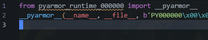
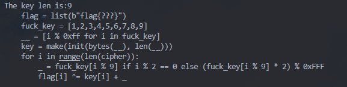
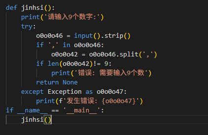
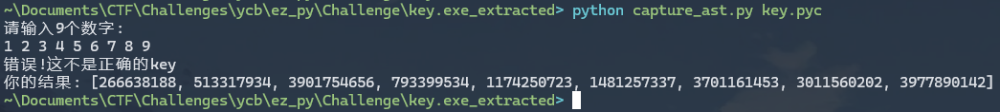
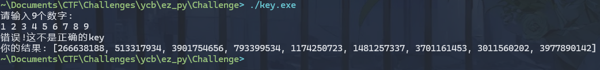
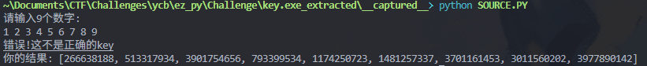

## ez_py

给了两个玩意:

1. pyinstaller 打包的`key.exe`, 要求输入正确9个数字
2. pyarmor 打包的`src.py`, 需要用[Pyarmor Static Unpack One-Shot Tool](https://github.com/Lil-House/Pyarmor-Static-Unpack-1shot)解包

每个pyarmor-obfuscated app文件夹内一般都会有一个`pyarmor_runtime.pyd`文件, 运行`shot.py`的时候需要`-r`指定`pyarmor_runtime.pyd`; 同时需要补一下文件头才能被工具扫, 后六位和给的pyarmor_runtime_000000文件夹名字后六位相同:



```bash
 python shot.py ./ -r C:\path\to\src\pyarmor_runtime_000000\pyarmor_runtime.pyd
```

看解出来的`src.py.1shot.cdc.py`有KSA和PRGA; print一下`make.__doc__`:



差key, 用decompyle3, pycdc都不行, 只有一部分, 用[pylingual](https://pylingual.io/):



`jinhsi`内部调用逻辑不全, 接下来两步:

1. 根据pylingual + das信息丢给LLM还原程序源代码, 还原的程序缺`Carlotta`
2. 写个AST截胡脚本把`Carlotta`截下来



还原的源码, 逻辑和源程序完全一致:

```python
# -*- coding: utf-8 -*-
# Reconstructed from your disassembly

import ast
import types  # 按原文件导入，但未直接使用
import sys

def Carlotta(o0oC, o0oD, o0oE, o0oF):
    o0oH = 305419896
    o0oI = o0oE & 65535
    o0oJ = o0oE >> 16 & 65535
    o0oK = (o0oE ^ o0oF) & 65535
    o0oL = (o0oE >> 8 ^ o0oF) & 65535
    o0oM = o0oH * (o0oF + 1) & 4294967295
    o0oN = (o0oD << 5) + o0oI ^ o0oD + o0oM ^ (o0oD >> 5) + o0oJ
    o0oP = o0oC + o0oN & 65535
    o0oN = (o0oP << 5) + o0oK ^ o0oP + o0oM ^ (o0oP >> 5) + o0oL
    o0oQ = o0oD + o0oN & 65535
    return (o0oP, o0oQ)

def _tea_helper_func(a, b, c):
    magic1 = (a ^ b) & 3735928559
    magic2 = c << 3 | a >> 5
    return magic1 + magic2 - (b & 3405691582) & 4294967295

def _fake_tea_round(x, y):
    return (x * 2654435769 ^ y + 305419896) & 4294967295
_tea_magic_delta = 2654435769 ^ 305419896
_tea_dummy_keys = [4369, 8738, 13107, 17476]


# 正确答案（9 个整数）
o0o0o0 = [
    105084753,
    3212558540,  # 0xBF7BC0CC
    351342182,
    844102737,
    2002504052,
    356536456,
    2463183122,  # 0x92D13112
    615034880,
    1156203296,
]

def changli(o0o0o1, o0o0o2, o0o0o3):
    """
    TEA 风格的 32 轮混淆（与反汇编一致）
    """
    o0o0o4 = 0x87456123  # 2269471011
    o0o0o5 = o0o0o3 & 0xFFFFFFFF
    o0o0o6 = ((o0o0o3 >> 8) ^ 0x12345678) & 0xFFFFFFFF
    o0o0o7 = ((o0o0o3 << 4) ^ 0x87654321) & 0xFFFFFFFF
    o0o0o8 = ((o0o0o3 >> 12) ^ 0xABCDEF00) & 0xFFFFFFFF

    o0o0o9  = o0o0o1 & 0xFFFFFFFF
    o0o0o10 = o0o0o2 & 0xFFFFFFFF
    o0o0o11 = 0

    for _ in range(32):
        o0o0o11 = (o0o0o11 + o0o0o4) & 0xFFFFFFFF
        o0o0o9  = (
            o0o0o9
            + (((o0o0o10 << 4) + o0o0o5) ^ (o0o0o10 + o0o0o11) ^ ((o0o0o10 >> 4) + o0o0o6))
        ) & 0xFFFFFFFF
        o0o0o10 = (
            o0o0o10
            + (((o0o0o9 << 4) + o0o0o7) ^ (o0o0o9 + o0o0o11) ^ ((o0o0o9 >> 4) + o0o0o8))
        ) & 0xFFFFFFFF

    return (o0o0o9, o0o0o10)

def Shorekeeper(o0o0o12):
    """
    拆 32 位为 (高 16, 低 16)
    """
    o0o0o13 = o0o0o12 >> 16
    o0o0o14 = o0o0o12 & 0xFFFF
    return (o0o0o13, o0o0o14)

def Kathysia(o0o0o15, o0o0o16):
    """
    合并为 32 位
    """
    return (o0o0o15 << 16) | (o0o0o16 + 0)

def shouan(o0o0o32):
    """
    传入 9 个整数的 key，做一轮拆分→Carlotta→合并，
    然后再做 8 次相邻 pair 的 changli 混淆，返回 9 个整数。
    """
    if len(o0o0o32) != 9:
        raise ValueError("需要输入9个key")

    o0o0o35 = []
    for o0o0o49, o0o0o34 in enumerate(o0o0o32):
        o0o0o33 = o0o0o49 * o0o0o49
        o0o0o36, o0o0o37 = Shorekeeper(o0o0o34)
        o0o0o38, o0o0o39 = Carlotta(o0o0o36, o0o0o37, 2025 + o0o0o49, o0o0o33)
        o0o0o40 = Kathysia(o0o0o38, o0o0o39)
        o0o0o35.append(o0o0o40)

    o0o0o41 = []
    for i in range(8):
        r1, r2 = changli(o0o0o35[i], o0o0o35[i + 1], 2025)
        o0o0o35[i]     = r1
        o0o0o35[i + 1] = r2
        o0o0o41.append(o0o0o35[i])

    o0o0o41.append(o0o0o35[8])
    return o0o0o41

def jinhsi():
    print("请输入9个数字:")
    try:
        o0o0o46 = input().strip()
        if "," in o0o0o46:
            o0o0o42 = o0o0o46.split(",")
        else:
            o0o0o42 = o0o0o46.split()

        if len(o0o0o42) != 9:
            print("错误: 需要输入9个数")
            return

        o0o0o43 = []
        for o0o0o44 in o0o0o42:
            o0o0o45 = int(o0o0o44.strip())
            o0o0o43.append(o0o0o45)

        o0o0o48 = shouan(o0o0o43)
        if o0o0o48 == o0o0o0:
            print("正确!这是真正的key")
            sys.exit(0)
        else:
            print("错误!这不是正确的key")
            print(f"你的结果: {o0o0o48}")
            sys.exit(0)

    except ValueError:
        print(f"错误: '{o0o0o44}' 不是有效的整数")
    except Exception as e:
        print(f"发生错误: {e}")

if __name__ == '__main__':
    jinhsi()

```





写脚本解出key`1234, 5678, 9123, 4567, 8912, 3456, 7891, 2345, 6789`, 进而解出flag:

```python
# -*- coding: utf-8 -*-

MASK32 = 0xFFFFFFFF

# 题目给定的最终比对列表 o0o0o0
TARGET = [
    105084753,
    3212558540,
    351342182,
    844102737,
    2002504052,
    356536456,
    2463183122,
    615034880,
    1156203296
]

# ---------- changli 的 32 轮“解密”（逆向） ----------
def changli_decrypt(v0, v1, c):
    delta = 2269471011
    k0 = c & MASK32
    k1 = ((c >> 8) ^ 305419896) & MASK32
    k2 = ((c << 4) ^ 2271560481) & MASK32
    k3 = ((c >> 12) ^ 2882400000) & MASK32
    s = (delta * 32) & MASK32
    v0 &= MASK32
    v1 &= MASK32
    for _ in range(32):
        v1 = (v1 - (((v0 << 4) + k2) ^ (v0 + s) ^ ((v0 >> 4) + k3))) & MASK32
        v0 = (v0 - (((v1 << 4) + k0) ^ (v1 + s) ^ ((v1 >> 4) + k1))) & MASK32
        s = (s - delta) & MASK32
    return v0, v1

# ---------- Carlotta 的闭式逆向 ----------
def invert_carlotta(P, Q, idx):
    # E=2025+idx, F=idx^2, H=0x12345678
    E = 2025 + idx
    F = idx * idx
    H = 305419896

    I = E & 0xFFFF
    J = (E >> 16) & 0xFFFF
    K = (E ^ F) & 0xFFFF
    L = ((E >> 8) ^ F) & 0xFFFF
    M = (H * (F + 1)) & 0xFFFFFFFF

    def f0(D):
        return (((D << 5) + I) ^ (D + M) ^ ((D >> 5) + J))
    def f1(Pv):
        return (((Pv << 5) + K) ^ (Pv + M) ^ ((Pv >> 5) + L))

    N1 = f1(P)
    D  = (Q - N1) & 0xFFFF
    N0 = f0(D)
    C  = (P - N0) & 0xFFFF
    return C, D

# ---------- 主过程：先逆 changli，再逆 Carlotta ----------
def recover_inputs():
    # 1) 逆 8 次链式 changli，复原 Carlotta 拼回的 9 个 32 位数
    arr = TARGET[:]  # 最终数组
    for i in range(7, -1, -1):
        arr[i], arr[i+1] = changli_decrypt(arr[i], arr[i+1], 2025)

    # 2) 对每个 32 位数（高16= P, 低16= Q）闭式反推 (C,D)，得到原始输入 v=(C<<16)|D
    res = []
    for idx, val in enumerate(arr):
        P = (val >> 16) & 0xFFFF
        Q = val & 0xFFFF
        C, D = invert_carlotta(P, Q, idx)
        v = ((C & 0xFFFF) << 16) | (D & 0xFFFF)
        res.append(v)
    return res

if __name__ == "__main__":
    keys = recover_inputs()
    print("Recovered 9 numbers (comma-separated):")
    print(", ".join(str(x) for x in keys))
# 1234, 5678, 9123, 4567, 8912, 3456, 7891, 2345, 6789
```

```python
def ksa(key):
    key_len = len(key)
    S = list(range(256))
    j = 0
    for i in range(256):
        j = (j + S[i] + key[i % key_len]) % 256
        S[i], S[j] = S[j], S[i]
    return S

def prga(S, data_len):
    i = 0
    j = 0
    keystream = []
    for index in range(data_len):
        i = (i + 1) % 256
        j = (j + S[i]) % 256
        S[i], S[j] = S[j], S[i]
        t = (S[i] + S[j] + index % 23) % 256
        keystream.append(S[t])
    return keystream

cipher = [
    1473,
    3419,
    9156,
    1267,
    9185,
    2823,
    7945,
    618,
    7036,
    2479,
    5791,
    1945,
    4639,
    1548,
    3634,
    3502,
    2433,
    1407,
    1263,
    3354,
    9274,
    1085,
    8851,
    3022,
    8031,
    734,
    6869,
    2644,
    5798,
    1862,
    4745,
    1554,
    3523,
    3631,
    2512,
    1499,
    1221,
    3226,
    9237]


flag = cipher
fuck_key = [1234, 5678, 9123, 4567, 8912, 3456, 7891, 2345, 6789]
t0 = [i % 0xff for i in fuck_key]
key = prga(ksa(bytes(t0)), len(cipher))
for i in range(len(cipher)):
    t1 = fuck_key[i % 9] if i % 2 == 0 else (fuck_key[i % 9] * 2) % 0xFFF
    flag[i] ^= key[i] + t1

print(bytes(flag))
# flag{8561a-852sad-7561b-asd-4896-qwx56}
```

## Tauri

用[Tauri Dumper](https://crates.io/crates/tauri-dumper):

```bash
$ tauri-dumper.exe -i easyTauri.exe -o C:\path\to\your\dump
```

用[synchrony](https://github.com/relative/synchrony?tab=readme-ov-file)去混淆`actuator.js`发现里面调了一个native函数greet:

```js
async function _0x9a2c6e7() {
    greetInputEl = document.querySelector('#greet-input');
    greetMsgEl = document.querySelector('#greet-msg');
    let getFlag = greetInputEl.value;
    const ciphertext = rc4('SadTongYiAiRC4HH', getFlag);
    greetMsgEl.textContent = await invoke('ipc_command', { name: uint8ArrayToBase64(ciphertext) });
}
```

搜`ipc_command`, 或者base64表`ABCDEFGHIJKLMNOPQRSTUVWXYZabcdefghijklmnopqrstuvwxyz0123456789+/`; 逆的时候注意Rust的Borrow机制, 值存储在堆上, 被一个binding (实际是个三指针结构体: `cap, ptr, len`. i.e, `容量, buffer起始, 当前长度`)引用.

 整体逻辑为`hacked_RC4` + `b64` + `hacked_tea` + `_byteswap_ulong` + `b64`:

- RC4 改了S盒初始化
- TEA改了初始`sum = 0x7E3997B7`

```c
#include <stdio.h>
#include <stdlib.h>
#include <stdint.h>
#include <string.h>

#define ARRLEN(arr) (int)(sizeof(arr) / sizeof(arr[0]))
#define DELTA 0x7E3997B7

void TEA_decrypt(uint32_t v[2], const uint32_t key[4])
{
    uint32_t v0 = _byteswap_ulong(v[0]), v1 = _byteswap_ulong(v[1]), delta = 0x7E3997B7, sum = delta * 33;
    for (int i = 0; i < 32; i++)
    { // 32 rounds
        sum -= delta;
        v1 -= ((v0 << 4) + key[2]) ^ (v0 + sum) ^ ((v0 >> 5) + key[3]);
        v0 -= ((v1 << 4) + key[0]) ^ (v1 + sum) ^ ((v1 >> 5) + key[1]);
    }
    v[0] = v0;
    v[1] = v1;
}

void print(uint8_t *data, int len)
{
    int i;
    for (i = 0; i < len; ++i)
    {
        printf("%02X ", data[i]);
        if ((i + 1) % 16 == 0 || i == len - 1)
        {
            int j;
            printf(" ");
            for (j = (i / 16) * 16; j <= i; ++j)
            {
                printf("%c", (data[j] >= 32 && data[j] <= 126) ? data[j] : '.');
            }
            printf("\n");
        }
    }
    printf("%s", data);
}

uint8_t cipher[] = {0x75,0xa1,0x7f,0x0e,0x44,0x31,0x8b,0x11,0xa6,0xce,0x7d,0x1a,0x3c,0x55,0xb6,0x13,0x63,0xe1,0x33,0xc3,0x5a,0x6d,0x1b,0x4b,0x8e,0x9e,0xa9,0x23,0xe7,0x3c,0x4e,0xd6,0x37,0x58,0xcb,0x8f,0xc5,0xf9,0xef,0x94,0x0b,0x29,0xf5,0xa9,0x6e,0x7f,0xc9,0xe8,0x67,0x2f,0xd3,0xe9,0x2c,0xfd,0x0c,0x98};
uint32_t key[] = {0x636C6557, 0x74336D4F, 0x73757230, 0x55615474};
int main(){
	for(int i = 0;i < ARRLEN(cipher);i += 8){
        TEA_decrypt((uint32_t *)&cipher[i], key);
    }
    print(cipher, ARRLEN(cipher));
	return 0;
}
// jmyHBntjPmBiE9k5OTl+7WHUjc6aLHY1ZThmMWRhvUAxZIVhZn0=
```

```python
def ksa(key):
    key_len = len(key)
    S = [0] * 256
    j = 0
    for i in range(256):
        S[i] = i
        j = (j + S[i] + key[i % key_len]) % 256
        S[i], S[j] = S[j], S[i]
    return S

def prga(S, data_len):
    i = 0
    j = 0
    keystream = []
    for _ in range(data_len):
        i = (i + 1) % 256
        j = (j + S[i]) % 256
        S[i], S[j] = S[j], S[i]
        t = (S[i] + S[j]) % 256
        keystream.append(S[t])
    return keystream

def rc4(key, data):
    result = []
    keystream = prga(ksa(key), len(data))
    for c, k in zip(data , keystream):
        result.append(c ^ k)
    return bytes(result)

cipher = [0x8e,0x6c,0x87,0x06,0x7b,0x63,0x3e,0x60,0x62,0x13,0xd9,0x39,0x39,0x39,0x7e,0xed,0x61,0xd4,0x8d,0xce,0x9a,0x2c,0x76,0x35,0x65,0x38,0x66,0x31,0x64,0x61,0xbd,0x40,0x31,0x64,0x85,0x61,0x66,0x7d]
key = b'SadTongYiAiRC4HH'

print(bytes(rc4(key, cipher)))
# flag{cf8be09b1c8a415f8b5e8f1dac71d4af}
```


