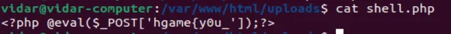
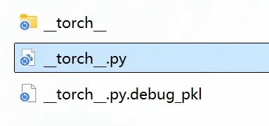
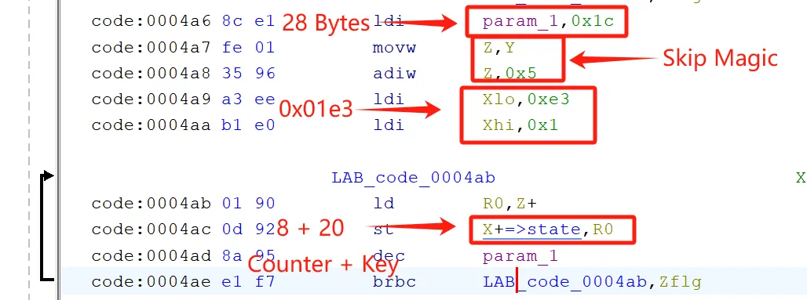

---
- Alias: Sh10l (个人赛事)
- Status: re ak; crypto 2; misc 4

---

## Compress dot new

> 了解下哈夫曼编码, 使用脚本解压：

```python
import json

class HuffmanDecoder:
    def __init__(self, tree_json):
        self.root = json.loads(tree_json)
        self.current_node = self.root

    def decode_bit(self, bit):
        self.current_node = self.current_node['a'] if bit == '0' else self.current_node['b']
        if 's' in self.current_node:
            char = chr(self.current_node['s'])
            self.current_node = self.root  # 重置到根节点
            return char
        return None

def main():
    # 读取加密文件
    with open('enc.txt', 'r') as f:
        tree_json, encoded_bits = f.read().split('\n', 1)

    # 初始化解码器
    decoder = HuffmanDecoder(tree_json)
    
    # 执行解码
    result = []
    for bit in encoded_bits.strip():
        char = decoder.decode_bit(bit)
        if char:
            result.append(char)

    print("解密结果:", ''.join(result))

if __name__ == "__main__":
    main()
```


## Turtle

> 手脱UPX，魔改RC4：


```c
#include <stdio.h>
#include <string.h>
#include <stdint.h>

typedef uint8_t u8;

void ksa(const u8* key, int key_len, u8 S[256]) {
    int j = 0;
    for (int i = 0; i < 256; i++) S[i] = i;
    
    for (int i = 0; i < 256; i++) {
        j = (j + S[i] + key[i % key_len]) % 256;
        u8 temp = S[i];
        S[i] = S[j];
        S[j] = temp;
    }
}

void prga(u8 S[256], int length, u8 keystream[]) {
    int i = 0, j = 0;
    u8 S_copy[256];
    memcpy(S_copy, S, 256);
    
    for (int k = 0; k < length; k++) {
        i = (i + 1) % 256;
        j = (j + S_copy[i]) % 256;
        u8 temp = S_copy[i];
        S_copy[i] = S_copy[j];
        S_copy[j] = temp;
        keystream[k] = S_copy[(S_copy[i] + S_copy[j]) % 256];
    }
}

void another_prga(u8 S[256], int length, u8 keystream[]) {
    int idx = 0, j = 0;
    u8 S_copy[256];
    memcpy(S_copy, S, 256);
    
    for (int k = 0; k < length; k++) {
        idx = (idx + 1) % 256;
        j = (S_copy[idx] + j) % 256;
        u8 temp = S_copy[idx];
        S_copy[idx] = S_copy[j];
        S_copy[j] = temp;
        keystream[k] = S_copy[(S_copy[idx] + S_copy[j]) % 256];
    }
}

int main() {
    // Step 1: 解密输入密钥
    u8 yekyek[] = "yekyek";
    u8 enc_key[] = {0xCD, 0x8F, 0x25, 0x3D, 0xE1, 0x51, 0x4A};
    u8 S[256];
    
    // 生成yekyek的S盒
    ksa(yekyek, 6, S);
    
    // 生成PRGA密钥流
    u8 prga_keystream[7];
    prga(S, 7, prga_keystream);
    
    // 解密得到inputKey_1
    u8 inputKey_1[7];
    for (int i = 0; i < 7; i++) {
        inputKey_1[i] = enc_key[i] ^ prga_keystream[i];
    }
    
    // Step 2: 解密flag
    u8 encrypted_flag[] = {
        0xF8, 0xD5, 0x62, 0xCF, 0x43, 0xBA, 0xC2, 0x23,
        0x15, 0x4A, 0x51, 0x10, 0x27, 0x10, 0xB1, 0xCF,
        0xC4, 0x09, 0xFE, 0xE3, 0x9F, 0x49, 0x87, 0xEA,
        0x59, 0xC2, 0x07, 0x3B, 0xA9, 0x11, 0xC1, 0xBC,
        0xFD, 0x4B, 0x57, 0xC4, 0x7E, 0xD0, 0xAA, 0x0A
    };
    int flag_len = sizeof(encrypted_flag);
    
    // 生成flag解密用的S盒
    u8 flag_S[256];
    ksa(inputKey_1, 7, flag_S);
    
    // 生成特殊PRGA密钥流
    u8 flag_keystream[40];
    another_prga(flag_S, flag_len, flag_keystream);
    
    // 解密flag
    u8 flag[41] = {0};
    for (int i = 0; i < flag_len; i++) {
        flag[i] = (encrypted_flag[i] + flag_keystream[i]) % 256;
    }
    
    printf("Decrypted Flag: %s\n", flag);
    return 0;
}
```


## Hakuya Want A Girl Friend

> 正着看ZIP文件，有密码
>
> 倒着看PNG文件，UTF-8编码，写脚本解码
>
> 拖入随波逐流工具修改高得密码，解压得flag

```python
def fix_ctf_data(byte_data):
    i = 0
    output = bytearray()
    while i < len(byte_data):
        # 检测双字节UTF-8序列 (0xC2-0xDF 开头)
        if 0xC2 <= byte_data[i] <= 0xDF and i+1 < len(byte_data):
            b1 = byte_data[i]
            b2 = byte_data[i+1]
            if 0x80 <= b2 <= 0xBF:
                # 计算原始单字节值
                decoded = ((b1 & 0x1F) << 6) | (b2 & 0x3F)
                output.append(decoded)
                i += 2
                continue
        # 非双字节序列直接保留
        output.append(byte_data[i])
        i += 1
    return bytes(output)

# 示例用法
with open('download.png', 'rb') as f:
    data = f.read()

fixed_data = fix_ctf_data(data)
with open('fixed_image.png', 'wb') as f:
    f.write(fixed_data)
```


## Computer cleaner

> Flag1:



> Flag2:


> Flag3:


```
hgame{y0u_hav3_cleaned_th3_c0mput3r!}
```

## **Level 314 线性走廊中的双生实体**

### 法一：老老实实构造输入

> 给了`entity.pt`用`binwalk`解压出`torch.py` & `Linear1`变换的文件




分析这俩文件内部代码

发现需要构造特定张量输入使输入张量经过线性变换（`Linear1`）

之后得到的值`x0`能够通过:

```python
torch.allclose(torch.mean(x), torch.tensor(0.31415000000000004), 1.0000000000000001e-05, 0.0001)
```

校验，调用`forward`方法自解码出`hidden flag`

Linear1内部`10 x 10`矩阵可提取，所以——权重与偏置已知

构造正确张量输入：

```python
import torch

# 解决PyTorch 2.6+的安全加载限制
try:
    model = torch.load("entity.pt", weights_only=False)
except RuntimeError as e:
    print(f"加载错误: {e}")
    print("请确保信任模型来源后使用以下方式加载：")
    model = torch.load("entity.pt", weights_only=False)

# 提取关键参数
linear1 = model.linear1
W = linear1.weight.data.detach().clone()  # 权重矩阵 [10,10]
b = linear1.bias.data.detach().clone()    # 偏置向量 [10]

# 计算关键参数
sum_rows_W = W.sum(dim=0)        # 行向量和 [10]
sum_b = b.sum().item()           # 偏置总和
target_sum = 0.31415000000000004 * 10  # 精确目标值

# 验证矩阵可解性
norm_sq = (sum_rows_W @ sum_rows_W).item()
if abs(norm_sq) < 1e-8:
    raise ValueError("权重矩阵行向量和模长为0，无解")

# 计算缩放系数
k = (target_sum - sum_b) / norm_sq

# 构造输入张量
x = k * sum_rows_W.unsqueeze(0)  # 形状 [1,10]

# 验证前向传播
with torch.no_grad():
    x0 = torch.nn.functional.linear(x, W, b)
    actual_mean = x0.mean().item()
    print(f"计算均值: {actual_mean:.7f} (误差: {abs(actual_mean - 0.31415):.2e})")

# 触发flag解码
output = model(x)
```


### 法二：直接直接提取`model.security.flag`然后与85异或一把梭

```python
import torch

# 加载模型（需关闭安全模式）
model = torch.load("entity.pt", weights_only=False)

# 提取加密flag
encrypted_flag = model.security.flag

# 异或解密
flag = "".join(chr(byte ^ 85) for byte in encrypted_flag)
print(f"解密Flag: {flag}")
```

## Erro0000ors

> 加载了`msdelta.dll` ，程序要求输出`hgame{…36Bytes…}`的flag，才能“正常”地触发异常进入`Seven eats the hash` 隐藏关卡
>
> 触发异常后要求用户输入修补的MD5，这个MD5用于`Target`数据的Hash校验，`ApplydeltaB` Hash校验失败返回`0` 成功`1`
>
> 如果输入MD5正确，则执行加密逻辑，并输出：`Flag is error!!`或者`Great` 
>
> 程序用函数`ApplydeltaB`巧妙地patch掉了**整个**FlagBody输入 → 生成`Target`——即密钥
>
> `ApplydeltaB`最后有个MD5校验环节，找到这个环节提取出正确MD5
>
> 只有输入正确的MD5，`ApplydeltaB`才会放心地把其生成的Target数据放出来
>
> 然后异或解密即可

异或逻辑：


动调发现我输入的MD5塞到了这里：


在`InputMD5`这个地方下硬件断点，然后一顿F9到达：


提出MD5：

```Plain
44D292FFE2E91730AE69EB50AE11D04A
```

测试MD5是否正确：


正确！

现在就差`Target`：


拿下`Target`：

```Plain
Seven says you're right!!!!
```

与Cipher异或得到flag：

```c
#include <stdio.h>
#include <string.h>

int main() {
    // 密文数据（十六进制字节数组）
    unsigned char ciphertext[] = {
        0x3B, 0x02, 0x17, 0x08, 0x0B, 0x5B, 0x4A, 0x52, 0x4D, 0x11,
        0x11, 0x4B, 0x5C, 0x43, 0x0A, 0x13, 0x54, 0x12, 0x46, 0x44,
        0x53, 0x59, 0x41, 0x11, 0x0C, 0x18, 0x17, 0x37, 0x30, 0x48,
        0x15, 0x07, 0x5A, 0x46, 0x15, 0x54, 0x1B, 0x10, 0x43, 0x40,
        0x5F, 0x45, 0x5A
    };
    
    // 密钥字符数组
    char key[] = "Seven says you're right!!!!";
    const int key_len = strlen(key); // 计算密钥长度（24字节）
    const int cipher_len = sizeof(ciphertext); // 密文长度（43字节）

    // 解密过程
    unsigned char plaintext[cipher_len + 1]; // +1给终止符
    memset(plaintext, 0, sizeof(plaintext));

    for (int i = 0; i < cipher_len; i++) {
        // 取模运算实现密钥循环使用
        int key_index = i % 0x1C; //注意这里
        // 异或解密：明文 = 密文 ^ 密钥
        plaintext[i] = ciphertext[i] ^ key[key_index]; 
    }

    // 添加字符串终止符
    plaintext[cipher_len] = '\0';

    // 输出解密结果
    printf("Decrypted Flag: %s\n", plaintext);
    return 0;
}
```


## 尊嘟假嘟

> `UsrInput`为`0.o` 和`o.0` 的随机组合，题目规定以`0.o` 或`o.0` 为”一组“，且要求我“输入”的总组数小于等于12组
>
> 分析`libcheck.so`文件发现有日志输出，使用`adb logcat -s Native:I *:S`看看log：
>
> 
>
> 结论先行， 分析出的程序加密流程：
>
> 1. `InputStr` → `encode(inputStr)` → `Key` ，encode函数已知
> 2. `Cipher`(已知) → `RC4(Cipher, Key)` → 中间数据 → `XOR`+ `b64encode` → `Result`
>
> `Cipher`不变，`UsrInput`变，"中间数据"也跟着变
>
> 根据提示`Try decrypto it，you will get flag！But realy?`，”中间数据“就是我要的Flag

`copyDexFromAssets`解密出来的dex文件转瞬即逝（被`delete`）所以，在`delete`之前下断点：


找到dex文件加载位置`/data/data/com.nobody.zunjia/cache/dex` ：


pull出解密的`zunjia.dex`文件:

```PLAIN
adb pull /data/data/com.nobody.zunjia/cache/dex C:\\YourPath
```

拖入JADX分析，发现有`encode`：


找字符串表，`callDexMethod`调用的`func1`就是`encode`


`UsrInput`最多12组，可以爆破解出flag:

```python
import itertools
CUSTOM_ALPHABET = "3GHIJKLMNOPQRSTUb=cdefghijklmnopWXYZ/12+406789VaqrstuvwxyzABCDEF5"
b64_encode_table = {i: char for i, char in enumerate(CUSTOM_ALPHABET)}
b64_decode_table = {char: i for i, char in enumerate(CUSTOM_ALPHABET) if i < 65}
def custom_b64encode(data):
    encoded = []
    for i in range(0, len(data), 3):
        chunk = data[i:i+3]
        if len(chunk) < 3:
            chunk += b'\\x00' * (3 - len(chunk))
        a, b, c = chunk
        combined = (a << 16) | (b << 8) | c
        indices = [
            (combined >> 18) & 0x3F,
            (combined >> 12) & 0x3F,
            (combined >> 6) & 0x3F,
            combined & 0x3F,
        ]
        for idx in indices:
            encoded.append(b64_encode_table[idx])
    return ''.join(encoded)
def encode_input(input_str):
    input_bytes = input_str.encode('latin-1')
    xor_bytes = bytearray()
    for i, byte in enumerate(input_bytes):
        xor_bytes.append(byte ^ i)
    return custom_b64encode(xor_bytes)
def rc4_decrypt(cipher, key):
    S = list(range(256))
    j = 0
    for i in range(256):
        j = (j + S[i] + key[i % len(key)]) % 256
        S[i], S[j] = S[j], S[i]
    i = j = 0
    plain = []
    for byte in cipher:
        i = (i + 1) % 256
        j = (j + S[i]) % 256
        S[i], S[j] = S[j], S[i]
        k = S[(S[i] + S[j]) % 256]
        plain.append(byte ^ k)
    return bytes(plain)
cipher = bytes([
    0x7A, 0xC7, 0xC7, 0x94, 0x51, 0x82, 0xF5, 0x99, 0x0C, 0x30,
    0xC8, 0xCD, 0x97, 0xFE, 0x3D, 0xD2, 0xAE, 0x0E, 0xBA, 0x83,
    0x59, 0x87, 0xBB, 0xC6, 0x35, 0xE1, 0x8C, 0x59, 0xEF, 0xAD,
    0xFA, 0x94, 0x74, 0xD3, 0x42, 0x27, 0x98, 0x77, 0x54, 0x3B,
    0x46, 0x5E, 0x95
])
def reverse_input(parts):
    return tuple('o.0' if element == '0.o' else '0.o' for element in parts)
# InputStr → encode(inputStr) → Key ，encode函数已知
# Cipher(已知) → 标准RC4(Cipher, Key) → 中间数据 → XOR + b64encode → Result
for n in range(1, 13):
    for parts in itertools.product(['0.o', 'o.0'], repeat=n):
        input_str = ''.join(parts)
        key_str = encode_input(input_str)
        key_bytes = key_str.encode('latin-1')
        middle_data = rc4_decrypt(cipher, key_bytes)
        '''
        new_input_str = ''.join(reverse_input(parts))
        new_key_str = encode_input(new_input_str)
        new_key_bytes = new_key_str.encode('latin-1')
        new_cipher = rc4_decrypt(middle_data,new_key_bytes)
        '''

        flag_candidate = bytearray()
        for i, byte in enumerate(middle_data):
            flag_candidate.append(byte)
        try:
            flag = flag_candidate.decode('Latin-1')

            if 'hgame{' in flag:
                print(f"Flag: {flag}")
                print(f"Input String: {input_str}")
                exit()

        except UnicodeDecodeError:
            continue
```


## Two wires

> AVR架构是小端序，`Counter`要求以大端字节序传入SHA1计算
>
> - 例如`0x0000000000000005`传入SHA1计算的字节序列为：`00 00 00 00 00 00 00 05` 而其在AVR架构下的实际存储为小端序：`05 00 00 00 00 00 00 00`
>
> **步骤如下：**
>
> - 提取波形数据，能看出来`Key`和`Counter`都是哪个
> - 看固件`regen_opt`取了`1000000`模，所以密码是6位：
>
> 
>
> - 看固件反序列化部分，发现魔数是`0xcafebabe`

### 上位机交互的HOTP

> ```
> X1 = 283942
> ```
>
> 因为`Key`是20Bytes，`Counter`是8Bytes，看波形数据很容易看出来：
>
> 
>
>
> `Key`和`Counter`取出来，写脚本得到`X2`


### counter+32

> ```
> Y1 = 431432
> ```
>
> 要原始`Key`和`Counter`，那就逆固件 + EEPROM

- **序列化****部分：**


对比EEPROM：


- **现在要知道****`Key`****和****`Counter`****是怎么存储的，看****`regen_otp`****怎么读取密钥**

程序取`Counter`：


端序转换：


复制`Key` ：


把`Key XOR ipad`传入`SHA1`：


`Counter`最后加`1`再存回去：


- **交叉引用****`state`****看反序列化：**



- **所以在****EEPROM****中的存储结构是：****`0xcafebabe`****+** **`Counter`** **+** **`Key`**

- **另法直接看****波形****数据，先写入计数器再写入密钥，能猜出来固件存****`Key`****和****`Counter`****的结构**, `counter + 64`同理

exp：

```python
import hmac
import hashlib
import struct

def hotp(key, counter, digits=6):
    """
    根据 RFC 4226 生成 HOTP (HMAC-Based One-Time Password) 值.
    """
    # 1. 将计数器值转换为 8 字节的网络字节顺序整数
    counter_bytes = struct.pack('>Q', counter)
    print(counter_bytes)

    # 2. 使用 HMAC-SHA-1 算法计算 HMAC 值
    hmac_hash = hmac.new(key, counter_bytes, hashlib.sha1).digest()

    # 3. 动态截取 (Dynamic Truncation)
    offset = hmac_hash[19] & 0xf  # 取最后一个字节的低 4 位作为偏移量
    binary = struct.unpack('>I', hmac_hash[offset:offset+4])[0] & 0x7fffffff  # 从偏移量处取 4 字节，并去除最高位

    # 4. 计算 HOTP 值
    hotp_value = binary % (10 ** digits)

    # 5. 将 HOTP 值格式化为指定位数的字符串
    return str(hotp_value).zfill(digits)

# 示例用法
if __name__ == "__main__":
    # 你的共享密钥 (必须是字节形式)
    your_secret_key = bytes.fromhex("6b694f7e0354f6c66ab51a04021b1c6d7d455802")

    # 计数器值
    counter_value = 0x0dcd7e9300000001

    # 生成一个 6 位数的 HOTP
    hotp_code = hotp(your_secret_key, counter_value, digits=6)

    print(f"HOTP Code: {hotp_code}")
# 283942
your_secret_key = bytes.fromhex("6b694f7e0354f6c66ab51a04021b1c6d7d455802")

# 计数器值
counter_value = 0x0dcd7e9300000001 + 9
# 633153
your_secret_key = bytes.fromhex("321c31d49454854244de86cc4ab6ddf435429052")

# 计数器值
counter_value = 0x3a92cd1700000592 + 32
# 431432
your_secret_key = bytes.fromhex("321c31d49454854244de86cc4ab6ddf435429052")

# 计数器值
counter_value = 0x3a92cd1700000592 + 64
# 187457
hgame{283942_633153_431432_187457}
```

## suprimeRSA

> `p`和`q`的结构高度相似：
>
> 
>
> 直接分解：
>
> 

```python
from Crypto.Util.number import long_to_bytes

n = 669040758304155675570167824759691921106935750270765997139446851830489844731373721233290816258049
enc = 487207283176018824965268172307888245763817583875071008869370172565777230514379236733742846575849
e = 0x10001

# Factored using external tool
p = 796688410951167236263039235508020180383351898113
q = 839777194079410698093279448382785381699926556673

phi = (p - 1) * (q - 1)
d = pow(e, -1, phi)
m = pow(enc, d, n)
print(long_to_bytes(m))
# hgame{ROCA_ROCK_and_ROll!}
```

## sieve

> 有：
>
> 
>
> - $$\pi(k$$计算的是小于等于$k$的素数的个数
> - $$tric$$每次都要计算阶乘，计算欧拉函数，时间复杂度高
> - $$\pi(k$$可以使用`sympy`的`primepi`求
> - 对第一项使用分块 + 动态规划筛法：
>
> 
>
> - **分块筛子：** 
>   - 在给定区间`[i , j]`,  `n//i`保持不变， 可以一次性处理区间`[i, j]`内的`summatory_phi(n // i)`
> - **DP****筛子：** 
>   - 定义`cache`不重复计算

exp：

```python
#!/usr/bin/env python3
import sys
sys.setrecursionlimit(10000)

from sympy import nextprime, primepi
from Crypto.Util.number import long_to_bytes

# 题目中给出的参数
e = 65537
# 注意这里“^”在 Sage 中是幂运算，故有：
#   e^2 = 65537^2 = 4295098369,  e^2//6 = 715849728
N_arg = 715849728

# 我们有： trick(N_arg) = (sum_{k=1}^{N_arg} φ(k)) + π(N_arg)
# 下面实现一个递归算法计算 ∑_{k=1}^n φ(k)
cache = {}
def summatory_phi(n):
    if n in cache:
        return cache[n]
    # 初值：∑_{k=1}^{n} φ(k) = n(n+1)/2  减去“重叠部分”
    res = n*(n+1)//2
    i = 2
    while i <= n:
        # 当 floor(n/i) 保持不变时，可以一次性处理区间 [i, j]
        j = n // (n // i)
        res -= (j - i + 1) * summatory_phi(n // i)
        i = j + 1
    cache[n] = res
    return res

print("[*] 计算 ∑φ(k)  ...")
S = summatory_phi(N_arg)
print(f"    ∑φ(k) for k=1..{N_arg} = {S}")

print("[*] 计算 π(n) ...")
P = primepi(N_arg)
print(f"    π({N_arg}) = {P}")

# 计算 trick(N_arg) = S + P
X = S + P
print(f"[*] trick({N_arg}) = {X}")

# 按位左移128位，相当于乘以 2^128
candidate = X << 128
print(f"[*] candidate = trick({N_arg}) << 128 = {candidate}")

# p = nextprime(candidate)
p = nextprime(candidate)
print(f"[*] p = {p}")

# 注意密钥构造中 p = q，故 n = p^2
n = p * p
print(f"[*] n = p^2 = {n}")

# 题目中给出的密文
enc = 2449294097474714136530140099784592732766444481665278038069484466665506153967851063209402336025065476172617376546
print(f"[*] enc = {enc}")

# 计算 φ(n) = p*(p-1)
phi_n = p * (p - 1)

# 求出 d，使得 d * e ≡ 1 (mod φ(n))
d = pow(e, -1, phi_n)
print(f"[*] d = {d}")

# 解密：m = enc^d mod n
m_int = pow(enc, d, n)
print("[*] 解密得到的整数 m =", m_int)

# 将整数 m 转回字节串
flag = long_to_bytes(m_int)
print("[*] FLAG =", flag)
# hgame{sieve_is_n0t_that_HArd}
```


