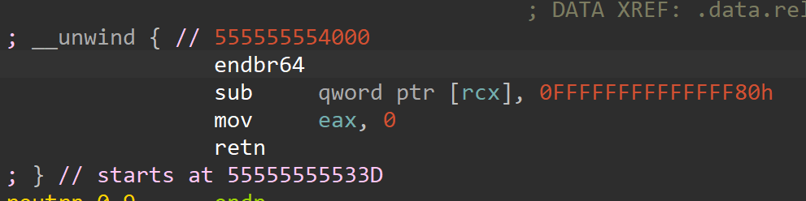

---

title: "Hgame 2025 week 2"
date: 2025-3-5
description: Hgame 2025 week 2 writeup
categories: [ctf]
pin: false
math: true
mermaid: true

---

---
- Alias: Sh10l (个人赛事)
- Status: re -1; crypto 1; misc 2; 
- Rank: 2

---

## signin

> 1. 硬件断点反调试
> 2. CRC校验——分别生成从main开始的四块CRC值：
>     
> 3. 输入flag长度43，取36字节为`FlagBody`传入XXTEA

不断调试：


- 这四个CRC值作为Key传入XXTEA
- `sum`应该永远等于`0`

要正确CRC值，要下两处**硬件****断点**，才能不改变代码块内容，一处下在这里：


一处下在这里：


通过改`ZF`过反调试

取出CRC值——`dword_7FF765C7B2A0`：
```
97A25FB5h, 0E1756DBAh, 0A143464Ah, 5A8F284Fh
```

```c
#include <stdio.h>
#include <stdint.h>

// 解密函数
void XXTEA_decrypt(uint32_t *v, int n, const uint32_t key[4]) {
    if (n < 2) return;  // At least two elements
    uint32_t y, z, sum, e;
    int p = 8;
    int q = 11;
    sum = 0;
    y = v[0];  // |  z(>>5  <<4)  |  v[p]  |  y(>>3  <<2) |
    do {
        e = (sum >> 2) & 3;
        for (p = n - 1; p > 0; p--) {
            z = v[p - 1];
            v[p] -= ((z >> 5) ^ (y << 2)) + ((y >> 3) ^ (z << 4)) ^ ((sum ^ y) + (key[(p & 3) ^ e] ^ z));
            y = v[p];
        }
        z = v[n - 1];
        v[0] -= ((z >> 5) ^ (y << 2)) + ((y >> 3) ^ (z << 4)) ^ ((sum ^ y) + (key[(p & 3) ^ e] ^ z));
        y = v[0];
        sum -= 0;
    } while (--q > 0);
}

int main() {
    // 密钥（注意字节序转换）
    uint32_t key[4] = {
        0x97A25FB5,
        0xE1756DBA,
        0xA143464A,
        0x5A8F284F
    };

    // 密文（注意小端序转换）
    unsigned char cipher[] = {
        0x23,0xEA,0x50,0x30,0x00,0x4C,0x51,0x47,0xEE,0x9C,
        0x76,0x2B,0xD5,0xE6,0x94,0x17,0xED,0x2B,0xE4,0xB3,
        0xCB,0x36,0xD5,0x61,0xC0,0xC2,0xA0,0x7C,0xFE,0x67,
        0xD7,0x5E,0xAF,0xE0,0x79,0xC5
    };

    // 将字节数组转换为DWORD数组（假设为小端序）
    uint32_t *data = (uint32_t*)cipher;
    int data_len = sizeof(cipher)/4;

    // 执行解密
    XXTEA_decrypt(data, data_len, key);

    // 输出解密结果（字符串形式）
    printf("Decrypted Data:\n");
    for(int i=0; i<sizeof(cipher); i++) {
        printf("%c", cipher[i]);
    }
    printf("\n");

    return 0;
}
```


## **Computer cleaner plus**

> 1. 想：
>    1. 可能恶意进程还在运行
>    2. 有定时设定启动恶意文件
>    3. 有奇怪的服务启动恶意文件
>    4. 恶意文件很可能在进程中运行，但文件本体不存在
>    5. 使用`top`或者`ps`查看可疑进程
> 2. 挨个排查，`top`看运行时进程没什么问题，但在使用`ps`时返回`Permission denied`
> 3. `ls -lah /bin/ps`发现没有执行权限 `chmod +x /bin/ps`手动恢复 使用ps，出现后门文件：


```
hgame{B4ck_D0_oR}
```

## **Fast and frustrating**

> 1. HKDF（HAMC-Based Key Derivation Function）是一种基于HMAC的密钥派生（扩展）算法
> 2. .NET程序能够根据`Locale(语言环境)`的不同加载不同的程序集资源:
>    1. 主程序集资源：`FastAndFrustrating.Resources.resources`
>    2. 卫星程序集资源：`FastAndFrustdating.Resources.`**`vt`**`.resources`
> 3. 程序将`UsrInput（27Bytes）`作为`ikm`（Input Key Meterial）传入`HKDF`算法来扩展出`Key + IV` 最后使用`AES_CBC`算法解密`EncryptedFlag` 算法到底是`AES-128`还是`AES-256`不能确定，所以`Key + IV`可能是`32 + 16 Bytes`或者`16 + 16 Bytes`
> 4. 整体流程： 加载`Constrs` → `b64decode` → `GZip`解压 → Json文件反序列化 → 求解方程组$$Ax = b$$ → 解向量$$x$$与`UsrInput`比较判断对错（猜出来的）
>    1.  `UsrInput` → `HKDF(SHA256, ikm, TargetLength, Salt, Keyinfo)`→ 分割派生密钥为`Key + IV` → `AES_CBC(AESInstance, Cipher, Key, IV)`

有一个`Locale(语言环境)`校验：

```PowerShell
./FastAndFrustrating.exe
No way! You must be a Vidar-Team member to run this app.
```

要求语言为"vt"才能进入`Give me your key:>`阶段

在`b46Decoded = FromBase64(*(_QWORD *)(__GCSTATICS_Program_ + 8));` 下断点，再次F8步进时出现如下错误：

```PowerShell
Give me your key:> U29tZVRoaW5nYWFhYWFhYWFhYWE=
Unhandled Exception: System.FormatException: The input is not a valid Base-64 string as it contains a non-base 64 character, more than two padding characters, or an illegal character among the padding characters.
   at System.Convert.FromBase64CharPtr(Char*, Int32) + 0xd0
   at System.Convert.FromBase64String(String) + 0x30
   at FastAndFrustrating.Program.Main(String[] args) + 0xfb
   at FastAndFrustrating!<BaseAddress>+0x1762c0
```

`GCSTATICS_Program`是：

```
.data:00007FF71FF647A8 GCSTATICS_Program dq 2C78B000068h
```

> `2C78B000068h`该地址只有在动态调试下才有效

所以动调进入地址2C78B000068h：

```Assembly
debug050:000002C78B000068                 dq offset __GCStaticEEType_0111
debug050:000002C78B000070                 dq offset unk_2C78D810128
debug050:000002C78B000078                 dq offset unk_2C78D8101F8
debug050:000002C78B000080                 dq offset unk_2C78D810230
```

`2C78D810128`、`2C78D8101F8`、`2C78D810230`分别是：

- `FakeConstrs`
- `Flag is not here!`
- `no_such_thing_go_somewhere_else`

`2C78D810128`的`fakeConstrs`并不是`base64`编码，所以应该我无论怎么调试都会出现错误

而在：

```c
  if ( *(&___NONGCSTATICS_FastAndFrustrating_FastAndFrustrating_Program__ - 1) )
    _GetGCStaticBase_FastAndFrustrating_FastAndFrustrating_Program();
```

是从`staticbase`里按照`locale`提取数据的，我想，在静态数据初始化时， 正确的Base64字符串只有在正确的`Culture`下才会被加载到`GCSTATICS_Program`的位置。

根据不同`CurrentUICulture`加载不同资源，非`vt`会加载假的

所以要找到正确的"vt"资源，，在`Strings`搜索`FakeConstrs`，往下找，离正确数据不远：


```
Constrs`+ `EncryptedFlag`+ `KeyInfo
```

> 或者搜索`.resources`文件的特征头 `CE CA EF BE`：
>
> 

b64decode + 解压

```python
import base64
import gzip
from io import BytesIO

def decode_and_extract(b64_str):
    try:
        # Base64解码
        compressed_data = base64.b64decode(b64_str)
        
        # Gzip解压
        with gzip.GzipFile(fileobj=BytesIO(compressed_data)) as f:
            decompressed_data = f.read()
            
        return decompressed_data.decode('utf-8')  # 根据实际情况调整编码
    
    except Exception as e:
        print(f"处理过程出错: {str(e)}")
        return None

# 原始数据
base64_str = """
H4sIABh9j2cC/21Wy47bMAz8lWDPESBS7/7KYrHYFj32VvRS9N+rGVKynQSIZUtiOCI5JPX37dfX78+vt2+393e53+L6vfzW+y3YJMzPjNl8S7UdFQxjLuAjtfstze84xep8ZOjH/fZu6mSpk/WD3mSv9QAm2WsiSJ96AAApLSZtkHOikCjc1+E44WwDDmzYuuAXXLVPnJeQ2SZlTsbAPkzKDVtUlAmaeKYOLLMgcWzblGxQjl0NKHR/+3+KSwBUcIo6V9p8woBkgdiYOntyo56Dsl1oFkJz3i6VwwGwD6vwUqNyDBLntBCZ8Tk5P15CcXZm3MFJZo7GFQycY7hGWNfGiplUkGRQa9bDnBXqJ9CQz2ELyWaFqraBmOZpSCcbsdGxiSUSI7Qn2oUL6YDi7oF6UtytsmgTAx4FApUXEiA2hAx/Mdo4N06GHQHRK6urJY8xRgxJmELwZTOhwtMXj9rIllczjaYI5ObSi4BdkTbjD5udhErn+g4mlUbDPJ6k8OSdI3BTOwy7pI+R3QLj/kvbvzCnrN0AMiKZpkaklH0y3TTTA4xhHVcXBg+++nQteQnIlnmWbdUjppZ/oajHLDHnIIVDKNOtT3wnvV6YWOzwbsqiIT4HIeAgz+PubFzlKx/pzXcafqI55GfO64Ekm+V1b4jZ2BxEnTescyUvphIDgyS4SR+idUnZXXijhcRxrGaQ/yRP27Y2hjnGRXvL502R2l/UpbBT7UgzvWaberkjUrGakVepqNnlzbMoI2ecXR8e4qS2FA3FaJdOpNF8MJLAdGGb8ngqsUCYHF877/zbTcQqETUOq+ewojRPJiYVcx0k7eReBwmrN44X0Xn044kh6+2JRmLs5eSzXCyMkvoqEPHSUeUhk7xtGbvUyZ0sVTzx0PNgGHuRwSYvT9L0XGZfNqhryT2KhxrP1PMyZA55JT177jxMa/Abj6z1KOc7FHoimytf1encNaIVBuMhN1bhplhxeVb22aPG6/vKxm47hYLnUDquKuLFATi8MEhmQg8rcWtUo7gebAiXJrWC7qS+3MTUK0PeEV0XsLyuLZVRZCFCm2+PpMsnfXm1B69jkha14Tiwm4codjOadKOV1do5F4a3Jxn90XXngHkxlU3GejR4Me91vz34bW9YeapgDFBZlFo87l7nVvfMdZt1N0s9G9O+AACoJ2+BQjQQDjxkwFr7mFBvf37++PyOi3KSRs5LjZ3ZLmCqjBjtEqJUnWJjyEdkk5hTuEaLcFpSZ7Q6rypaxyBrW4H0ZKA5NqZiTh9260VMUypoANKyuV0KylcYIxZe6nhTLaOwIaiS9IO1u0Jw/n167t9/pH9jSPgLAAA=
"""

if __name__ == "__main__":
    # 清理输入字符串（移除换行和空格）
    cleaned_str = base64_str
    
    # 执行解码解压
    result = decode_and_extract(cleaned_str)
    
    if result:
        print("解码解压结果：")
        print(result)  # 防止过长输出
        # 若要保存到文件：with open('output.txt', 'w') as f: f.write(result)
#{"mat_a": [[1, 0, 0, 0, 1, 0, 0, 0, 1, 0, 0, 2, -1, 0, -2, 4, -12, 16, 2, -21, -29, 11, -37, 3, 104, 64, 192], [0, 1, 1, 0, 2, 1, 1, 1, -1, 3, -1, -1, -1, 0, -3, 0, -6, 18, 6, -23, -25, 3, -21, -25, 26, 156, -229], [0, -1, 0, 0, 0, -2, 0, 1, 2, 1, 0, 3, -1, -6, 3, -7, 30, -34, -7, 50, 99, -69, 147, -30, -241, -236, 188], [1, 1, 3, 1, 7, -1, 3, 4, 2, 10, -2, 6, -6, -8, -6, -1, 1, 35, 10, -34, 13, -65, 75, -98, -51, 197, 83], [0, 0, 0, 0, 1, 0, 0, 1, 1, 1, 2, 0, -1, 4, 1, -1, 10, 0, 0, -7, 31, -56, 78, -58, -106, 53, -62], [-1, -1, 0, 0, -1, -1, 0, 1, 0, 0, 0, 0, 0, -3, 3, -6, 20, -21, -1, 29, 53, -35, 79, -23, -162, -90, -142], [0, 0, -1, 0, -1, 0, 0, -1, -1, -4, -2, 0, 1, -3, -2, 5, -16, 1, -1, 5, -48, 84, -116, 86, 148, -25, -72], [0, 1, 1, 0, -1, 1, 1, -1, -4, 0, -7, -2, 2, -13, -6, 0, -24, 5, 4, 14, -86, 151, -207, 132, 230, -30, -241], [0, 0, -2, 0, -1, 2, -1, -1, 0, -6, 4, -3, 1, 16, 0, 12, -26, 27, 0, -55, -75, 31, -94, 11, 192, 226, -94], [-1, -1, 0, 0, -2, -1, -1, 0, 0, 1, 2, -1, 1, 1, 6, -8, 24, -22, -1, 24, 63, -66, 112, -50, -180, -111, 37], [0, 0, 1, 0, 3, -1, 1, 3, 2, 5, 2, 2, -3, 1, 1, -6, 25, 2, 5, -10, 69, -119, 169, -134, -240, 124, -169], [0, 0, -2, -1, -3, 2, -2, -2, -1, -5, 3, -4, 3, 14, 2, 6, -24, 23, 4, -52, -86, 36, -114, 10, 234, 189, 62], [-2, 0, -1, 0, -5, 1, -2, -3, -4, -2, 3, -9, 6, 12, 8, -6, 8, -16, -1, 3, -4, -6, -1, -6, -39, -24, -244], [0, 0, -1, 0, -2, 1, -2, -1, 1, -3, 6, -2, 1, 15, 3, 7, -16, 26, 4, -56, -54, -13, -39, -39, 133, 221, 37], [0, 0, 0, 0, 0, 0, -1, 0, 2, 0, 5, -2, 1, 11, 4, -2, 21, -17, -9, 6, 73, -100, 151, -79, -212, -50, 68], [0, 0, 0, 0, 1, -1, 1, 0, 1, 1, -1, 2, -1, -4, 0, -2, 13, -17, -5, 29, 49, -23, 64, 2, -116, -135, 68], [0, 0, -1, -1, -5, 1, -2, -3, -2, -5, 0, -4, 5, 2, 3, -2, -2, -24, -6, 25, -17, 54, -70, 70, 66, -152, 40], [0, 0, 0, 0, 0, 0, 0, 0, 0, 0, 2, 1, 0, 6, 1, 5, -19, 35, 9, -57, -66, 3, -64, -33, 180, 238, 106], [1, 0, 0, 0, 0, -1, 0, 0, 0, 1, -1, 1, 1, -2, -1, -2, -1, 2, 2, -7, -11, -2, -13, -11, 45, 21, 138], [-1, 0, -1, 0, -3, 1, -2, -2, -1, -1, 7, -6, 4, 22, 8, -3, 10, 3, 2, -41, 9, -97, 87, -113, -75, 172, -72], [0, 0, 0, 0, 1, 0, 0, 1, -1, 1, 1, -1, 0, 3, -1, 2, -9, 24, 10, -40, -44, -1, -37, -38, 77, 232, -226], [0, 1, 0, 0, 2, 2, 0, 1, 1, 0, 3, -3, -1, 13, -2, 5, -10, 23, -1, -43, -20, -30, 13, -51, 13, 207, -149], [0, 1, 1, 0, 2, 1, 0, 1, 0, 7, 5, -2, -1, 11, 3, -6, 18, 16, 8, -43, 41, -141, 159, -169, -169, 216, -12], [1, 0, -1, 0, -1, 1, -1, -2, 0, -4, 1, 0, 0, 2, -2, 7, -14, 1, -2, 1, -29, 49, -69, 63, 106, -36, 57], [1, 0, 0, 0, 4, 0, 0, 2, 4, 1, 6, 3, -4, 13, 1, 5, 10, 19, 0, -45, 50, -138, 166, -142, -139, 192, 198], [0, 1, 1, 0, 0, 1, 0, 0, -2, 3, 1, -3, 1, 6, 1, -3, -1, 18, 8, -35, -23, -29, 4, -61, 28, 173, -70], [1, 1, 0, 0, 1, 2, 0, -1, 0, -3, 1, -1, 0, 8, -4, 12, -33, 31, -1, -45, -83, 63, -129, 47, 244, 159, 77]], "vec_b": [31772, -16089, -5137, 19004, -11231, -30741, 1908, -13072, 12518, -15381, -28148, 26993, -37508, 20766, -10350, -4593, -2569, 33556, 17442, -11570, -9905, -5847, -5959, 13220, 23951, -670, 33570]}
```

- Mat_a是个`27×27`的矩阵
- vec_b是个`27维`向量
- 把数据丢给AI分析下：


- 再回去看伪代码：


- 应该如此，试一下求解$$Ax = b$$：

```python
import numpy as np

data = {
"mat_a": [[1, 0, 0, 0, 1, 0, 0, 0, 1, 0, 0, 2, -1, 0, -2, 4, -12, 16, 2, -21, -29, 11, -37, 3, 104, 64, 192], [0, 1, 1, 0, 2, 1, 1, 1, -1, 3, -1, -1, -1, 0, -3, 0, -6, 18, 6, -23, -25, 3, -21, -25, 26, 156, -229], [0, -1, 0, 0, 0, -2, 0, 1, 2, 1, 0, 3, -1, -6, 3, -7, 30, -34, -7, 50, 99, -69, 147, -30, -241, -236, 188], [1, 1, 3, 1, 7, -1, 3, 4, 2, 10, -2, 6, -6, -8, -6, -1, 1, 35, 10, -34, 13, -65, 75, -98, -51, 197, 83], [0, 0, 0, 0, 1, 0, 0, 1, 1, 1, 2, 0, -1, 4, 1, -1, 10, 0, 0, -7, 31, -56, 78, -58, -106, 53, -62], [-1, -1, 0, 0, -1, -1, 0, 1, 0, 0, 0, 0, 0, -3, 3, -6, 20, -21, -1, 29, 53, -35, 79, -23, -162, -90, -142], [0, 0, -1, 0, -1, 0, 0, -1, -1, -4, -2, 0, 1, -3, -2, 5, -16, 1, -1, 5, -48, 84, -116, 86, 148, -25, -72], [0, 1, 1, 0, -1, 1, 1, -1, -4, 0, -7, -2, 2, -13, -6, 0, -24, 5, 4, 14, -86, 151, -207, 132, 230, -30, -241], [0, 0, -2, 0, -1, 2, -1, -1, 0, -6, 4, -3, 1, 16, 0, 12, -26, 27, 0, -55, -75, 31, -94, 11, 192, 226, -94], [-1, -1, 0, 0, -2, -1, -1, 0, 0, 1, 2, -1, 1, 1, 6, -8, 24, -22, -1, 24, 63, -66, 112, -50, -180, -111, 37], [0, 0, 1, 0, 3, -1, 1, 3, 2, 5, 2, 2, -3, 1, 1, -6, 25, 2, 5, -10, 69, -119, 169, -134, -240, 124, -169], [0, 0, -2, -1, -3, 2, -2, -2, -1, -5, 3, -4, 3, 14, 2, 6, -24, 23, 4, -52, -86, 36, -114, 10, 234, 189, 62], [-2, 0, -1, 0, -5, 1, -2, -3, -4, -2, 3, -9, 6, 12, 8, -6, 8, -16, -1, 3, -4, -6, -1, -6, -39, -24, -244], [0, 0, -1, 0, -2, 1, -2, -1, 1, -3, 6, -2, 1, 15, 3, 7, -16, 26, 4, -56, -54, -13, -39, -39, 133, 221, 37], [0, 0, 0, 0, 0, 0, -1, 0, 2, 0, 5, -2, 1, 11, 4, -2, 21, -17, -9, 6, 73, -100, 151, -79, -212, -50, 68], [0, 0, 0, 0, 1, -1, 1, 0, 1, 1, -1, 2, -1, -4, 0, -2, 13, -17, -5, 29, 49, -23, 64, 2, -116, -135, 68], [0, 0, -1, -1, -5, 1, -2, -3, -2, -5, 0, -4, 5, 2, 3, -2, -2, -24, -6, 25, -17, 54, -70, 70, 66, -152, 40], [0, 0, 0, 0, 0, 0, 0, 0, 0, 0, 2, 1, 0, 6, 1, 5, -19, 35, 9, -57, -66, 3, -64, -33, 180, 238, 106], [1, 0, 0, 0, 0, -1, 0, 0, 0, 1, -1, 1, 1, -2, -1, -2, -1, 2, 2, -7, -11, -2, -13, -11, 45, 21, 138], [-1, 0, -1, 0, -3, 1, -2, -2, -1, -1, 7, -6, 4, 22, 8, -3, 10, 3, 2, -41, 9, -97, 87, -113, -75, 172, -72], [0, 0, 0, 0, 1, 0, 0, 1, -1, 1, 1, -1, 0, 3, -1, 2, -9, 24, 10, -40, -44, -1, -37, -38, 77, 232, -226], [0, 1, 0, 0, 2, 2, 0, 1, 1, 0, 3, -3, -1, 13, -2, 5, -10, 23, -1, -43, -20, -30, 13, -51, 13, 207, -149], [0, 1, 1, 0, 2, 1, 0, 1, 0, 7, 5, -2, -1, 11, 3, -6, 18, 16, 8, -43, 41, -141, 159, -169, -169, 216, -12], [1, 0, -1, 0, -1, 1, -1, -2, 0, -4, 1, 0, 0, 2, -2, 7, -14, 1, -2, 1, -29, 49, -69, 63, 106, -36, 57], [1, 0, 0, 0, 4, 0, 0, 2, 4, 1, 6, 3, -4, 13, 1, 5, 10, 19, 0, -45, 50, -138, 166, -142, -139, 192, 198], [0, 1, 1, 0, 0, 1, 0, 0, -2, 3, 1, -3, 1, 6, 1, -3, -1, 18, 8, -35, -23, -29, 4, -61, 28, 173, -70], [1, 1, 0, 0, 1, 2, 0, -1, 0, -3, 1, -1, 0, 8, -4, 12, -33, 31, -1, -45, -83, 63, -129, 47, 244, 159, 77]], 
"vec_b": [31772, -16089, -5137, 19004, -11231, -30741, 1908, -13072, 12518, -15381, -28148, 26993, -37508, 20766, -10350, -4593, -2569, 33556, 17442, -11570, -9905, -5847, -5959, 13220, 23951, -670, 33570]
}

A = np.array(data['mat_a'])
b = np.array(data['vec_b'])

# Solve the linear system using least squares method
x = np.linalg.lstsq(A, b, rcond=None)[0]

# Convert numerical solutions to Unicode characters
solution = ''.join([chr(int(round(num))) for num in x])

print("Decoded Message:", solution)
```


已知：`ikm`、`EncryptedFlag`、`Keyinfo`、其中`salt`为零：

```python
ikm = 'CompressedEmbeddedResources'
EncryptedFlag = '@GFxmVucV6MVUXiWCMAnWpyvzXoLdHc5CmFeim+JjUBszB8HFX8Ku8NMc201AGZ9X'
# base64编码，需要解码出Cipher
Keyinfo = 'HGAME2025'
```

解密流程：

```c
/*
Key_IV_Length = 32 或者 48 Bytes
Key_derived 结构为：Key + IV
*/
Key_derived = (ConmmonStr *)HKDF__DeriveKey((unsigned int)&_Str_SHA256,(_DWORD)ikm,
Key_IV_Length,
0,
Keyinfo);
/*
AES有可能为128 或 256
可以都试一下
*/
Result = AESDecCBC((__int64)AES, (__int64)&Cipher, &IV, 2u);
```
```python
import base64
from cryptography.hazmat.primitives import hashes
from cryptography.hazmat.primitives.kdf.hkdf import HKDF
from cryptography.hazmat.primitives.ciphers import Cipher, algorithms, modes
from cryptography.hazmat.backends import default_backend
from cryptography.hazmat.primitives.padding import PKCS7

# 给定参数
ikm = 'CompressedEmbeddedResources'
EncryptedFlag = '@GFxmVucV6MVUXiWCMAnWpyvzXoLdHc5CmFeim+JjUBszB8HFX8Ku8NMc201AGZ9X'
Keyinfo = 'HGAME2025'
ciphertext = base64.b64decode(EncryptedFlag)

def decrypt_with_params(key_length_type, derived_key, iv):
    try:
        # 选择AES算法
        if key_length_type == 128:
            algorithm = algorithms.AES(derived_key) # 传入16字节密钥自动识别为AES-128
        elif key_length_type == 256:
            algorithm = algorithms.AES(derived_key) # 传入32字节密钥自动识别为AES-256
        
        # 创建解密器
        cipher = Cipher(algorithm, modes.CBC(iv), backend=default_backend())
        decryptor = cipher.decryptor()
        
        # 执行解密并去除填充
        decrypted_padded = decryptor.update(ciphertext) + decryptor.finalize()
        unpadder = PKCS7(128).unpadder()
        decrypted = unpadder.update(decrypted_padded) + unpadder.finalize()
        
        return decrypted.decode('utf-8')
    
    except Exception as e:
        return f"解密失败：{str(e)}"

# 尝试两种可能性组合
def try_combinations():
    # 组合1：Key_IV_Length=32（AES-128）
    hkdf_32 = HKDF(
        algorithm=hashes.SHA256(),
        length=32,
        salt=b'',
        info=Keyinfo.encode(),
    )
    key_iv_32 = hkdf_32.derive(ikm.encode())
    result_128 = decrypt_with_params(128, key_iv_32[:16], key_iv_32[16:32])

    # 组合2：Key_IV_Length=48（AES-256）
    hkdf_48 = HKDF(
        algorithm=hashes.SHA256(),
        length=48,
        salt=b'',
        info=Keyinfo.encode(),
    )
    key_iv_48 = hkdf_48.derive(ikm.encode())
    result_256 = decrypt_with_params(256, key_iv_48[:32], key_iv_48[32:48])

    # 验证结果
    flag_prefix = "hgame{"
    valid_results = []
    for name, result in [("AES-128-CBC", result_128), ("AES-256-CBC", result_256)]:
        if flag_prefix in result:
            valid_results.append(f"[成功] 使用{name}解密\nFlag: {result}")
    
    return "\n\n".join(valid_results) if valid_results else "所有组合尝试均失败"

# 执行解密
print(try_combinations())
```


## **Ancient Recall**

> 原矩阵：
>
> 
>
> 计算逆矩阵，左乘250次，求出的索引再处理下大阿卡那正逆向，得出原始索引：

```python
from fractions import Fraction

# 塔罗牌配置（与题设相同）
Major_Arcana = ["The Fool", "The Magician", "The High Priestess","The Empress", "The Emperor", "The Hierophant","The Lovers", "The Chariot", "Strength","The Hermit", "Wheel of Fortune", "Justice","The Hanged Man", "Death", "Temperance","The Devil", "The Tower", "The Star","The Moon", "The Sun", "Judgement","The World"]
wands = ["Ace of Wands", "Two of Wands", "Three of Wands", "Four of Wands", "Five of Wands", "Six of Wands", "Seven of Wands", "Eight of Wands", "Nine of Wands", "Ten of Wands", "Page of Wands", "Knight of Wands", "Queen of Wands", "King of Wands"]
cups = ["Ace of Cups", "Two of Cups", "Three of Cups", "Four of Cups", "Five of Cups", "Six of Cups", "Seven of Cups", "Eight of Cups", "Nine of Cups", "Ten of Cups", "Page of Cups", "Knight of Cups", "Queen of Cups", "King of Cups"]
swords = ["Ace of Swords", "Two of Swords", "Three of Swords", "Four of Swords", "Five of Swords", "Six of Swords", "Seven of Swords", "Eight of Swords", "Nine of Swords", "Ten of Swords", "Page of Swords", "Knight of Swords", "Queen of Swords", "King of Swords"]
pentacles = ["Ace of Pentacles", "Two of Pentacles", "Three of Pentacles", "Four of Pentacles", "Five of Pentacles", "Six of Pentacles", "Seven of Pentacles", "Eight of Pentacles", "Nine of Pentacles", "Ten of Pentacles", "Page of Pentacles", "Knight of Pentacles", "Queen of Pentacles", "King of Pentacles"]
Minor_Arcana = wands + cups + swords + pentacles
tarot = Major_Arcana + Minor_Arcana

# 原变换矩阵的逆矩阵（使用分数精确表示）
M_inv = [
    [Fraction(1,2), Fraction(-1,2), Fraction(1,2), Fraction(-1,2), Fraction(1,2)],
    [Fraction(1,2), Fraction(1,2), Fraction(-1,2), Fraction(1,2), Fraction(-1,2)],
    [Fraction(-1,2), Fraction(1,2), Fraction(1,2), Fraction(-1,2), Fraction(1,2)],
    [Fraction(1,2), Fraction(-1,2), Fraction(1,2), Fraction(1,2), Fraction(-1,2)],
    [Fraction(-1,2), Fraction(1,2), Fraction(-1,2), Fraction(1,2), Fraction(1,2)]
]

# 加密后的最终数值
final_values = [
    2532951952066291774890498369114195917240794704918210520571067085311474675019,
    2532951952066291774890327666074100357898023013105443178881294700381509795270,
    2532951952066291774890554459287276604903130315859258544173068376967072335730,
    2532951952066291774890865328241532885391510162611534514014409174284299139015,
    2532951952066291774890830662608134156017946376309989934175833913921142609334
]

# 转换数值类型为分数并应用逆变换
current = [Fraction(v) for v in final_values]
for _ in range(250):
    current = [
        sum(M_inv[i][j] * current[j] for j in range(5))
        for i in range(5)
    ]

# 转换回整数并处理牌面
original_values = [int(x) for x in current]
flag_parts = []

for vi in original_values:
    # 处理大阿卡那正逆向
    reversed_idx = vi ^ (-1)
    if 0 <= reversed_idx < len(Major_Arcana):
        flag_parts.append(f"re-{Major_Arcana[reversed_idx]}")
    elif 0 <= vi < len(Major_Arcana):
        flag_parts.append(Major_Arcana[vi])
    else:
        idx = vi % len(tarot)
        flag_parts.append(tarot[idx])

flag = "hgame{" + "&".join(flag_parts).replace(" ", "_") + "}"
print(flag)
hgame{re-The_Moon&re-The_Sun&Judgement&re-Temperance&Six_of_Cups}
```

## **Nop****'d**

> -  **模拟了一个半主机(SemiHosting)系统：**
>    1. Host System：`launcher`
>    2. Target System：`game`
> -  **奇特的****NOP****调用约定：**
>    1. `game`内部采用包裹在`syscall`周围的多字节的NOP指令传参
>    2. SIB.Scale == 0（`rax`无缩放）：`REX.B + SIB.Base` 获取基址寄存器编号，按照`launcher`内的`switch`表查表取值，这里表是正常的，直接看就行
>    3. SIB.Scale > 0（`rax`有缩放）：那么就按照`rsp + 8 * SIB.Base`从栈上传参
>    4. 最后一个字节为：参数编号，从1开始，编号1的参数是`Call_Number`, 也就是调用`Host System`的函数索引
>    5. 例如：`48 0F 1F 44 41 03 nop qword ptr [rcx+rax*2+3]` 其中变址寄存器`rax`乘了2，即有`rax`缩放，`lacuncher`读取`game`的栈上数据作为参数，参数编号为3
>    6. 例如：`49 0F 1F 44 01 02 nop qword ptr [r9+rax+2]` 其中变址寄存器`rax`没乘，即没有`rax`缩放，`lacuncher`读取`game`的`r9`数据作为参数，参数编号为2
>     
>
> 
>
>
> -  **`launcher`****中的检验逻辑：**
>     ```c
>       if ( (byte[0] & 0xFC) != 0x48   // REX字节
>           || byte[1] != 0x0F          // NOP 操作码部分
>           || byte[2] != 0x1F          // NOP 操作码部分
>           || (byte[3] & 0xC7) != 0x44 // ModR/M
>             //byte[4]                 // SIB 字节 
>           || byte[5] != 0x7F) {      // 偏移量检查
>           // 非目标指令，跳过处理
>       }
>     ```
>
> -  **`launcher`****提供的服务（接口函数）：**
>    ```
>      0. Sub_0_return_0
>      1. UsrInput_fgets_1
>      2. What_s_your_name_?_puts_2
>      3. Sub_ChaChaQR_20_return_0_3
>      4. Shuffle_4
>      5. state_init_5
>      6. Addstate_6
>      7. Check_7
>      8. return_A_number_8
>      9. reutrn_0_set_rcx_9
>    ```
>
> -  **`Chacha20`****需要：**
>
>    1. `0x61707865, 0x3320646e, 0x79622d32, 0x6b206574`(16Bytes)(ASCII "expand 32-byte k")
>    2. `Key`(32 Bytes)
>    3. `Counter`(4 Bytes)
>    4. `Nounce`(12 Bytes) 常数
>
> -  **奇妙的20层：**
>
>     
>
>
>     
>
>    -  **完整轮次（Double Round）**
>
>    -  ChaCha20 共执行 **20 轮（10 次双轮）** 操作，每双轮包含：
>
>    -  1. **列轮（Column Round）**：对矩阵的 **4 列** 应用 QR。
>       2. **行轮（Diagonal Round）**：对矩阵的 **4 条对角线** 应用 QR。
>
>     
>     
>
>    - **列轮**：对每列（`0,4,8,12`、`1,5,9,13` 等）应用 QR。
>    - **行轮**：对对角线（`0,5,10,15`、`1,6,11,12` 等）应用 QR。
>
>       
>
>    -  在"trust NOTHING but your OWN EYES."之后便是是校验逻辑：
>
>     

> Note: Launcher的`main`函数没有什么问题，通过动调发现进入了一个满是`ptrace`的函数，就是`Host System`
>
> 或者看`init_array`段内有一个`atexit`函数注册了`exit`执行后的操作：
> 
> 

```c
Key[32] = "It's all written in the Book of HGAME...\n"
Nounce[12] = "What's your name?> "
unsigned char RAND_POOL[51] =
{
  0x64, 0x6A, 0x50, 0x17, 0x81, 0x7D, 0x6F, 0x1A, 0x87, 0xB1, 
  0xA4, 0x00, 0x09, 0x03, 0xF8, 0x8D, 0xF8, 0x6B, 0xDF, 0x32, 
  0x5F, 0x40, 0x90, 0x9C, 0xB8, 0x3D, 0x86, 0x13, 0x26, 0xB7, 
  0x63, 0xF7, 0x74, 0xE8, 0x53, 0xED, 0x58, 0x20, 0x4F, 0xD9, 
  0x99, 0x26, 0x21, 0x37, 0xDE, 0x35, 0x76, 0xC8, 0xBC, 0xD0, 
  0x6E
};
```
ebp初始值 = 0x46

程序流程：

-  ChaCha20没有魔改：
   -  使用Key[32]、Nounce[12]、初始化矩阵
-  用得到的密钥流块（`state`）,进行：`(RAND_POOL[i] ^ ebp) ^ state_0[i]`：
    ```Assembly
      loop_start:
          lea     rcx, _end
          lea     rax, [rcx-40h]        ; Input buffer start
          
          movzx   edx, byte ptr [rax]   ; Load byte
          xor     dl, [r12]             ; XOR with key byte
          xor     ebp, edx              ; Additional XOR
          mov     [rax], bpl            ; Store modified byte
          add     rax, 1                ; Move buffer pointer
          add     r12, 1                ; Move key pointer
          cmp     rax, rcx              ; Check end of buffer
          jnz     short loop_start
    ```
-  最后和对比`RAND_POOL`，判断对错
-  编写解密脚本解密正确`flag`：

```python
## 解密脚本
from Crypto.Cipher import ChaCha20

# 定义密钥、计数器和Nonce
key = bytes([0x49, 0x74, 0x27, 0x73, 0x20, 0x61, 0x6C, 0x6C, 0x20, 0x77, 
             0x72, 0x69, 0x74, 0x74, 0x65, 0x6E, 0x20, 0x69, 0x6E, 0x20, 
             0x74, 0x68, 0x65, 0x20, 0x42, 0x6F, 0x6F, 0x6B, 0x20, 0x6F, 
             0x66, 0x20])
nonce = bytes([0x57, 0x68, 0x61, 0x74, 0x27, 0x73, 0x20, 0x79, 0x6F, 0x75, 0x72, 0x20])

# 初始化ChaCha20并生成密钥流
cipher = ChaCha20.new(key=key, nonce=nonce)
state_0 = cipher.encrypt(bytes(64))[:51]  # 生成64字节块后取前51字节

# 目标密文数据
RAND_POOL = bytes([
  0x64, 0x6A, 0x50, 0x17, 0x81, 0x7D, 0x6F, 0x1A, 0x87, 0xB1, 
  0xA4, 0x00, 0x09, 0x03, 0xF8, 0x8D, 0xF8, 0x6B, 0xDF, 0x32, 
  0x5F, 0x40, 0x90, 0x9C, 0xB8, 0x3D, 0x86, 0x13, 0x26, 0xB7, 
  0x63, 0xF7, 0x74, 0xE8, 0x53, 0xED, 0x58, 0x20, 0x4F, 0xD9, 
  0x99, 0x26, 0x21, 0x37, 0xDE, 0x35, 0x76, 0xC8, 0xBC, 0xD0, 
  0x6E
])

# 逆向异或操作
ebp_mask = 0x46  # 初始掩码
flag = []
for i, c in enumerate(RAND_POOL):
    # 解密流程 (逆向运算)
    decrypted = (c ^ ebp_mask) ^ state_0[i]
    flag.append(decrypted)
    
    # 更新掩码 (必须模拟加密时的掩码生成过程)
    ebp_mask = (ebp_mask ^ (decrypted ^ state_0[i])) & 0xFF

print(bytes(flag))
```


两个问题：

-  再launcher的调试下，`sys_write`不管用了，因为强制了syscall返回`-1`
-  最后的汇编有一个hlt，我看见了调用编号为9的函数内：



-  如何跳过玩家HP校验，让game一直进行到21层的？

## invest in hint

> 1. 将二进制反转
> 2. 二进制里面的每一个‘1’都对应那行字符串的一个字符（从左到右顺序）（因为每行二进制的‘1’的个数正好是对应字符串的长度）
> 3. 设二进制里的‘1’为有效位
> 4. 编写脚本：将所有二进制行的有效位对应的字符存入flag数组（长度为71）中，注意存入的位置要与该行二进制位的位置一样，若flag数组的目标位置已经有字符，则不存

Exp:

```python
## 二进制数据
binary_hints = [
    "00100011110110000000000000000000101110001001000000001011110010100110000",
    "00000011001110001001000000000110110010000100010100000000011011100010110",
    "00000000000010001101010111010110001000010110010001100011010000000100101",
    "11100000111010000011100110100100001000000100001100100001001000001010000",
    "00010000000110100011110000011001101011000000000000000000100100101001110",
    "00000111001000010011001000100010010111011110111101001000010010000101110",
    "00011000100010001001101100000101101010010100110000011000000001010100001",
    "00000101110110000010100001100001100000100100110000010010000010111100000",
    "10101010100001000100011010000000000000101110010010000000010010010110010",
    "11110000100010010101001001110000100100110011001000111011001100101001001",
    "00101000100010000110100000010001110001011000000000010000011000100010010",
    "10110010010110001000111100010000000010001000001110100011100001000010100",
    "00000010000000000000001000100100011010001010000101000000001011101000010",
    "00101010000011110101000110100011101100010100000111010010011000000000110",
    "00001101001111010100111011011101100001101101010110000001001010000010000",
    "00001000000101010110011100010000101101000010001111011100000000101001010"
]

## 对应字符串
string_lines = [
    "aAug5MkyAzq6Dr2mCALwmH",
    "AuYMk9CKay2q9NCADLEwH42",
    "k99C7r0gSKaAi91Nxu2mAm4}",
    "hgag5YkACir0QKA9lCumDdH",
    "mMk3ACi7SCWyAq3C5wda42",
    "{AuYoACLQa2zq3i691hNlCxrALma42",
    "megk9CiLrKWyAqi9hN8rELm}",
    "{ug5MkAigQWyt9hN82LwLdm",
    "haeAgf97L0t691NbALLmH2",
    "hgamgko9CLgQSyzti1Dlu8r2mD5wda}",
    "aegk9AiSWy23i68ADwH2",
    "hamA5Mk9i7LrSq6lCbu2mCEH4",
    "ALQK2Aq61CxDLEwd2",
    "aeAkf3o9Cr0QaWyAzi9Cbx82AD42",
    "e{uYMkfo9i7L0gSCKWy3t69DNCbmDLH",
    "eMfo9A7LrSyAz31lCbx8rRwda2"
]

## 初始化flag数组
flag = [None] * 71

## 处理每个二进制-字符串对
for bin_str, s in zip(binary_hints, string_lines):
    # 获取所有有效位（'1'的位置索引）
    active_indices = [idx for idx, bit in enumerate(bin_str) if bit == '1']
    
    # 验证字符串长度与有效位数匹配
    if len(active_indices) != len(s):
        print(f"Error: 有效位数量 ({len(active_indices)}) 与字符串长度 ({len(s)}) 不匹配")
        continue
    
    # 填充flag数组（跳过已填充的位）
    for pos, char in zip(active_indices, s):
        if flag[pos] is None:
            flag[pos] = char

## 组合最终结果并输出
final_flag = ''.join([c if c is not None else '?' for c in flag])
print(final_flag)
hgame{Aug5YMkf3o99ACi7Lr0gQSCKaWy2Azq3ti691DhNlCbxu8rR2mCAD5LEwLdmHa42}
```

## **Middlemen**

> 1. 找[ucontext_t](https://github.com/lattera/glibc/blob/master/sysdeps/unix/sysv/linux/aarch64/sys/ucontext.h)结构体
> 2. 先`UsrInput[8:16] XOR 'Sevenlikeseccmop'`
> 3. 后`AES_ECB.encrypt(UsrInput) == Cipher`
> 4. 缺`UsrInput[8:16]`
> 5. `seccomp`过滤器能够拦截特定的`syscall`，其规则由BPF字节码撰写，由BPF虚拟机运行
> 6. 既然有虚拟机，那就一定有额外的校验逻辑能够约束得到这后八字节
> 7. 使用`seccomp-tools`反汇编过滤规则（BPF字节码）

syscall被拦截，进入信号处理函数：


缺`Usrinput`后八字节，看`seccomp`的过滤规则：

字节码：


`seccomp-tools`反汇编：


```c
// 小端序,该算法可逆，应该可以解出args[2] args[3]
unsigned int args[6];
int nr = 0xAC
args[0] = *(_QWORD *)Str
args[1] = *(_QWORD *)&Str[4]
args[2] = *(_QWORD *)&Str[8]
args[3] = *(_QWORD *)&Str[12]
args[4] = 0x221221LL

mem0 = args[2];                
mem1 = args[3];          

mem2 = (args[3] << 4) + 0x65766573; 
temp = args[3] + 0x22122122;       
tmp = mem2 ^ temp; 
mem0 + tmp == 0x93cd6340 // 条件 1

mem0 = mem0 + tmp;
mem2 = (mem0 >> 5) + 0x6e6e6e6e;
temp2 = mem0 + 0x22122122; 
tmp2 = mem2 ^ temp2;  
mem1 + tmp2 == 0xb5f40d3f // 条件 2
```

GPT反编译：

```c
function filter(arch, sys_number, args):
{
    // --- 检查架构
    if ( arch != 0xc00000b7 )            // 0xc00000b7 表示 ARCH_AARCH64
        return ALLOW;                   // 跳转到 0040：返回 ALLOW

    // --- 从参数中取出数据
    mem0 = args[2];                     // 对应指令 0002~0003
    mem1 = args[3];                     // 对应指令 0004~0005

    // --- 第一阶段计算（指令 0006~0019）
    // 计算 mem2 = (args[3] << 4) + 0x65766573
    // 其中 0x65766573 对应 ASCII “seve”（或“eves”，视大小端排列而定）
    mem2 = (args[3] << 4) + 0x65766573;  // 指令 0006~0008

    // 取 args[3]，加上常量 0x22122122（即 571613474），存入临时变量 temp
    temp = args[3] + 0x22122122;         // 指令 0009~0012

    // 令 X = temp，然后计算：XOR 运算
    // 即：tmp = mem2 XOR temp
    tmp = mem2 ^ temp;                   // 指令 0014~0016（X 先保存了 temp 的值，经 mem2 异或后成为 tmp）

    // 将 mem0 与 tmp 相加，结果必须等于 0x93cd6340
    // 0x93cd6340 == 2479711040
    if ( mem0 + tmp != 0x93cd6340 )      // 指令 0017~0019
        return ALLOW;                  // 检测不符则跳转到 0040

    // 更新 mem0 为：mem0 = mem0 + tmp
    mem0 = mem0 + tmp;                   // 指令 0020

    // --- 第二阶段计算（指令 0021~0034）
    // 计算新 mem2 = (mem0 >> 5) + 0x6e6e6e6e
    // 0x6e6e6e6e 对应 ASCII "nnnn"
    mem2 = (mem0 >> 5) + 0x6e6e6e6e;      // 指令 0021~0023

    // 再次取 mem0，加上常量 0x22122122，得到 temp2
    temp2 = mem0 + 0x22122122;           // 指令 0024~0027（先将 mem0 取出，再加常量）

    // 令 tmp2 = mem2 XOR temp2
    tmp2 = mem2 ^ temp2;                 // 指令 0029~0031

    // 计算 mem1 + tmp2，结果必须等于 0xb5f40d3f
    // 0xb5f40d3f == 3052670271
    if ( mem1 + tmp2 != 0xb5f40d3f )     // 指令 0032~0034
        return ALLOW;                  // 不符则返回 ALLOW

    // --- 检查系统调用号和额外参数（指令 0035~0038）
    if ( sys_number != 0xac )           // 0xac 表示 aarch64.getpid 的 syscall 编号
        return ALLOW;                  // 指令 0035~0036

    if ( args[4] != 0x221221 )           // 指令 0037~0038
        return ALLOW;

    // --- 所有检测均通过
    return TRAP;                       // 指令 0039返回 TRAP

    // 注意：后面两个 return 指令（0040 返回 ALLOW、0041 返回 ERRNO(0)）是作为跳转目标，
    //       当检测失败时跳转到 0040，从而返回 ALLOW；而 0041 则永远不会被执行。
}
```

Exp1:

```python
def decrypt():
    # 常量定义（均为32位无符号整数运算）
    CONST1   = 0x65766573        # mem2第一部分常量
    CONST2   = 0x22122122        # 加法常量
    TARGET1  = 0x93cd6340        # 条件1： args[2] + tmp == TARGET1
    CONST3   = 0x6e6e6e6e        # mem2第二部分常量
    TARGET2  = 0xb5f40d3f        # 条件2： args[3] + tmp2 == TARGET2

    mem2_2 = ((TARGET1 >> 5) + CONST3) & 0xffffffff
    temp2  = (TARGET1 + CONST2) & 0xffffffff
    tmp2   = mem2_2 ^ temp2
    y = (TARGET2 - tmp2) & 0xffffffff

    # 根据条件1反推 x
    mem2_1 = ((y << 4) + CONST1) & 0xffffffff
    temp   = (y + CONST2) & 0xffffffff
    tmp    = mem2_1 ^ temp
    x = (TARGET1 - tmp) & 0xffffffff

    return x, y

if __name__ == "__main__":
    x, y = decrypt()
    print("解密结果:")
    print("args[2] = 0x{:08X}".format(x))
    print("args[3] = 0x{:08X}".format(y))
"""
args[2] = 0x4D19D88C
args[3] = 0xEF20AF55
"""
```

Exp2:

```python
from Crypto.Cipher import AES

# 题目给出的 16 字节密文
cipher_bytes = bytes([
    0xB7, 0x62, 0x40, 0x6A, 0xEB, 0x70, 0xB9, 0xED,
    0x81, 0x71, 0xDB, 0x9D, 0xAC, 0x82, 0xFF, 0x94
])

# 给定字符串
s = "Sevenlikeseccmop"  # 长度 16

args2 = int.to_bytes(0x4D19D88C, length=4, byteorder='little') # 8cd81965
args3 = int.to_bytes(0xEF20AF55, length=4, byteorder='little') # 55af20d7 
combine = args2 + args3
print(combine)

aes_key = bytes(combine[i % 8] ^ ord(s[i]) for i in range(16))

cipher = AES.new(aes_key, AES.MODE_ECB)
plaintext = cipher.decrypt(cipher_bytes)

print("解密结果（Hex 表示）  :", plaintext.hex())
# hgame{34ae7f8b-6059-4587-8cd8-194d55af20ef}
```


## 附录

### 逆出来的`.NET`主函数

```c
__int64 FastAndFrustrating_FastAndFrustrating_Program__Main()
{
  Class *SomeClass; // rbx
  __int64 v1; // rsi
  _UNKNOWN **Line; // rdx
  unsigned __int64 Input; // rax
  __int64 MemStream; // rsi
  GCSTATICS *GCSTATICS; // rdi
  __int64 b46Decoded; // rax
  __int64 GZipDecompressedStream; // r14
  void **ConstrsContext; // rax
  unsigned __int64 CorrectInputJsonObject; // rax
  JsonObject *JsonObject; // rcx
  SomeStr_1 *mat_a; // rsi
  __int64 DelInstance; // r15
  JsonObject *temp; // rsi
  SomeStr_2 *vec_b; // r15
  SomeStr_1 *Mat_a; // rsi
  __int64 DelInst; // r13
  __int64 res; // rsi
  AESInstance *AES; // rsi
  ConmmonStr *ikm; // r13
  int IV_Size; // r12d
  int Key_IV_Length; // ebx
  __int64 v22; // r12
  __int64 Keyinfo; // rax
  ConmmonStr *Key_derived; // rbx
  int KeySize; // eax
  __int64 SubArray_UInt8; // rax
  ConmmonStr *Cipher; // rax
  _BYTE *CipherContent; // rdi
  int CipherLen; // r13d
  unsigned int Key_Length; // r15d
  unsigned int IVLength; // ecx
  _BYTE *IV_Str; // rcx
  unsigned int IV_length; // edx
  unsigned int v34; // eax
  __int64 Result; // rax
  __int64 String; // rax
  __int128 IV; // [rsp+40h] [rbp-68h] BYREF
  __int128 cipher; // [rsp+50h] [rbp-58h] BYREF
  __int64 Size; // [rsp+60h] [rbp-48h]

  IV = 0LL;
  cipher = 0LL;
  SomeClass = (Class *)RhpNewFast(&FastAndFrustrating_FastAndFrustrating_Program___c__DisplayClass3_0::`vftable');
  System_Console_System_Console__Write_15(&_Str_Give_me_your_key____D0E89D1A9D72C2840D5ED16F3F9B221A4D37C237A4202F7E37B797AC4245CDAD);
  if ( *(&___NONGCSTATICS_S_P_CoreLib_System_Text_ASCIIEncoding__ - 1) )
    _GetGCStaticBase_S_P_CoreLib_System_Text_ASCIIEncoding();
  v1 = *(_QWORD *)(___GCSTATICS_S_P_CoreLib_System_Text_ASCIIEncoding__ + 8);
  Line = (_UNKNOWN **)System_Console_System_Console__ReadLine();
  if ( !Line )
    Line = &_Str_;
  Input = (*(__int64 (__fastcall **)(__int64, _UNKNOWN **))(*(_QWORD *)v1 + 120LL))(v1, Line);
  RhpAssignRefAVLocation((unsigned __int64 *)&SomeClass->UsrInput, Input);
  MemStream = RhpNewFast(&S_P_CoreLib_System_IO_MemoryStream::`vftable');
  if ( *(&___NONGCSTATICS_FastAndFrustrating_FastAndFrustrating_Program__ - 1) )
    _GetGCStaticBase_FastAndFrustrating_FastAndFrustrating_Program();
  GCSTATICS = (GCSTATICS *)GCSTATICS_Program;
  b46Decoded = S_P_CoreLib_System_Convert__FromBase64String(*(_QWORD *)(GCSTATICS_Program + 8));
  S_P_CoreLib_System_IO_MemoryStream___ctor_2(MemStream, b46Decoded, 1LL);
  GZipDecompressedStream = RhpNewFast(&System_IO_Compression_System_IO_Compression_GZipStream::`vftable');
  System_IO_Compression_System_IO_Compression_GZipStream___ctor_0(GZipDecompressedStream, MemStream, 0LL, 0LL);
  if ( *(&___NONGCSTATICS_FastAndFrustrating_FastAndFrustrating_ConstrsJsonContext__ - 1) )
    _GetGCStaticBase_FastAndFrustrating_FastAndFrustrating_ConstrsJsonContext();
  ConstrsContext = FastAndFrustrating_FastAndFrustrating_ConstrsJsonContext__get_Constrs(*(_QWORD *)(___GCSTATICS_FastAndFrustrating_FastAndFrustrating_ConstrsJsonContext__ + 16));
  CorrectInputJsonObject = JsonSerializer__Deserialize(
                             &_GenericDict_System_Text_Json_System_Text_Json_JsonSerializer__Deserialize_21_FastAndFrustrating_FastAndFrustrating_Constrs_,
                             GZipDecompressedStream,
                             ConstrsContext);
  RhpAssignRefAVLocation((unsigned __int64 *)&SomeClass->JsonObject, CorrectInputJsonObject);
  JsonObject = SomeClass->JsonObject;
  if ( JsonObject )
  {
    mat_a = JsonObject->mat_a;
    if ( mat_a )
    {
      if ( mat_a->Length > 0 && mat_a->Length == JsonObject->vec_b->Length )// Check Length
      {
        DelInstance = RhpNewFast(&S_P_CoreLib_System_Func_2___Array_Int32___Bool_::`vftable');
        _DelegateCtor_S_P_CoreLib_System_Delegate__InitializeClosedInstance__FastAndFrustrating_FastAndFrustrating_Program___c__DisplayClass3_0___Main_b__0(
          DelInstance,
          (__int64)SomeClass);
        if ( (unsigned int)System_Linq_System_Linq_Enumerable__All_System___Canon_(
                             &_GenericDict_System_Linq_System_Linq_Enumerable__All___Array_Int32__,
                             mat_a,
                             DelInstance) )
        {
          temp = SomeClass->JsonObject;
          vec_b = temp->vec_b;
          if ( LODWORD(SomeClass->UsrInput->Length) != vec_b->Length
            || (Mat_a = temp->mat_a,
                DelInst = RhpNewFast(&S_P_CoreLib_System_Func_2_S_P_CoreLib_System_ValueTuple_2___Array_Int32___Int32___Bool_::`vftable'),
                res = System_Linq_System_Linq_Enumerable__Zip_0_System___Canon__Int32_(
                        &_GenericDict_System_Linq_System_Linq_Enumerable__Zip_0___Array_Int32___Int32_,
                        Mat_a,
                        vec_b),                 // Caculate Ax = b
                _DelegateCtor_S_P_CoreLib_System_Delegate__InitializeClosedInstance__FastAndFrustrating_FastAndFrustrating_Program___c__DisplayClass3_0___Main_b__1(
                  DelInst,
                  (__int64)SomeClass),
                !(unsigned int)System_Linq_System_Linq_Enumerable__All_S_P_CoreLib_System_ValueTuple_2_System___Canon__Int32__(
                                 (__int64)&_GenericDict_System_Linq_System_Linq_Enumerable__All_S_P_CoreLib_System_ValueTuple_2___Array_Int32___Int32__,
                                 res,
                                 DelInst)) )    // compare(result_x, UsrInput)
          {
            System_Console_System_Console__WriteLine_12(&_Str_Try_again__9A6F7D76B5372DD9138EB55694976E1F946617CC48B7F18BECFC267CE0E4BAA0);
            return _InterfaceDispatchCell_S_P_CoreLib_System_IDisposable__Dispose_FastAndFrustrating_FastAndFrustrating_Program__Main(GZipDecompressedStream);
          }
          AES = (AESInstance *)RhpNewFast(&System_Security_Cryptography_System_Security_Cryptography_AesImplementation::`vftable');
          System_Security_Cryptography_System_Security_Cryptography_Aes___ctor(AES);
          ikm = SomeClass->UsrInput;
          IV_Size = ((__int64 (__fastcall *)(AESInstance *))AES->Methods->GetKeySize)(AES);
          Key_IV_Length = (int)(AES->Methods->GetIvSize(AES) + IV_Size) / 8;
          if ( *(&___NONGCSTATICS_S_P_CoreLib_System_Text_UTF8Encoding__ - 1) )
            _GetGCStaticBase_S_P_CoreLib_System_Text_UTF8Encoding();
          v22 = ___GCSTATICS_S_P_CoreLib_System_Text_UTF8Encoding__;
          Keyinfo = GetBytes(*(_QWORD *)(___GCSTATICS_S_P_CoreLib_System_Text_UTF8Encoding__ + 8), GCSTATICS->KeyInfo);
          Key_derived = (ConmmonStr *)HKDF__DeriveKey((__int64)&_Str_SHA256, (__int64)ikm, Key_IV_Length, 0LL, Keyinfo);
          KeySize = ((__int64 (__fastcall *)(AESInstance *))AES->Methods->GetKeySize)(AES);
          if ( KeySize / 8 < 0 )
            S_P_CoreLib_System_Index__ThrowValueArgumentOutOfRange_NeedNonNegNumException((unsigned int)(KeySize / 8));
          LODWORD(Size) = 0;
          HIDWORD(Size) = KeySize / 8;
          SubArray_UInt8 = S_P_CoreLib_System_Runtime_CompilerServices_RuntimeHelpers__GetSubArray_UInt8_(
                             Key_derived,
                             Size);
          AES->Methods->GetKey(AES, SubArray_UInt8);// Pass the Key
          Cipher = (ConmmonStr *)S_P_CoreLib_System_Convert__FromBase64String(GCSTATICS->Encrypted_Flag);
          if ( Cipher )
          {
            CipherContent = Cipher->StrContent;
            CipherLen = Cipher->Length;
          }
          else
          {
            CipherContent = 0LL;
            CipherLen = 0;
          }
          Key_Length = ((int (__fastcall *)(AESInstance *))AES->Methods->GetKeySize)(AES) / 8;
          IVLength = (int)AES->Methods->GetIvSize(AES) / 8;
          if ( Key_derived )
          {
            if ( IVLength + (unsigned __int64)Key_Length <= LODWORD(Key_derived->Length) )
            {
              v34 = IVLength;
              IV_Str = &Key_derived->StrContent[Key_Length];// Get IV
              IV_length = v34;
              goto LABEL_29;
            }
          }
          else if ( !(Key_Length | IVLength) )
          {
            IV_Str = 0LL;
            IV_length = 0;
LABEL_29:
            *(_QWORD *)&cipher = CipherContent;
            DWORD2(cipher) = CipherLen;
            *(_QWORD *)&IV = IV_Str;
            DWORD2(IV) = IV_length;
            Result = AESDecCBC((__int64)AES, (__int64)&cipher, &IV, 2u);// AES Decrypt
            String = S_P_CoreLib_System_Text_UTF8Encoding_UTF8EncodingSealed__GetString(*(_QWORD *)(v22 + 8), Result);
            System_Console_System_Console__WriteLine_13(
              &_Str_Good_job__Here_is_your_flag____B54570A8B75960258647708972072AECA79CAD4FF75EB8CCEC82836A136BFB03,
              String);
            _InterfaceDispatchCell_S_P_CoreLib_System_IDisposable__Dispose_FastAndFrustrating_FastAndFrustrating_Program__Main(AES);
            return _InterfaceDispatchCell_S_P_CoreLib_System_IDisposable__Dispose_FastAndFrustrating_FastAndFrustrating_Program__Main(GZipDecompressedStream);
          }
          S_P_CoreLib_System_ThrowHelper__ThrowArgumentOutOfRangeException();
        }
      }
    }
  }
  System_Console_System_Console__WriteLine_12(&_Str_An_error_has_occured__58E42DDA92A22882359DDD4568D3BCE30A8B18043B88DBE9437ED44D45B6C43E);
  return _InterfaceDispatchCell_S_P_CoreLib_System_IDisposable__Dispose_FastAndFrustrating_FastAndFrustrating_Program__Main(GZipDecompressedStream);
}
```

### 逆出来的`launcher`

```c
__int64 __fastcall sub_555555555B9B(unsigned int pid)
{
  unsigned int PID; // ebx
  char i; // bl
  int Index; // ebx
  unsigned __int64 REG; // rax
  __int64 v5; // r15
  char Idx; // dl
  unsigned __int64 Funcret; // r15
  int (__fastcall *Func)(); // rax
  unsigned int pida; // [rsp+4h] [rbp-64h]
  __int64 regster; // [rsp+18h] [rbp-50h] BYREF
  _BYTE NOPInstruction[4]; // [rsp+22h] [rbp-46h] BYREF
  unsigned __int8 SIB_BYTE; // [rsp+26h] [rbp-42h]
  unsigned __int8 NOPInstruction_5; // [rsp+27h] [rbp-41h]
  unsigned __int64 v15; // [rsp+28h] [rbp-40h]

  PID = pid;
  v15 = __readfsqword(0x28u);
  waitpid(pid, 0LL, 0);
  ptrace(PTRACE_SETOPTIONS, pid, 0LL, 0x100000LL); // PTRACE_O_EXITKILL 
  while ( ptrace(PTRACE_SYSCALL, PID, 0LL, 0LL) >= 0 )
  {
    // RIP 寄存器会指向 SYSCALL 指令的下一条指令

    // **等待syscall-enter通知**
    waitpid(PID, 0LL, 0); 
    ptrace(PTRACE_GETREGS, PID, 0LL, &regs);
    Ptrace_Peektext(PTRACE_PEEKTEXT, PID, (__int64)ripData, regs.rip - 8, 6uLL);// rip - 8 取到了NOP调用的头
    
    // **检查头**
    if ( (ripData[0] & 0xFC) != 0x48
      || ripData[1] != 0xF
      || ripData[2] != 0x1F
      || (ripData[3] & 0xC7) != 0x44
      || ripData[5] != 0x7F )
    {
      regster = regs.rip;
      goto LABEL_41;
    }
    memset(IsEffective, 0, sizeof(IsEffective));
    Offset = 0LL;
    pida = PID;

    // **取参开始**
    for ( i = 0; ; i = 1 )
    {
      v5 = Offset;
      Ptrace_Peektext(PTRACE_PEEKTEXT, pida, (__int64)NOPInstruction, regs.rip + 6 * Offset, 6uLL); // 向后取
      // 读取参数和CALL_NUMBER
      if ( (NOPInstruction[0] & 0xFC) != 0x48
        || NOPInstruction[1] != 0xF
        || NOPInstruction[2] != 0x1F
        || (NOPInstruction[3] & 0xC7) != 0x44
        || NOPInstruction_5 == 0x7E )
      {
        // 检查尾
        break;
      }
      Index = (NOPInstruction_5 - 1) % 128;
      if ( SIB_BYTE > 0x3Fu ) // 是否存在放缩（SIB最高2为是否 > 0）
      {
        PtracePeekData(
          pida,
          (__int64)&regster,                    // REX.B + SIB.Base
          regs.rsp + ((8 * (SIB_BYTE & 7 | (unsigned __int8)(8 * (NOPInstruction[0] & 1)))) & 0x78),// 参数通过栈传递
          8uLL);
        Params[(unsigned __int8)Index] = regster;
      }
      else
      {
        switch ( SIB_BYTE & 7 | (unsigned __int8)(8 * (NOPInstruction[0] & 1)) )// 参数通过寄存器传递
        {
        // 查表取值
          case 0:
            REG = regs.orig_rax;
            break;
          case 1:
            REG = regs.rcx;
            break;
          case 2:
            REG = regs.rdx;
            break;
          case 3:
            REG = regs.rbx;
            break;
          case 4:
            REG = regs.rsp;
            break;
          case 5:
            REG = regs.rbp;
            break;
          case 6:
            REG = regs.rsi;
            break;
          case 7:
            REG = regs.rdi;
            break;
          case 8:
            REG = regs.r8;
            break;
          case 9:
            REG = regs.r9;
            break;
          case 10:
            REG = regs.r10;
            break;
          case 11:
            REG = regs.r11;
            break;
          case 12:
            REG = regs.r12;
            break;
          case 13:
            REG = regs.r13;
            break;
          case 14:
            REG = regs.r14;
            break;
          case 15:
            REG = regs.r15;
            break;
        }
        Params[(unsigned __int8)Index] = REG;
      }
      // 参数有效
      IsEffective[(unsigned __int8)Index] = 1;
      Offset = v5 + 1;
    }
    // **取参结束**

    // **调用函数与返回值**
    Idx = i;
    PID = pida;
    regster = regs.rip;
    if ( Idx )
    {
      Funcret = -38LL;
      if ( IsEffective[0] )
      {
        if ( Params[0] <= 9uLL )                // If the CALL_NUMBER_IS_EFFECTIVE
        {
          Func = (int (__fastcall *)())funcs_1DBD[Params[0]];
          if ( Func )
            Funcret = Func();
        }
        regs.orig_rax = -1LL;                   // 直接导致内核返回 ENOSYS 错误（功能未实现）
        ptrace(PTRACE_SETREGS, pida, 0LL, &regs);
      }
      ptrace(PTRACE_SYSCALL, pida, 0LL, 0LL);   // 允许继续执行
      // **等待syscall-exit通知**
      waitpid(pida, 0LL, 0);                    
      ptrace(PTRACE_GETREGS, pida, 0LL, &TempReg); // 转入返回值
      TempReg.rax = Funcret;
      TempReg.rip = regster;
      ptrace(PTRACE_SETREGS, pida, 0LL, &TempReg);
    }
    else
    {
LABEL_41:
      ptrace(PTRACE_SYSCALL, PID, 0LL, 0LL);
      waitpid(PID, 0LL, 0);
    }
    // **一套Semihosting Call结束**
    // **继续下一个**
  }
  return 0LL;
}
```

### 做题用到的结构体

```c
/*
ptrace(PTRACE_GETREGS, PID, 0LL, &regs);中的regs是定义在定义在 <sys/user.h> 中的结构体
*/
struct user_regs_struct {
    unsigned long r15;
    unsigned long r14;
    unsigned long r13;
    unsigned long r12;
    unsigned long rbp;
    unsigned long rbx;
    unsigned long r11;
    unsigned long r10;
    unsigned long r9;
    unsigned long r8;
    unsigned long rax;       // Index = 10
    unsigned long rcx;
    unsigned long rdx;
    unsigned long rsi;
    unsigned long rdi;
    unsigned long orig_rax;  // 系统调用号
    unsigned long rip;       // 指令指针 Index = 16
    unsigned long cs;        // 代码段寄存器
    unsigned long eflags;    // 标志寄存器
    unsigned long rsp;       // 栈指针
    unsigned long ss;        // 栈段寄存器
    unsigned long fs_base;   // FS 段基址
    unsigned long gs_base;   // GS 段基址
    unsigned long ds;        // 数据段寄存器
    unsigned long es;        // 附加段寄存器
    unsigned long fs;
    unsigned long gs;
};
struct ucontext_t{
    unsigned long (uc_flags);
    struct ucontext_t *uc_link;
    stack_t uc_stack;
    sigset_t uc_sigmask;
    mcontext_t uc_mcontext;
};
struct mcontext_t{
    unsigned long long int (fault_address);
    unsigned long long int (regs)[31];
    unsigned long long int (sp);
    unsigned long long int (pc);
    unsigned long long int (pstate);
    /* This field contains extension records for additional processor
       state such as the FP/SIMD state.  It has to match the definition
       of the corresponding field in the sigcontext struct, see the
       arch/arm64/include/uapi/asm/sigcontext.h linux header for details.  */
    unsigned char __reserved[4096] __attribute__ ((__aligned__ (16)));
};
struct sock_fprog {
    unsigned short len;    // 本应是16位，但显示为64位0x2A
    struct sock_filter *filter;  // 应当是指针值
};

struct sock_filter {    /* Filter block */
    __u16   code;      // 2字节操作码
    __u8    jt;        // 1字节条件为真跳转步长
    __u8    jf;        // 1字节条件为假跳转步长
    __u32   k;         // 4字节通用参数
};
struct seccomp_data {
    int   nr;         // 系统调用号 (offset 0x00)
    __u32 arch;       // 架构标识 (offset 0x04)
    __u64 instruction_pointer; // 触发系统调用的指令地址 (offset 0x08)
    __u64 args[6];    // 系统调用的参数数组 (offset 0x10)
};
```

### REX 字节的结构

REX 字节的二进制格式为 `0100WRXB`，共 4 个控制位：


### SIB 字节的结构

SIB 字节由以下三部分组成（共 8 位）：

1. Scale（缩放因子，2 位） 指定变址寄存器的缩放因子，可能的取值为：
   1. `00b` = 1 倍（无缩放）
   2. `01b` = 2 倍
   3. `10b` = 4 倍
   4. `11b` = 8 倍
2. Index（变址寄存器，3 位） 通过 3 位编码指定变址寄存器（如 `RAX`, `RBX` 等），具体编码与寄存器编号一致：
   1. `000b` = RAX
   2. `001b` = RCX
   3. `010b` = RDX
   4. `011b` = RBX
   5. `100b` = RSP（通常禁用）
   6. `101b` = RBP（通常禁用）
   7. `110b` = RSI
   8. `111b` = RDI
3. 在 64 位模式下，若存在 REX 前缀的 `X` 位（扩展变址寄存器），则支持扩展寄存器（如 `R8`-`R15`）。
4. Base（基址寄存器，3 位） 通过 3 位编码指定基址寄存器（如 `RBP`, `RDI` 等），编码规则与 `Index` 类似：
   1. `000b` = RAX
   2. `001b` = RCX
   3. `010b` = RDX
   4. `011b` = RBX
   5. `100b` = RSP
   6. `101b` = RBP（若 `Mod=00b` 表示无基址）
   7. `110b` = RSI
   8. `111b` = RDI
5. 在 64 位模式下，若存在 REX 前缀的 `B` 位（扩展基址寄存器），则支持扩展寄存器（如 `R8`-`R15`）。

### ModR/M 字节结构

```c
| 7 6 | 5 4 3 | 2 1 0 |
| --- | ----- | ----- |
| Mod | Reg   | R/M   |
```

1. Mod（模式，2 位） 决定操作数的类型和寻址模式：
   1. `00b`: 内存寻址（无位移）或特殊寄存器操作。
   2. `01b`: 内存寻址（8 位位移）。
   3. `10b`: 内存寻址（16/32 位位移，取决于模式）。
   4. `11b`: 寄存器直接寻址（无内存操作）。
2. Reg（寄存器，3 位） 指定源或目的寄存器，或作为操作码扩展：
   1. 寄存器编码（如 `000b` = `RAX`/`EAX`/`AX`/`AL`，具体取决于操作数大小）。
   2. 若指令无需 `Reg` 字段，则用于扩展操作码。
3. R/M（寄存器/内存，3 位） 与 `Mod` 字段共同决定操作数的寻址模式：
   1. 若 `Mod=11b`，`R/M` 直接编码寄存器。
   2. 若 `Mod≠11b`，`R/M` 结合 `SIB` 字节描述内存地址。
