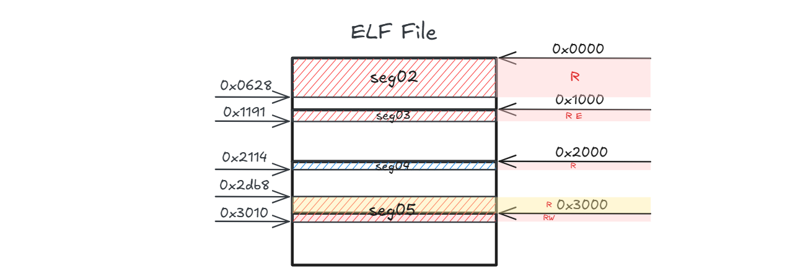
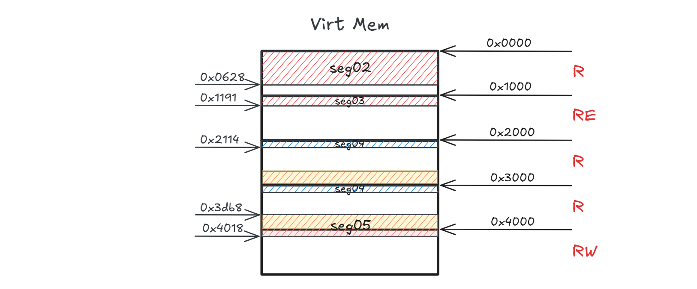

This article's aim is to generally explain what sections and segments are in an ELF file under x86-64 architecture on GNU/Linux and how they map into memory. It's a good practice to understanding ELF file structure and virtual memory mapping, and is also my personal note.

## Program headers and PT_LOAD segments

[Program headers](https://gist.github.com/x0nu11byt3/bcb35c3de461e5fb66173071a2379779#program-headers-phdr), preceded by [ELF header](https://gist.github.com/x0nu11byt3/bcb35c3de461e5fb66173071a2379779#executable-headers-ehdr), are essentially an array of structures that can be parsed to show the mapping between **sections** (within ELF file) and **segments** (loaded into memory).


The diagram above shows a panoramic view of an ELF file structure. Now, I want to know exactly where program headers reside and what each header contains[^1]. It's always a good way to start by compiling a simple program to understand the file structure using tools like `readelf`, `gdb`, `IDA`, etc.

```c
// test.c
#include <stdio.h>
int main(){
	printf("hello world!, this is function: %s\n", __FUNCTION__);
	return 0;
}
// Usage: gcc test.c -o test
```

```
; IDA View-A
[ ... ] skipping ELF header
LOAD:0000000000000040 ; ELF64 Program Header
[ ... ] skipping PHT entry 0 - 2
LOAD:00000000000000E8 ; PHT Entry 3
LOAD:00000000000000E8                 dd 1                    ; Type: LOAD
LOAD:00000000000000EC                 dd 5                    ; Flags
LOAD:00000000000000F0                 dq 1000h                ; File offset
LOAD:00000000000000F8                 dq offset _init_proc    ; Virtual address
LOAD:0000000000000100                 dq 1000h                ; Physical address
LOAD:0000000000000108                 dq 191h                 ; Size in file image
LOAD:0000000000000110                 dq 191h                 ; Size in memory image
LOAD:0000000000000118                 dq 1000h                ; Alignment
[ ... ] skipping staff
```

The IDA view shows the virtual memory layout as if it were loaded into memory with `base_addr` = `0x0000` and each program header contains metadata for one segment—including its type - `Type`, alignment boundary for segment- `Alignment`, access permissions - `Flags`, disk location - `File offset` , and runtime address - `Virtual address`. 

These program headers (the binary data embedded from C structures) will be parsed by `readelf`. For the sake of illustrating the relation between each program header and associated segment, I've added an `Idx` column to `Program Headers` output below:

```bash
$ readelf -l test
[ ... ]
Program Headers:
  Idx  Type           Offset             VirtAddr           PhysAddr           FileSiz            MemSiz             Flags  Align
  00   PHDR           0x0000000000000040 0x0000000000000040 0x0000000000000040 0x00000000000002d8 0x00000000000002d8  R      0x8
  01   INTERP         0x0000000000000318 0x0000000000000318 0x0000000000000318 0x000000000000001c 0x000000000000001c  R      0x1    [Requesting program interpreter: /lib64/ld-linux-x86-64.so.2]
  02   LOAD           0x0000000000000000 0x0000000000000000 0x0000000000000000 0x0000000000000628 0x0000000000000628  R      0x1000
  03   LOAD           0x0000000000001000 0x0000000000001000 0x0000000000001000 0x0000000000000191 0x0000000000000191  R E    0x1000
  04   LOAD           0x0000000000002000 0x0000000000002000 0x0000000000002000 0x0000000000000114 0x0000000000000114  R      0x1000
  05   LOAD           0x0000000000002db8 0x0000000000003db8 0x0000000000003db8 0x0000000000000258 0x0000000000000260  RW     0x1000
  06   DYNAMIC        0x0000000000002dc8 0x0000000000003dc8 0x0000000000003dc8 0x00000000000001f0 0x00000000000001f0  RW     0x8
  07   NOTE           0x0000000000000338 0x0000000000000338 0x0000000000000338 0x0000000000000030 0x0000000000000030  R      0x8
  08   NOTE           0x0000000000000368 0x0000000000000368 0x0000000000000368 0x0000000000000044 0x0000000000000044  R      0x4
  09   GNU_PROPERTY   0x0000000000000338 0x0000000000000338 0x0000000000000338 0x0000000000000030 0x0000000000000030  R      0x8
  10   GNU_EH_FRAME   0x0000000000002034 0x0000000000002034 0x0000000000002034 0x0000000000000034 0x0000000000000034  R      0x4
  11   GNU_STACK      0x0000000000000000 0x0000000000000000 0x0000000000000000 0x0000000000000000 0x0000000000000000  RW     0x10
  12   GNU_RELRO      0x0000000000002db8 0x0000000000003db8 0x0000000000003db8 0x0000000000000248 0x0000000000000248  R      0x1

 Section to Segment mapping:
  Segment Sections...
   00     
   01     .interp
   
   02     .interp .note.gnu.property .note.gnu.build-id .note.ABI-tag .gnu.hash .dynsym .dynstr .gnu.version .gnu.version_r .rela.dyn .rela.plt
   03     .init .plt .plt.got .plt.sec .text .fini
   04     .rodata .eh_frame_hdr .eh_frame
   05     .init_array .fini_array .dynamic .got .data .bss
   
   06     .dynamic
   07     .note.gnu.property
   08     .note.gnu.build-id .note.ABI-tag
   09     .note.gnu.property
   10     .eh_frame_hdr
   11     
   12     .init_array .fini_array .dynamic .got
```

Our focus is on the `LOAD` segments which have the `p_type` = `PT_LOAD (1)`. These are the segments that will actually get loaded into memory[^2]. You are probably familiar with some of the sections—`.text` (**RE**) section in `seg03`, `.rodata` (**R**) section in `seg04` , `.data` and `.bss`  (**RW**) sections in `seg05` . The primary distinction you will see compared to other segments is the value of `Align`; Unlike other segments, the `LOAD` segments always have an `Align` value of `0x1000`.

## Page alignment and its mapping

The `p_align` member of `Phdr` tells the ELF loader[^4], "When you are mapping each segment of ELF file to memory, please let the base address of these segments be a multiple of `0x1000`[^3]". In other words, loadable segments are supposed to be **page aligned**.

The basic mapping unit is **a page**, with a size of `0x1000` on x86-64 GNU/Linux. We'll draw a memory layout diagram for the ELF file based on `readelf` output[^2]:



The loader will map each **file page** (a page-sized data block from the ELF file) into virtual memory by means of [`mmap()`](https://man7.org/linux/man-pages/man2/mmap.2.html) [^3] which requires the file offset to equal a multiple of page size; The loader *sequentially* looks through the program headers and maps the corresponding segments into memory. Here's the tricky part: as you see, `seg05` is not page aligned. How will the loader deal with it?

First see the result:

```
pwndbg> vmmap
LEGEND: STACK | HEAP | CODE | DATA | WX | RODATA
             Start                End Perm     Size Offset File (set vmmap-prefer-relpaths on)
    0x555555554000     0x555555555000 r--p     1000      0 test
    0x555555555000     0x555555556000 r-xp     1000   1000 test
    0x555555556000     0x555555557000 r--p     1000   2000 test
    0x555555557000     0x555555558000 r--p     1000   2000 test
    0x555555558000     0x555555559000 rw-p     1000   3000 test
    0x7ffff7da4000     0x7ffff7dcc000 r--p    28000      0 /usr/lib/x86_64-linux-gnu/libc.so.6
    0x7ffff7dcc000     0x7ffff7f54000 r-xp   188000  28000 /usr/lib/x86_64-linux-gnu/libc.so.6
    0x7ffff7f54000     0x7ffff7fa3000 r--p    4f000 1b0000 /usr/lib/x86_64-linux-gnu/libc.so.6
    0x7ffff7fa3000     0x7ffff7fa7000 r--p     4000 1fe000 /usr/lib/x86_64-linux-gnu/libc.so.6
    0x7ffff7fa7000     0x7ffff7fa9000 rw-p     2000 202000 /usr/lib/x86_64-linux-gnu/libc.so.6
    0x7ffff7fc5000     0x7ffff7fc6000 r--p     1000      0 /usr/lib/x86_64-linux-gnu/ld-linux-x86-64.so.2
    0x7ffff7fc6000     0x7ffff7ff1000 r-xp    2b000   1000 /usr/lib/x86_64-linux-gnu/ld-linux-x86-64.so.2
    0x7ffff7ff1000     0x7ffff7ffb000 r--p     a000  2c000 /usr/lib/x86_64-linux-gnu/ld-linux-x86-64.so.2
    0x7ffff7ffb000     0x7ffff7ffd000 r--p     2000  36000 /usr/lib/x86_64-linux-gnu/ld-linux-x86-64.so.2
    0x7ffff7ffd000     0x7ffff7fff000 rw-p     2000  38000 /usr/lib/x86_64-linux-gnu/ld-linux-x86-64.so.2
    0x7ffffffde000     0x7ffffffff000 rw-p    21000      0 [stack]
```

Focusing on `offset` column, the file offset `0x2000` gets mapped twice? Does this result in memory waste, and why?



Addressing the first question. ELF loader *sequentially* scans through program headers. 

**It sees the first loadable segment:**

- The `seg02` is page-aligned.
- `seg02` ranges `0x0000` - `0x0628`, within `0x0000` - `0x1000`; I only need to map **1 file page**.
- What I should do is to directly map the file page (`0x0000` - `0x1000`) into the memory.

**Then the second loadable segment:**

- The `seg03` is page-aligned.
- `seg03` ranges `0x1000` - `0x1191`, within `0x1000` - `0x2000`; I only need to map **1 file page**.
- What I should do is to directly map the file page (`0x1000` - `0x2000`) into the memory.

**And the third:**

- The `seg04` is page-aligned.
- `seg04` ranges `0x2000` - `0x2114`, within `0x2000` - `0x3000`; I only need to map **1 file page**.
- What I should do is to directly map the file page (`0x2000` - `0x3000`) into the memory.

**The tricky part is `seg05`**:

- It's memory range in the file  (`0x2db8` - `0x3010`) is not page-aligned. 
- Again, `mmap()` can only map the file page with file offset equals the multiple of the page-size.
- So I decided first to map one file page the ranging `0x2000` - `0x3000` then the following file page ranging `0x3000` - `0x4000`, **2 file pages** in total.

Thus, here we are! The file page at offset `0x2000` gets mapped twice, resulting in the virtual memory from `0x2114` to `0x3db8` unused.

Will it cause memory waste? No, these 2 pages (`0x2000` - `0x4000` in virtual memory) share the same physical memory by virtue of [demand paging](https://en.wikipedia.org/wiki/Mmap#:~:text=In%20computing%2C%20mmap(2),no%20physical%20RAM%20at%20all.) implemented by `mmap()`.

## Side note #1: Why can't seg05 be page-aligned?

Scrolling back to the diagram of ELF file memory layout on disk, `seg05` mainly contains two parts:

1. Offset: `0x2db8` - `0x3000`: `.init_array` `.fini_array` `.dynamic` `.got` with permission `R`.
2. Offset: `0x3000` - `0x3010`: `.data`, `.bss` with permission `RW`

Obviously, these two parts require different permissions (`R` vs `RW`). Since "one permission setting to one page", a page can't have more than one permission settings. Therefore `seg05` spans across two pages with two permission settings.

## Side note #2: Why do `FileSiz` and `MemSiz` of seg05 differ?

```bash
FileSiz            MemSiz
0x0000000000000258 0x0000000000000260
```

When loaded, the size of `seg05` got increased by 8 bytes. The uninitialized data section `.bss` also has 8 bytes and it won't take up any space in file until it gets loaded into memory:

```bash
$ readelf -S test # examine the section headers
[Nr] Name      Type      Address              Offset             Size               EntSize            Flags Link Info Align
[25] .data     PROGBITS  0000000000004000     00003000           0000000000000010   0000000000000000   WA    0    0    8
[26] .bss      NOBITS	 0000000000004010     00003010           0000000000000008   0000000000000000   WA    0    0    1
```

```bash
pwndbg> x/24xb 0x555555558000
<.data>:
0x555555558000: 0x00    0x00    0x00    0x00    0x00    0x00    0x00    0x00
0x555555558008: 0x08    0x80    0x55    0x55    0x55    0x55    0x00    0x00
<.bss>:
0x555555558010: 0x00    0x00    0x00    0x00    0x00    0x00    0x00    0x00 # initialized to zero
```

## Side note #3 WTF is the output of `readelf`?

```
 Section to Segment mapping:
  Segment Sections...
[ ... ]
   05(RW) .init_array .fini_array .dynamic .got .data .bss (p_type = PT_LOAD)
   06(RW) .dynamic (p_type = PT_DYNAMIC)
[ ... ]
   12(R)  .init_array .fini_array .dynamic .got (p_type = PT_GNU_RELRO)
```

Leaving the `seg06` aside for now[^5], why do the permission setting of `seg05` and `seg12` differ? Things may become clearer if we examine these sections one by one:

```
.init_array:0000000000003DB8 __frame_dummy_init_array_entry dq offset frame_dummy
.fini_array:0000000000003DC0 __do_global_dtors_aux_fini_array_entry dq offset __do_global_dtors_aux
```

```bash
$ readelf -d test
Dynamic section at offset 0x2dc8 contains 27 entries:
  Tag        Type                         Name/Value
 0x0000000000000001 (NEEDED)             Shared library: [libc.so.6]
 0x000000000000000c (INIT)               0x1000
 0x000000000000000d (FINI)               0x1184
 0x0000000000000019 (INIT_ARRAY)         0x3db8
 0x000000000000001b (INIT_ARRAYSZ)       8 (bytes)
 0x000000000000001a (FINI_ARRAY)         0x3dc0
 0x000000000000001c (FINI_ARRAYSZ)       8 (bytes)
 0x000000006ffffef5 (GNU_HASH)           0x3b0
 0x0000000000000005 (STRTAB)             0x480
 0x0000000000000006 (SYMTAB)             0x3d8
 0x000000000000000a (STRSZ)              143 (bytes)
 0x000000000000000b (SYMENT)             24 (bytes)
 0x0000000000000015 (DEBUG)              0x0
 0x0000000000000003 (PLTGOT)             0x3fb8
 0x0000000000000002 (PLTRELSZ)           24 (bytes)
 0x0000000000000014 (PLTREL)             RELA
 0x0000000000000017 (JMPREL)             0x610
 0x0000000000000007 (RELA)               0x550
 0x0000000000000008 (RELASZ)             192 (bytes)
 0x0000000000000009 (RELAENT)            24 (bytes)
 0x000000000000001e (FLAGS)              BIND_NOW
 0x000000006ffffffb (FLAGS_1)            Flags: NOW PIE
 0x000000006ffffffe (VERNEED)            0x520
 0x000000006fffffff (VERNEEDNUM)         1
 0x000000006ffffff0 (VERSYM)             0x510
 0x000000006ffffff9 (RELACOUNT)          3
 0x0000000000000000 (NULL)               0x0
```

```
.got:0000000000003FB8 dq offset _DYNAMIC
.got:0000000000003FC0 dq 0
.got:0000000000003FC8 dq 0
.got:0000000000003FD0 dq offset printf
.got:0000000000003FD8 dq offset __libc_start_main
.got:0000000000003FE0 dq offset _ITM_deregisterTMCloneTable
.got:0000000000003FE8 dq offset __gmon_start__
.got:0000000000003FF0 dq offset _ITM_registerTMCloneTable
.got:0000000000003FF8 dq offset __imp___cxa_finalize
```

These sections are all needed to be patched during load-time. 

- `.init_array` and `.fini_array` are an array of function pointers, which are initially set to **relative virtual addresses**; These functions will run before and after `main()`. The **absolute virtual addresses** will be resolved and replace the original addresses when loaded.
- `.dynamic` section is the same as the two above. The relative address will be resolved and patched into absolute address.
- The program uses [eager binding](https://stackoverflow.com/questions/31366236/lazy-loading-vs-eager-loading) instead of lazy binding, so the `.got` section needs to be patched at first then be restricted to `R` permission by **dynamic linker** (`ld.so`)[^4], same as the other segments.

Let's do some examinations to verify:

```bash
# .init_array and .fini_array
.init_array:0000000000003DB8 40 11 00 00 00 00 00 00                         __frame_dummy_init_array_entry dq offset frame_dummy
.fini_array:0000000000003DC0 00 11 00 00 00 00 00 00                         __do_global_dtors_aux_fini_array_entry dq offset __do_global_dtors_aux

pwndbg> x/16b 0x0000000000003DB8 + 0x555555554000
0x555555557db8: 0x40    0x51    0x55    0x55    0x55    0x55    0x00    0x00
0x555555557dc0: 0x00    0x51    0x55    0x55    0x55    0x55    0x00    0x00

# .dynamic
LOAD:0000000000003E48 05 00 00 00 00 00 00 00 80 04 00 00 00 00 00 00                 Elf64_Dyn <5, 480h>     ; DT_STRTAB
LOAD:0000000000003E58 06 00 00 00 00 00 00 00 D8 03 00 00 00 00 00 00                 Elf64_Dyn <6, 3D8h>     ; DT_SYMTAB
pwndbg> x/32b 0x0000000000003E48 + 0x555555554000
0x555555557e48: 0x05    0x00    0x00    0x00    0x00    0x00    0x00    0x00
0x555555557e50: 0x80    0x44    0x55    0x55    0x55    0x55    0x00    0x00
0x555555557e58: 0x06    0x00    0x00    0x00    0x00    0x00    0x00    0x00
0x555555557e60: 0xd8    0x43    0x55    0x55    0x55    0x55    0x00    0x00

```

These addresses actually get patched at load-time!

## References

- [https://blog.zolutal.io/understanding-paging](https://blog.zolutal.io/understanding-paging/)
- [https://www.geeksforgeeks.org/operating-systems/paging-in-operating-system](https://www.geeksforgeeks.org/operating-systems/paging-in-operating-system)
- [https://www.geeksforgeeks.org/c/structure-member-alignment-padding-and-data-packing](https://www.geeksforgeeks.org/c/structure-member-alignment-padding-and-data-packing/)
- [https://gist.github.com/x0nu11byt3/bcb35c3de461e5fb66173071a2379779](https://gist.github.com/x0nu11byt3/bcb35c3de461e5fb66173071a2379779)
- [https://github.com/compilepeace/BINARY_DISSECTION_COURSE](https://github.com/compilepeace/BINARY_DISSECTION_COURSE)
- [https://stackoverflow.com/questions/10410785/where-should-the-bss-section-of-elf-file-take-in-memory](https://stackoverflow.com/questions/10410785/where-should-the-bss-section-of-elf-file-take-in-memory)
- [https://www.gabriel.urdhr.fr/2015/01/22/elf-linking/#dynamic-binary-mapping](https://www.gabriel.urdhr.fr/2015/01/22/elf-linking/#dynamic-binary-mapping)
- [https://stackoverflow.com/questions/38857741/is-dynamic-linker-part-of-kernel-or-gcc-library-on-linux-systems](https://stackoverflow.com/questions/38857741/is-dynamic-linker-part-of-kernel-or-gcc-library-on-linux-systems)
- [https://unix.stackexchange.com/questions/611733/what-is-the-linker-and-what-is-the-loader-in-dynamic-linking](https://unix.stackexchange.com/questions/611733/what-is-the-linker-and-what-is-the-loader-in-dynamic-linking)

## Footnotes

[^1]: Just copying and pasting the high-level C structure of program header (`Phdr`) to explain how it's embedded and hard-coded in the program—and what it contains—is not enough. Instead, compare the C structure (from `man elf`), IDA view, and `readelf` output provided in the article for clearer understanding.
[^2]: The segments other than `PT_LOAD` have an obvious overlap in sections (e.g., sections from `seg12` (**R**) are a subset of sections from `seg05` (**RW**)). These segments (or more accurately, the overlapped sections) will also get loaded. **Additional note**: Overlapping types like PT_GNU_RELRO are *hints* for the dynamic linker to post-process, so the loading sequence is that ELF loader of the kernel maps PT_LOAD, then user-space linker handles the rest.
[^3]: ELF loader uses `mmap()` to load pages; it requires the base address of the file page it maps to be the multiple of page-size.
[^4]: There are some differences between [ELF loader](https://lwn.net/Articles/631631/) and  [dynamic linker](https://lwn.net/Articles/961117/).
[^5]: Why is there a dedicated program header for `.dynamic` ? From `readelf -d` output,  the relative virtual addresses of `.init_array`, `.fini_array` and `.got` are included; It acts as the "headquarters" or "container" for load-time writable sections' address, so a dedicated header lets the linker efficiently locate `.dynamic`'s virtual address via the program headers.
