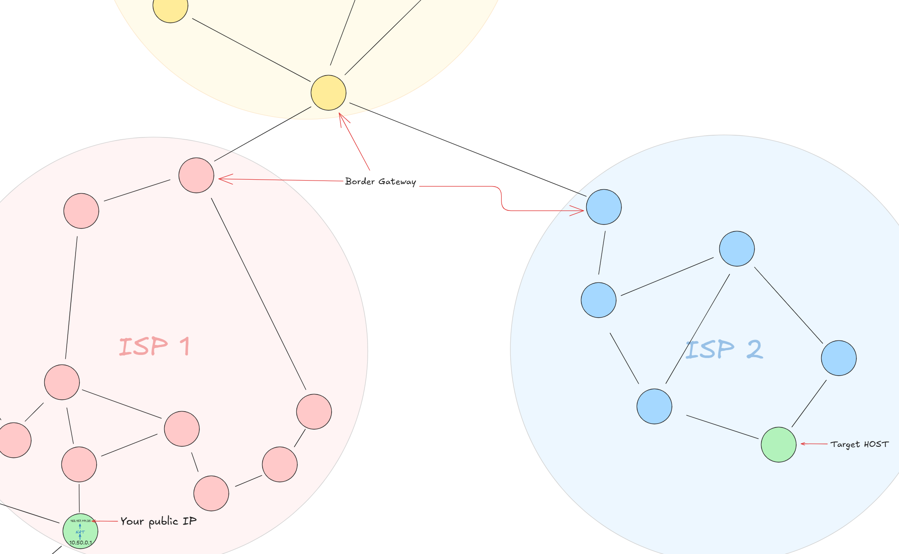
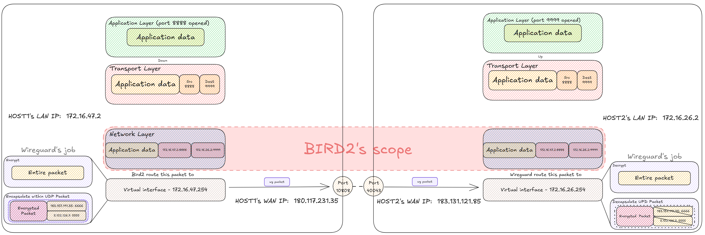

有一台公网服务器接入DN11还是挺方便的, 主要用到的工具有两个:
1. [Wireguard](https://www.wireguard.com/#:~:text=WireGuard%C2%AE%20is%20an,in%20the%20industry.) (创建安全隧道)
2. [Bird2](https://bird.network.cz/?get_doc&v=20&f=bird-1.html#ss1.1) (负责不同AS之间的路由)

## 前置知识

DN11可以看成因特网 (Internet) 的缩小版, 它由很多独立的网络组成, 即[自治域 (AS)](https://en.wikipedia.org/wiki/Autonomous_system_(Internet)); 每个自治域由[ISP](https://en.wikipedia.org/wiki/Internet_service_provider)管理, 我们说的 "上网" 就是接入了ISP, 让ISP给你分配一个公网IP地址, 你的数据包从你的路由器 (这里指家庭路由器) 出发, 经过ISP的边界网关, 到达其他ISP的边界网关, 再到达目标ISP的边界网关, 最后传递到目标主机.

BGP解决的是如何选择在不同AS之间跳跃的最优路径; 每个边界网关都存储了一个路由表, 边界网关会根据数据包的目的地址和路由表决定这个数据包的下一跳去哪个AS.



现在来到DN11, 每个接入DN11的成员都需要有独立的ASN和网段, 二者是对应关系, 在[成员注册表](https://github.com/dn-11/registry)统一管理. 比如我申请的网段和ASN分别为`172.16.47.0/24`, `4220085757`; 我在Wireguard创建的虚拟内网[^2]中就扮演了因特网里面的ISP, 拥有独立网段和ASN.

可以看看DN11的[实时拓扑图](https://status.dn11.top/#/bgp/DN11).

## 配置Wireguard

用来建立对等会话 (peer), 柏师傅的[`wg-quick-op`](https://github.com/dn-11/wg-quick-op)丰富了原版`wg-quick-go`的功能, 先运行`wg-quick-op install`, 然后到配置文件 (`/etc/wireguard.your_wg_interface_name.conf`)进行虚拟网口和peer的配置, 如果配置没问题的话, 在运行`wg-quick-op up <interface name>`后, 脚本会自动帮你做以下几个事情:

1. 在你的系统内创建一个虚拟网口
2. Wireguard开始监听`0.0.0.0:port`
3. 执行`PostUp`指令, 分配我先前配置的地址`172.16.47.254`给这个网口, 现在这个网口有了一个IP地址

4. 与对端peer握手, 建立连接

完成之后, 应该就可以ping通对端IP[^1]了, 可以使用`ifconfig`查看刚刚建立的虚拟网口:

```shell
$ ifconfig
wg0: flags=209<UP,POINTOPOINT,RUNNING,NOARP>  mtu 1420
        inet 172.16.47.254  netmask 255.255.255.255  destination 172.16.26.253
        [ ... ] skipping stuff

eth0: flags=4163<UP,BROADCAST,RUNNING,MULTICAST>  mtu 1500
        inet 172.17.24.224  netmask 255.255.192.0  broadcast 172.17.63.255
    	[ ... ] skipping stuff
```

## 配置Bird2

DN11使用[Bird2](https://bird.network.cz/?get_doc&v=20&f=bird-1.html#ss1.1:~:text=BIRD%3A%20Well%2C%20we,the%20IPv6%20protocol)实现BGP, 按照柏师傅的wiki里面配置就好

使用`birdc s p`看到我的`wg0`网口为`Established`就代表已经接入DN11了:

```shell
$ sudo birdc s p
BIRD 2.17.1 ready.
Name       Proto      Table      State  Since         Info
device1    Device     ---        up     2025-07-05
kernel1    Kernel     master4    up     2025-07-05
static1    Static     BGP_table  up     2025-07-06
pipe1      Pipe       ---        up     2025-07-06    master4 <=> BGP_table
wg0        BGP        ---        up     2025-07-06    Established
```

## 探索


Wireguard为我们创建了一个虚拟局域网[^2] , Bird2运行在此之上:



数据包通过BGP在不同AS之间穿梭; 从不同AS之间的跳跃由边界网关负责, 我们可以用`traceroute <ip>`看看目的地为`172.16.4.1`的数据包是怎么走的:

```shell
$ traceroute 172.16.4.1
traceroute to 172.16.4.1 (172.16.4.1), 30 hops max, 60 byte packets
 1  172.16.26.253 (172.16.26.253)  30.135 ms  30.076 ms  30.055 ms
 2  10.255.1.1 (10.255.1.1)  36.032 ms  35.785 ms  35.997 ms
 3  172.16.4.66 (172.16.4.66)  43.596 ms  43.547 ms  43.528 ms
 4  172.16.4.1 (172.16.4.1)  55.591 ms  55.422 ms  55.605 ms
```

除了`172.16.4.1`外, 经过的其他IP应该都是边界网关, 并且属于各自的AS. 经过的第一个IP: `172.16.26.253` 就是我的peer, 同时也是网段`172.16.26.0/24`的边界网关.

现在有一个小问题: 我怎么知道要发送给`172.16.4.1`的数据包下一跳到哪里?

执行`birdc`进入bird命令行界面, 使用`show route`看看路由表, 有这么一行:

```shell
Table master4:
[ ... ] skipping stuff
172.16.4.0/24        unicast [wg0 15:37:51.246] * (100) [AS4220084444i]
        via 172.16.26.253 on wg0
```

即所有目的地IP在`172.16.4.0/24`网段内的数据包都要通过`wg0`网口发送, 到达另一个AS的边界网关`172.16.26.253`, 由于我和对面都是单一的公网服务器, 所以边界网关应该就是服务器本身.

关于学校内网接入, 咕咕咕, 开学再说.


---

[^1]: 即`PostUp`内的`<another tunnel IP>`

[^2]: 可能并不准确, LAN应该在数据链路层, 而Wireguard是操作在网络层的; 但从用户的角度来看, 概念上是合理的.
