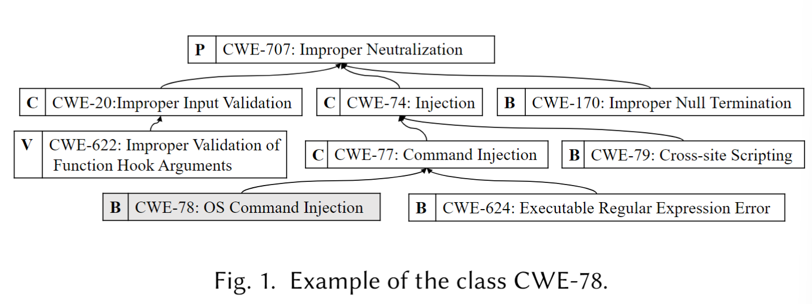
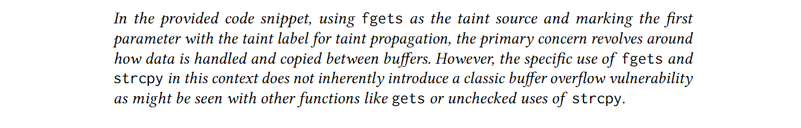

## Introduction

***General Idea.***    文章使用LLMs协助人工对二进制文件进行污点分析, 与传统的污点分析 (源 → 污点传播 + Sanitizer → 汇) 的流程不同, 它从危险函数调用点sink (使用LLMs识别) 开始向反方向构建`(函数; 参数)`调用链, 然后修剪非外部可控的数据源source (也使用LLMs识别) 同时不使用Sanitizer以防止假阴性, 得到危险流 (Dangerous Flows, DFs), 这些危险流处理后成为LLMs的Prompt序列, 最后由LLMs负责完成漏洞判定. 此方法解决了传统人工二进制污点分析时对代码语义理解和漏洞模式识别的高要求难点.

***Challenges.***    提示词工程会严重影响LLMs的性能; 同时LLMs的上下文有限, 需要合理编码代码上下文, 一个静态二进制文件包含的上下文会一下把LLMs喂饱; 再加上超长上下文带来的幻觉问题, LLMs要接收的信息必须少而精.

***LATTE.***    **L**LM-Powered Bin**a**ry **T**ain**t** Analyz**e**r, 是首个将污点分析和LLMs结合的技术, 文章指明其核心通过代码切片构建Prompt序列, 整体流程大致如下:

研究人员使用来自Juliet Test Suite的数据集 (含有污点式漏洞的二进制文件, 去符号) 进行测试, 在准确率和F1分数上都表现很好, 准确率 (Accuracy) 和 F1 二者互补[^1], 前者关注总体正确率; 后者只关注正类 (实际为正, 检测也为正) 的检测质量; 计算公式分别为:

$$
\begin{gather*}
Accuracy = \frac{TP+TN}{TP+TN+FP+FN} \\
Precision = \frac{TP}{TP+FP} \\
Recall = \frac{TP}{TP+FN} \\
F1 = \frac{2 \cdot Precision \cdot Recall}{Precision + Recall}
\end{gather*}
$$

Precision高表示多抓到; Recall高表示少报错, 都只关注正类的检测质量; 其在测试项目中识别sinks和sources实现全中; 实战测试嵌入式设备固件发现10个新高危CVE, 比同类竞品更优. ~~(论文前面一段说自己发现了119个独特bugs, 后面又说发现了117个独特bugs, 好奇怪).~~

## Background

污点分析可有效发现由外界输入引发的漏洞, 我们叫它污点式漏洞. 文章想要根据CWE (Common Weakness Enumeration) 对其进行统一分类. CWE是个树状关系, 用来表示不同抽象级别的弱点类型, 抽象级别从高到低大致为PCBV, 具体来说: pillar > class > basic > variant. 举个例子:

要想按照CWE对漏洞贴标签/分类, 那么漏洞归类到CWE的哪个抽象层级是个问题, 为了避免一个漏洞被贴上多个标签, 造成重复分类, 作者规定三条"只给一个最合适的标签"的分类方案:

1. 优先对齐CWE的基础层级 (basic), 次选变体层级 (variant), class粒度太大, variant粒度太细, basic 被设计为 *概念上* 相互独立, 自然选它.

2. 如果一个漏洞同时属于两个base级别的CWE, 再具体的分类要基于漏洞触发点 (面向sinks), 不在乎污点数据源 (sources). 文章举了个例子: 如果有一个漏洞既可以归为 CWE-78, 也可以归为 CWE-76, 那就要这么看: 命令注入漏洞 (CWE-78) (**sink**) 是由未检查的输入数据——等效特殊元素的错误中和 CWE-76 (**source**) 造成, 那么该漏洞将会被归为CWE-78 (**sink**), 而不是 CWE-76 (**source**), 因为CWE-76 (source) 很泛, 同样造成重复分类.

3. 第一个被触发的漏洞优先, 如果一整数溢出漏洞 (CWE-190) 导致缓冲区溢出 (CWE-680), 那将这个漏洞分类到CWE-190.

根据作者指定的分类规则, 下图展示了各大Analyzer支持检测的漏洞类型, LATTE技能点满:

污点引擎 (taint engine) 和污点规则 (taint rules) 是正交/解耦的, 意味着二者相互独立, 改变污点规则不会影响污点引擎, 反之亦然.

- 污点引擎: 具体实现污点跟踪的引擎.
- 污点规则: 让引擎识别污点, 及其传播, 清洗的规则集.

作者从引擎和规则两个维度讲传统分析的难处:

1. 实现污点引擎分析二进制文件很麻烦, 因为二进制制文件通常缺少符号, 数据类型, 并且受不同编译器, 优化选项, 目标架构的影响大. 就算看反编译代码, 结构和语义都不清楚. 所以先前的技术只能做出特定的假设来实现污点引擎.
2. 尽管有人使用过函数抽象和机器学习的方法来指定新污点规则, 但想要减少漏洞分析和后期分析的工作量, source, sanitization, sink的规则必然更加复杂的难点仍然不易解决. 总而言之, 高准度要求高复杂度.

LLMs在上游进行过大量广泛的数据训练, 要在下游使用LLMs去完成具体工作, 需要进行提示词工程或者微调, 二者任选其一. 比如 [Cline](https://cline.bot/), Curosr 用的就是提示词工程 (Agent 包括提示词工程, Agent ≈ Prompt + Tools + Iteration) 来完成编码的具体工作. 微调需要额外数据来训练模型, 费钱, 而且LLMs已经在大语料库上进行训练, 所以作者采用提示词工程的方式让LLMs具备执行具体任务的能力.

## Motivation

显然, 源码漏洞分析工具的发展快于静态二进制文件分析工具, 因为反编译伪代码函数, 类, 变量名等信息都不全. SATC, FBI 使用人类专家和启发式算法来优化 Karonte 的规则, 降低了FN和FP, 但还是费时又费力, 为什么人工定义全面的污点传播规则和检查规则难? 文章下面列出了几个问题来让我们理解原因.

### Problem 1. Determining Taint Sources and Initial Taint Labels

识别污点源[^2]可不容易, 除了C标准库函数 (`recv`, `fscanf`, `fgets`), 还有第三方函数 (`SLL_read`, `BIO_read`, `OpenSSL`) 都能接收外部数据. 识别污点源之后就要给各种返回值和参数贴污点标签, 这就要有强大的语义理解能力, 例如下图的`fscanf`. 你要理解它是干啥的, 这几个参数都啥意思, 才能知道第三个参数`&a`是携带外部环境的输入数据的, 这样才能贴上污点标签. 第三方函数的相关文档往往并不完善, 甚至没有, 贴污点标签很难.

### Problem 2: Defining Rules to Propagate Taint Labels

污点标签的传播通过赋值 (`b = a`), 计算 (`e = b + 1`)等等, 分析数据依赖可以获得传播路径. 在传播过程中还存在净化 (Sanitization):

1. 当把安全数据赋值到污点数据所在内存区域时 (`a = 1` line 5)进行净化.
2. 有关语义的复杂净化, 一般的净化规则会导致污点标签在 line 10 处的传播终止, 没有考虑后续 line 17 的整数溢出.

### Problem 3: Formulating Inspection Rules for Various Sinks and Vulnerabilities

首先需要识别sinks, 根据潜在的CWE制定检查规则, 比如 line 9 的printf是个sink, 它可能触发[CWE-134](https://cwe.mitre.org/data/definitions/134.html)或者[CWE-190](https://cwe.mitre.org/data/definitions/190.html); 要看能不能触发CWE-134, 检查规则就要检查第一个参数(在这里是`%d`)是否被污染; 要看能不能触发CWE-190, 检查规则就要基于第一个参数看第二个`(ulong)e`是否被污染. 这只是一个简单的例子, 实际人工来做出准确全面的规则是很大的工作量.

### Advantages of LLMs in Vulnerability Inspection

LLMs能像人一样进行语义理解, 作者用一个Prompt模板直观地展示了这一点:

***Code Snippet without Vulnerabilities.***    Fig. 3 没有漏洞, GPT-4正确给出了分析结果:

***Vulnerable Code Snippet with `fgets`.***    Fig. 4 有缓冲区溢出漏洞:

***Vulnerable Code Snippet with `recv`.***    

## Overview of LATTE

如何构建有效的Prompt来指示LLMs进行漏洞检查, 这里有两个挑战:

---

***Challenge 1: Large Code Size and Complexity vs. Limited Token Context of LLMs.***

***—Solution to Challenge 1.***    生成危险流 (Dangerous Flows/DF = 函数切片 + 数据依赖) 压缩上下文.

---

***Challenge 2: Obscurity of Vulnerability Discovery vs. Generality of Instructions for LLMs.***    漏洞发现天生就带有探索性质, 把一大堆漏洞模式都塞进Prompt里面是不合实际的. 如果使用few-shot方式, 新型漏洞不一定长得像示例, 容易漏掉. 所以给LLMs的Prompt要有普遍性, 即使漏洞类型改变也可以进行检查.

***—Solution to Challenge 2.***    作者从人工审计中获得灵感, 人工审计会首先审计每个在危险流中的函数, 不会根据具体的漏洞示例进行分析. 我们先有可疑数据流 (包括DF), 然后一步步让LLMs去检查每个数据流中的单个函数, 即把大任务拆成小任务, 第一性原理. 具体方式是Prompt Sequence, 每一轮都有明确输入, 目标, 与输出格式, 上一轮的结果会作为下一轮的上下文.

---

### Workflow of LATTE

LATTE包括三个模块:

1. **Preprocess**: 使用反汇编和反编译得到函数 + 代码结构.
2. **Code slicing**: 从sink分析数据依赖, 倒着找出到达sink的函数调用链, 再找到source对上这些调用链, 得到DF.
3. **Prompt construction**: 取每条DF, 拆成正向提示序列 (source → … → sink), 一段函数一问, 这样可以减少上下文负担.

下面对应以上三个模块来讲:

***Phase 1: Function Call Chain Extraction.***    这个阶段, 首先利用LLMs识别危险程序点 (sinks), 即执行危险操作的外部函数和相关参数. 然后从sinks进行反向数据依赖性分析, 包括过程内 (intraprocedural) 和过程间 (interprocedural)分析, 得到一堆函数调用链:

***Phase 2: Dangerous Flow Generation.***    每个函数调用链都会有一个"头", 但这些"头"不一定都是接收污点数据的, 它只是回溯自某个 sink 得到的一条调用路径; 同时也会有多个数据接收点 (`recv`, `fgets`, `getenv`)接收污点数据, 污点数据可能流入同一个sink.

这里解释下定义, 在这条调用链 $CC = [f1, f2, …, fn]$ 里, 起点函数 f1 的函数体中, 必须至少有一次对"污点源"API 的调用 (即把不可信外部数据读进来的地方, 如 `recv`/`fgets`/`getenv`). 这样保证危险流从真实的外部输入开始. 若整条链上没有任何 source 调用, 则这条链不会成为危险流.

***Phase 3: Prompt Sequence Construction.***    取每个危险流构造Prompt Sequence (函数粒度), 作者设计了三个Prompt模板:

1. **Initiate a conversation**: 绑定危险流的第一个函数 f1, 分析函数体明确哪一个是污点源/输入起点, 要求做数据别名, 数据依赖与污点分析.

2. **Function-by-function progression template**: 对危险流中的每个后续函数各问一轮, 递归构建用于数据流分析的Prompt, 一直干到末尾.

3. **Final vulnerability analysis**: LLM进行漏洞判定.

## LATTE design

在使用Prompt Sequence让LLMs分析DF时 (**phase 3.2**) 并没有像传统污点分析那样进行Sanitize和检查漏洞, 这两个步骤留在了 **Phase 3.3**.

### Phase 1: Function Call Chain Extraction

该过程分两步, 识别sinks (i.e., Vulnerable Destinations, VD) 和反向切片.

1. **Identification of Vulnerable Destinations**: 对于不同类型的函数, 有不同的处理方法, 作者分了三种:
   - Externally linked: 放进 $F_{external}$ 列表.
   - Dynamically linked: 动态链接会保留符号名, 直接把 *函数名* 丢给LLM.
   - Statically linked: 把 *函数名* 换成 *函数体* 丢给LLM让它分析是否是sink.

现在开始利用LLM确定一个函数是否是sink—构建Prompt template = Analyst persona + one-shot + No additional explanation; 这里给出了一个例子:

得到的`(𝑓; Para)`会被存到一个名为 $sinks$ 集合内, 以便复用. 此分析只需要在$sinks$没记录该函数的时候执行.

最后得到的是`(sink, Para)`的集合, 比如 `{(printf; 1), (printf; 2), ...}`. 由于函数间的调用关系复杂, 所以只记录了函数信息, 没有调用点信息. 确定sinks之后还要一步, 即对整个二进制文件遍历得到调用点, 形成VD列表, 比如Fig. 2 的VD列表为: `{(9; printf; e), (15; printf; c), (18;printf; d)}`.

2. **Backward Slicing**: 取VD列表内的每个三元组在函数调用图[^3]上 *根据数据流* 进行反向深度优先遍历, 得到函数调用链 (Call Chains, CCs). 咱们首先看VD所在的函数, 姑且将它命名为 $f$ 吧. 作者制定的算法首先进行**过程内** (intraprocedural) 数据依赖分析——即在函数 $f$ 内部使用流不敏感 + 路径不敏感 + 指针别名数据依赖分析, 如果有循环导致的路径重复, 直接退出. 如果VD的污点实参直接依赖于函数 $f$ 的形参 (说白了是来自上一个函数的调用传参 e.g., `f(x){foo(x)}`), 分析就直接转入**过程间** (Interprocedural) 数据依赖分析——看谁调用了谁, 分析深度最大50 (实际二进制很少那么深). 作者又举了个例子让我们理解:

根据数据流, 这里是`CCs = {[fun2, fun1], [· · · , fun3, fun1]}`.

### Phase 2: Dangerous Flow Generation

主要目标是找到可以让外部输入流入VD的CC, 分两步:

1. **Source Identification**: 使用了Sink Identification/Vulnerability Identification同样的方式让LLM识别:

识别之后的函数会被放到一个 $sources$ 集合, 以便复用. 当然LLM分析肯定会出错, 这里需要人工改成`(fscanf; >2)`, 但是只需要 "slight expert experience."  ~~(是的, 是不是有点草台, 没错, 我也这么觉得).~~

2. **Matching and Deduplication**: 有了 $sources$ 集合 (i.e, `{(source; Para), ... }`), 我们可以把集合中的`source` (这玩意还是个函数, 我们还是叫他 $f$ 吧) 对应到刚刚分析的出来的CCs, 对应不到就说明这条CC没有能接收外部输入的函数, 舍去; 如果对应到那就继续分析`Para`的流向, 与CCs中的污点数据流向重合那就放入候选危险流 (Candidate Dangerous Flow, CDF). 由于一个拥有多个 $f$ 的CC可以产生多条CDF, 我们只保留最长的那条; 如果两个CC产生相同的CDF链或子链[^4],  我们合并相同的CDF链, 清除相应的子链, 最后得到DFs. 文中给了个例子, 这里直接翻译原文了:

   我们使用 `CCs = {[fun2, fun1], […, fun3, fun1]}` 在Fig 8. 中说明上述过程. 在 `fun2` 中, 污点源 `fgets` 被调用, 并且第一个参数 a 与 `func1` 的参数 b 存在数据依赖关系 (图 8 的第 18 行中的 `snprintf` 将 a 存储在 b 中). 因此, `[fun2, fun1]` 是一个候选危险流 (CDF). 我们假设 `CC = […, fun3, fun1]` 在递归分析后形成了 `{[fun5, fun4, fun3, fun1], [fun6, fun4, fun3, fun1]}`. 如果污点源在 `fun4` 和 `fun6` 中被调用, 相应的 CDFs 是 `{[fun4, fun3, fun1], [fun6, fun4, fun3, fun1]}`. 但是 `[fun4, fun3, fun1]` 是 `[fun6, fun4, fun3, fun1]` 的子链, 因此前者被丢弃. 最终的危险流 (DFs) 是 `{[fun2, fun1], [fun6, fun4, fun2, fun1]}`. 

### Phase 3: Prompt Sequence Construction

作者设计Prompt时遵循的规则:

- 明确陈述分析任务
- 丰富Prompt内容
- 分析师角色设定
- 大任务分解成小任务
- 制定输出格式

下面是作者给出的 "三个可以实例化作用在每个DF上的Prompt模板":

1. **Start Template**: 输入为危险流DF的上下文,  及其第一个函数`(<function>, <parameter>)`, 和第一个函数的函数体代码 , 其中 `<function>` 为DF (如 `[fun2, fun1]`) 那么 `fun2` 的函数, 和函数体, 和参数就被作为输入. 输出被标记为tainted的参数, 或者是否净化.

2. **Middle Template**: 危险流DF的上下文, 以及当前所处位置, 当前函数哪些参数被标记为tainted, 当前函数体代码. 输出为被标记为tainted的参数, 或者是否净化. 如果当前函数体内有源函数, 那就加上括号的内容.
3. **End Template**: 输入为污点分析结果, 让LLM给出最终判定, 是不是漏洞, 属于什么CWE类型, 并给出理由.

特别地, 当DF只有一个函数的时候, 只留下 **Start** 和 **End** Template, 作者又举了个例子:

## Evaluation

接下来是经典的评估环节, 在研究评估这一段, 作者使用问问题的方式来评估自己的研究成果 (Research Question):

**RQ1**: LATTE检查漏洞有多好? 从三个方面解释:

1. LATTE多有效? (Effectiveness)
2. LATTE多稳定? (Stability)
3. LATTE多高效? (Efficiency)

**RQ2**: LATTE识别sinks和sources多有效?

**RQ3**: LATTE提取DFs多有效?

**RQ4**: 提示词序列 (PS) 对LATTE的性能影响多大?

**RQ5**: LATTE能不能扩展到真实世界的二进制漏洞分析?

### Evaluation setup

本段在于交代实验如何实施和复现, 评测数据来源, 评测环境等, 用来支撑前面提出的RQs.

***Implementation.***    LATTE的实现基于两个东西: Ghidra, GPT-4.0. 把二进制分析掉分几步:

1. 把二进制加载到Ghidra.
2. 用Ghidra插件提取出必要信息.
3. LATTE提取出DFs.
4. LATTE用PSs指示LLM干活.
5. 把生成的每个结果分别存放在一堆文件中.

***Benchmarks.***    使用了 Juliet Test Suite 和 Karonte 数据集中选取 Benchmark 来评估RQ1 - RQ4 (Juliet无CWE-120的基准, 所以加上了 Karonte); RQ5的评估进行在真实世界的来自 Karonte 的固件数据.

***Baselines.***    选择了同类竞品 Emtaint 和 Arbiter 作为基线分别在 Juliet 和 Karonte 数据集上进行比较, 数据集不同当然Baseline也不同, 所以有两个Baseline. 他们没有找CodeQL, QueryX, Joern这些工具, 因为这些工具的性能很大程度上由人决定[^5], 由于 Karonte 的固件数据没有绝对答案 (没人标注这个固件是否存在漏洞), 所以只能记录 TP, FP两项指标.

***Metrics.***    Juliet Test Suite数据集的评估中使用了六个指标: TP, FN, TN, FP, Accuracy, F1 分数, 是不是很熟悉, 计算公式在文章开头有.

***Running Environment.***    所有实验都是在一个 Intel Core i7-8750H CPU, 64G RAM 的 Linux 工作站上进行.

### Vulnerability inspection (RQ1)

#### 1. Effectiveness

LATTE在从Juliet编译的, 去符号的二进制文件上进行漏洞检查因为CWE类型在同一个二进制文件上有重复 (树形结构), 作者只根据Juliet上面记载的CWE类型来看是否命中 ~~(这是不是会拉低准确率?)~~ 

这里作者说明了CWE-190的情况, Arbiter 依赖符号表, LATTE不依赖, 这导致LATTE在TP落后 318 个, 但是加上符号表后, LATTE能超过Arbiter 485 个.

***Analysis of FNs and FPs.***    作者说是生成DFs和GPT的创造性 (原文是 "Creativity of GPT-4.0", 这里应该是幻觉?) 问题, 后面会细讲.

***GPT-4.0 vs. GPT-3.5.***    作者也用GPT-3.5测试了LATTE, 显然GPT-4.0更胜一筹, 结论是LATTE的检测漏洞的有效性随着LLM的能力提高而提高.

#### 2. Stability

这段讲了LLM的temperature 参数的影响, 作者进行了两项实验, 分别评估LATTE的稳定性和temperature对检查结果的影响.

***Analysis Stability at Temperature 0.5.***    作者在temperature 0.5的条件下进行了五轮测试, 测试五轮得到的交集由蓝色条标出. 漏洞召回率 (计算公式开头有写) 分别为: 90.42%, 88.42%, 58.04%, 和 82.5%, CWE-190召回率低的原因与上面一致, 是由于数据类型判定错误 (LLMs creativity) 和没有函数名称 (Symbol Table) 造成的.

***Impact of Temperature on Analytical Results.***    下图给出了准确度在不同temperature下的箱线图:

以 0.4 为分界, 在0.4之前, 检查结果分布更加密集, 表明更稳定; 在0.4之后, 分布广, 检查结果更分散; 按中位数来看大致呈正态分布, 0.4 - 0.6 之间的准确度高; 所以最佳的temperature选择应该在0.4 - 0.6 之间, 兼顾准确率和稳定性.

#### 3. Efficiency

这里看的是时间和钱, 在表2里有展示, 主要时间花在了与GPT-4.0的对话上; 关于钱, 作者说总比雇一个人工分析师来的好, 而且随着LLM进步, API cost 也会变得更低, 文章只给出了分析出DF所需的花费: 0.35刀.

***Answer to RQ1.***    平均准确率为77%, LATTE优于Emtaint 和 Arbiter. 此外平均召回率是79.85%, 说明LATTE的检查结果是稳定的.

### Sink and Source Identification (RQ2)

***Answer to RQ2.***    LATTE平均精确度为82.1%, 覆盖率 (召回率)为 100%. 这意味着所有sink & source pair都被召回, 其识别的所有sink & source pair中平均有82.1%为正确 (TP) 的

### Dangerous Flow Extraction (RQ3)

***Answer to RQ3.***    平均精确度为100%, 平均召回率为95%. 这意味着LATTE提取出来的DFs有100%是真DF, 在所有实际存在的DFs中LATTE提取出了95%的DFs.

对于假阴性, 作者将原因归为:

1. Ghidra 反编译错误, 比如参数识别错误
2. 纯虚函数调用, 虚函数没有函数体, 无法分析.

### Prompt Sequence Construction (RQ4)

作者尝试了5种不同的方式来构建提示词序列, 改了两个参数:

1. 代码切片的粒度
2. 任务描述的细节程度/粒度

将这些修改参数后的5个方案所得到的准确度与原来的PS (Their best design) 进行比较

1. 让代码切片为整个程序, 即把整个反编译出来的代码一次性丢给LLM
2. 把整个DF丢给LLM
3. 最小粒度的切片, 只保留有关参数的行
4. 去掉角色指定
5. 不要那么多Prompt模板了, 直接一把梭, 告诉我漏洞判定结果

***Answer to RQ4.***    与基于不同代码切片粒度和分析任务描述粒度构建的提示 (提示序列) 相比, LATTE 在检测二进制漏洞方面表现出更高的准确性. 

### Real-world Vulnerability Inspection (RQ5)

作者扫了49 个真实固件, 在255个alert当中有222是TP, 有119个独特bugs ~~(所以到底是117还是119)~~. 可怜的 Karonte 和 Arbiter 被拿来比较, TP和准度都比他俩高, 时间还短, 作者提到了 Karonte 和 Arbiter 依赖于符号执行, 所以时间长. Emtaint 的TP数量虽然多, 但是很多是同一个bug的重复的数据流, 虽然LATTE漏掉了16个 Emtaint 发现的独特bugs (作者给出的理由是指针别名识别不准导致的调用链缺失), 但LATTE发现的这119个bugs中有21个是Emtaint没发现的.

***Answer to RQ5.***    LATTE发现了119个独特bugs ~~(所以是119喽)~~, 总体由于同类竞品

## Discussion

LATTE不能有效检查逻辑, 竞态, 和复杂数学计算漏洞, 这会导致污点标记过多/过少, 复杂漏洞需要提取更多的上下文比如, 资源锁, 中断向量表, 共享内存地址, 如何让丢给LLMs的上下文更加有效是将来研究的一个方向; 二进制分析这块, 难点有三个, 指针别名 (两个指针引用同一内存), 虚函数/间接调用, 函数内联; 识别库函数这块, 大部分都是系统库函数 (glibc), 动态链接所以会保留符号, 降低了错误发生率; 评估指标这块, 精准度 (Precision) 和 召回率 (Recall) 二者是个权衡, 分析严格 -> FPs降低, Pre提高, 反之, 分析不严格 -> Recall提高, Pre降低; 二进制文件的保护这块, 被混淆的, 加密的二进制文件需要额外操作. 有趣的是, 如果命名函数为 "no_vulnerability" 会干扰LLM的识别效果.

## Conclusion

核心是使用友善的提示词工程让LLM协助人工分析, 效果也不错, 使用代码切片, 分解任务的方式解决了上下文的问题. LLM在根据我们给它的上下文"预测"漏洞的有无, 所以事后要人工检查, 它不是数据库或严格逻辑机, 所以更灵活, 而现在的Agent的工具调用可以让LLMs得到有效的反馈, 同时也优化了上下文, 单论提示词工程有局限性, 后续可以考虑加入实证性的工具类协助LLMs.

## References

[^1]: 二者均考虑的原因: 显然, 在 1000 样本, 10 个真漏洞(正类), 990 个非漏洞(负类), 如果一个工具测出来全阴: $F1 = 0$; $Accuracy = 990 / 1000 = 99\%$, 这种情况下就需要二者均考虑了.

[^2]:  Sources, 一个可以让危险数据进入程序运行状态的程序点, Program Points = API + Other Execution Location

[^3]: 论文里使用了Ghidra进行调用图分析. 具体来讲, 作者通过遍历Ghidra识别到的函数们得到了每个函数的内存地址

[^4]: 比如`CC1 = {main, A, B, sink}`, `CC2 = {main, X, A, B, sink}`, 产生的CDF可以是相同的: `CDF = {A, B, sink}`

[^5]: CodeQL, QueryX和Joern等工具通过运行自定义的手写查询/规则来工作, 这些查询/规则由人编写, 用于查找特定的错误模式; 这意味着他们的结果由自定义的查询/规则的质量决定.
