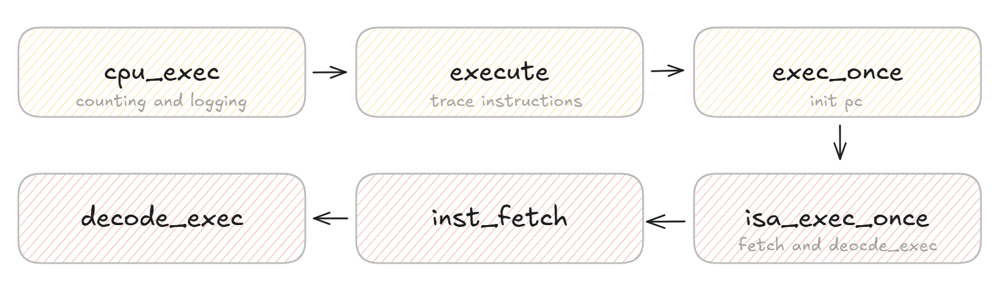

## pa1: Perform value-based checks for macros, using a macro

If we want to check whether a macro exists, we can simply use `#ifdef`. Here, we want to test whether a **macro exists** and **has a specific value** using a function-like macro.

Let's design a macro with the return value of `0` or `1`:

```c
// test if a boolean macro is defined
ISDEF(macro)
```

If we have:

```c
#define FOO x
if(ISDEF(FOO)) {
	printf("FOO is a boolean value!");
}else { // otherwise
    printf("FOO is either undefined or not a boolean value");
}
```

The definition of `ISDEF` will be:

```c
#define __P_DEF_0 X,
#define __P_DEF_1 X,

#define concat_temp(x, y) x ## y
#define concat(x, y) concat_temp(x, y)

#define choose_2nd(a, b, ...) b
#define MUX_TMP(p, a, b) choose_2nd(p a, b)
#define MUXDEF(macro, a, b) MUX_TMP(concat(__P_DEF_, macro), a, b)
#define ISDEF(macro) MUXDEF(macro, 1, 0)
```

The prerequisites for understanding the snippet are some rules as per the C standard:

1. Arguments passed to the "function" (function-like macro) are expanded first if the argument is a macro at the call site.
2. However, arguments will not be expanded if they are the operand of `#` (stringizing) or `##` (token-pasting).

A macro for **conditional compilation** can also be implemented — "if a certain macro is defined, then keep a certain piece of code":

```c
#define __IGNORE(...)
#define __KEEP(...) __VA_ARGS__
#define IFDEF(macro, ...) MUXDEF(macro, __KEEP, __IGNORE)(__VA_ARGS__)
```

Note that `__KEEP` and `__IGNORE` won't get expanded during the invocation of `MUXDEF` unless there are arguments passed to `__KEEP` and `__IGNORE`.

## pa1: The CPU execution process

The core CPU execution process in NEMU is fetch, decode, and execute.



This consequently involves two structs: `Decode` and `CPU_state`:

```c
// 'nemu/include/cpu/decode.h'
typedef struct Decode {
  vaddr_t pc;
  vaddr_t snpc; // static next pc
  vaddr_t dnpc; // dynamic next pc
  ISADecodeInfo isa;
  IFDEF(CONFIG_ITRACE, char logbuf[128]);
} Decode;
```

```c
// '/nemu/src/isa/riscv32/include/isa-def.h'
typedef struct {
  word_t gpr[MUXDEF(CONFIG_RVE, 16, 32)]; // general purpose registers
  vaddr_t pc;
} MUXDEF(CONFIG_RV64, riscv64_CPU_state, riscv32_CPU_state);

// '/nemu/include/isa.h'
typedef concat(__GUEST_ISA__, _CPU_state) CPU_state;
```

- `Decode` is the **temporary context** for each instruction; it defines `snpc` as the static next PC (`pc + 4`) and `dnpc` as the actual address of the next instruction—mainly due to branches and jumps.
- `CPU_state` is the **overall architectural state** that gets changed after each call to `exec_once()`.

## pa1: Recursively evaluate an expression

This is a familiar topic: the key idea of recursion is to divide a big problem into smaller ones and solve them. The following steps are involved when orchestrating a recursive function:

1. Tackle the **error** cases.

2. Tackle the **basic problem** cases.

3. Tackle the **non-basic problem** cases; this is commonly done by calling the function **itself** to perform the division of the problem.

Put succinctly, the fundamental role of a recursive function is to **handle different cases**.

### The cleverness of `check_parentheses`

```c
static bool check_parentheses(int p, int q) {
  if (tokens[p].type != '(' || tokens[q].type != ')') return false;
  int balance = 0;
  for (int i = p + 1; i < q; i++) {
    if (tokens[i].type == '(') balance++;
    else if (tokens[i].type == ')') balance--;
    if (balance < 0) return false;
  }
  return balance == 0;
}
```

We assume the first and last tokens form a matching pair and check only the interior tokens from `p + 1` to `q - 1`. If they are balanced (i.e., first `(` then `)`), the assumption holds and the function returns `true`. If they are imbalanced (i.e., first `)` then `(`), for example in `(4 + 3) * (2 - 1)`, the function returns `false`. We therefore maintain a `balance` variable to implement the checking function. In the balanced case, `balance` will always be non-negative thourghout the scan.

### Skip over parentheses

We should find the main operator (the operator with **the lowest precedence**) only outside the parentheses. Tokens inside `()` are not considered:

```c
static int find_main_op(int p, int q) {
  int main_op = -1;
  int min_precedence = 100;
  int balance = 0;
  // Traverse all the tokens
  for (int i = p; i <= q; i++) {
    // Jump through the parentheses
    if (tokens[i].type == '(') {
      balance++;
      continue;
    }
    if (tokens[i].type == ')') {
      balance--;
      continue;
    }
    if (balance != 0) continue;

    // Find the operator with the lowest precedence
    int precedence;
    switch(tokens[i].type) {
      case '+': case '-': precedence = 1; break;
      case '*': case '/': precedence = 2; break;
      default: continue;
    }

    if (precedence <= min_precedence) {
      min_precedence = precedence;
      main_op = i;
    }
  }
  return main_op;
}
```

### Handle errors in the recursion of eval()

The `eval()` function takes the boundaries of the expression and returns the evaluation result, but what if an error occurs?

A `success` boolean variable is used as a **global error flag**. `eval()` passes its pointer on each recursive call:

```c
static word_t eval(int p, int q, bool *success){
    if( p > q ){ ... }
    else if ( p == q ) { ... }
    else if(check_parentheses(p, q) == true) { ... }
    else{
        int op = find_main_op(p, q);
        [ ... ]
        word_t val1 = eval(p, op - 1, success);
        if (!*success) return 0;
        word_t val2 = eval(op + 1, q, success);
        if (!*success) return 0;
        switch(tokens[op].type){
          case '+': return val1 + val2;
          case '-': return val1 - val2;
          case '*': return val1 * val2;
          [ ... ]
        }
    }
}

```

For instance, given the input `5 + (3 * zxcvbn)`:

```
eval(0, 6)  // "5 + (3 * zxcvbn)"
├── eval(0, 0)  // "5" → success = true, returns 5
└── eval(2, 6)  // "(3 * zxcvbn)"
    └── eval(3, 5)  // "3 * zxcvbn"
        ├── eval(3, 3)  // "3" → success = true, returns 3
        └── eval(5, 5)  // "zxcvbn" → success = false, returns 0
```

`eval(3, 5)` and `eval(0, 6)` terminate before completing evaluation. The error is successfully propagated to `cmd_x`:

```c
word_t expr(char *e, bool *success) {
  [ ... ]
  *success = true;
  return eval(0, nr_token - 1, success);
}

static int cmd_x(char *args){
  [ ... ]
  bool success = true;
  paddr_t addr = expr(arg2, &success);
  if (!success) {
    printf("Invalid expression for address.\n");
    return 0;
  }
  [ ... ]
}
```

### Conclusion

Of the three subsections above, two of them showed how a meticulously defined variable `balance` determines matching parentheses, and the last illustrated an error-handling method in recursive calls that avoids issues like silent failures, cascading errors, and unnecessary computation.

## References

- [https://en.cppreference.com/w/c/preprocessor/replace](https://en.cppreference.com/w/c/preprocessor/replace)
- [https://stackoverflow.com/questions/26099745/test-if-preprocessor-symbol-is-defined-inside-macro](https://stackoverflow.com/questions/26099745/test-if-preprocessor-symbol-is-defined-inside-macro)
- [https://en.wikipedia.org/wiki/Divide-and-conquer_algorithm](https://en.wikipedia.org/wiki/Divide-and-conquer_algorithm)
- [https://en.wikipedia.org/wiki/Backus%E2%80%93Naur_form](https://en.wikipedia.org/wiki/Backus%E2%80%93Naur_form)
- [https://en.wikipedia.org/wiki/Box-drawing_characters](https://en.wikipedia.org/wiki/Box-drawing_characters)

## Utilities for debugging

```c
// The upgraded version of `printf`
Log("Processing expression starting at position %d. Current substring: '%s'", position, e + position);
// The upgraded version of `assert`
Assert(len < TOKEN_BUF_SIZE, "Token string too long! Length: %d, Max: %d", len, TOKEN_BUF_SIZE - 1);
assert(len < TOKEN_BUF_SIZE);
// The upgraded version of `Assert` that implies this line of code should not be executed
panic("Unexpected token type %d in expression evaluation. This should not happen!", type);

```


