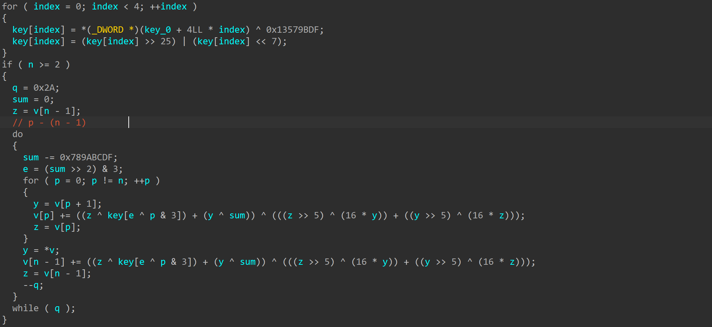

手生，练手

## Lesscommon

注意`x + y == (x ^ y) + ((x & y) << 1)`

```c
__int64 __fastcall one_rond_enc(context *context_struct, unsigned __int8 *p_input_i, _BYTE *p_output_i)
{
  interim_0 = v0 + key[0];
  interim_1 = v1 + key[1];
  for ( i = 1; i <= 12 ++i ) // 12 iters
  {
    interim_0 = interim_1 ^ ROL4(key[2*i] + interim_0, interim_1);
    interim_1 = interim_0 ^ ROL4(key[2*i] + interim_1, interim_0);
  }
}
```

```c
#include <stdio.h>
#include <stdlib.h>
#include <string.h>
#include <stdint.h>

unsigned int cipher[12] = {
    0xF3AB6F4C, 0xF6E27813, 0x991C9D86, 0x10CC85DE, 0x05EE28E8, 0x344B2192, 0x3C172843, 0x51735B56, 
    0x0F1D8A9F, 0x562C3497, 0x48699F42, 0xF58AD5A3
};

unsigned int key[26] = {
    0xE29075B4, 0xBBF28559, 0x01CEA3AA, 0xC32F06A9, 0x322BCBD2, 0x4B6947FD, 0xC65A9676, 0xE6EC21DE, 
    0xFC0D4679, 0xFBAD7BE4, 0x1E6A2032, 0x47150799, 0xFCA5733F, 0xD7D2FD1C, 0xA957923D, 0x94A4D5C6, 
    0xD8EBABA8, 0x7321CBE0, 0x5A0E0417, 0xA9F74244, 0x4616ADBD, 0xFB0925C4, 0x168F9ACC, 0xBE6AF2E2, 
    0xDB033BA9, 0xFFA2830E
};

uint32_t ROR4(uint32_t value, uint32_t count){
    count %= 32;
    return (value >> count) | (value << (32 - count));
}

int main(){
    for (int i = 0;i < 12;i++){
        uint32_t v0 = cipher[2 * i];
        uint32_t v1 = cipher[2 * i + 1];
        for (int i = 12; i >= 1 ;--i ) // 12 iters
        {
            v1 = ROR4(v1 ^ v0, v0) - key[2*i + 1];
            v0 = ROR4(v0 ^ v1, v1) - key[2*i];
        }
            v0 -=  key[0];
            v1 -=  key[1];

            cipher[2 * i] = v0;
            cipher[2 * i + 1] = v1;
    }

    printf("%s", cipher);
    
    return 0;
}
// flag{8c1fe64f-1085-48bb-947e-7635abc40f4c}
```

| Precedence | Operator                                                                                          | Description                                                                | Associativity |
| ---------- | ------------------------------------------------------------------------------------------------- | -------------------------------------------------------------------------- | ------------- |
| 1          | `()` `[]` `->` `.` `++` `--` (postfix)                                                            | Function call, array subscript, member access, postfix increment/decrement | Left to Right |
| 2          | `++` `--` (prefix) `+` `-` (unary) `!` `~` `*` (dereference) `&` (address-of) `sizeof` `_Alignof` | Unary operators, prefix increment/decrement                                | Right to Left |
| 3          | `*` `/` `%`                                                                                       | Multiplication, division, modulus                                          | Left to Right |
| 4          | `+` `-`                                                                                           | Addition, subtraction                                                      | Left to Right |
| 5          | `<<` `>>`                                                                                         | Bitwise left shift, right shift                                            | Left to Right |
| 6          | `<` `<=` `>` `>=`                                                                                 | Relational operators                                                       | Left to Right |
| 7          | `==` `!=`                                                                                         | Equality operators                                                         | Left to Right |
| 8          | `&`                                                                                               | Bitwise AND                                                                | Left to Right |
| 9          | `^`                                                                                               | Bitwise XOR (exclusive OR)                                                 | Left to Right |
| 10         | `\|`                                                                                              | Bitwise OR (inclusive OR)                                                  | Left to Right |
| 11         | `&&`                                                                                              | Logical AND                                                                | Left to Right |
| 12         | `\|\|`                                                                                            | Logical OR                                                                 | Left to Right |
| 13         | `?:`                                                                                              | Ternary conditional operator                                               | Right to Left |
| 14         | `=` `+=` `-=` `*=` `/=` `%=` `<<=` `>>=` `&=` `^=` `\|=`                                          | Assignment operators                                                       | Right to Left |
| 15         | `,`                                                                                               | Comma operator                                                             | Left to Right |

## Prover

用到了四个等式和四个校验和做约束z3求解, 注意Concat接收俩都要是BitVec, z3加和运算在有限域上, BitVec需要扩展.

```python
from z3 import *

def ROL4(x, n):
    # Correctly handle 32-bit rotation for BitVecs
    return (x << n) | (LShR(x, 32 - n))

def popcount8(x):
    # This function works as-is, Z3's operators handle the integer constants
    return (x & 1) + ((x>>1) & 1) + ((x>>2) & 1) + ((x>>3) & 1) + ((x>>4) & 1) + ((x>>5) & 1) + ((x>>6) & 1) + ((x>>7) & 1)

s = Solver()

V0 = BitVec('V0', 32)
V1 = BitVec('V1', 32)
V2 = BitVec('V2', 32)
V3 = BitVec('V3', 32)
V4 = BitVec('V4', 32)
V5 = BitVec('V5', 32)

s.add(V0 == 0x1B744424)
s.add((V1 & 0xFF) == 0x4E)
s.add((V5 & 0xFFFF0000) == 0)
s.add((V5 & 0xFF00) == 0xD500)

# Equation1
t = ROL4(V0, 5)
term1 = ROL4(V1, 11)
term2 = V4 ^ 0xDEADBEEF
term3 = (V2 - 0x61C88647) ^ t
s.add(term1 + term2 + term3 == 0xC356FD3A)

# Equation2
termA = ROL4(V3, 17)
termB = 0x27D4EB2D * V3
termC = V2 + 0x7F4A7C15
termD = ROL4(V5, 13) + 0x85EBCA6B * V1
v13 = termB ^ termC ^ termD
s.add(termA + v13 == 0xB5CCF033)

# Loop part
a0 = V3 ^ V0 ^ 0x13579BDF
b0 = ROL4(V2, 7) + V1

# n2=0
v9_0 = ROL4(0x9E3779B9 - (0x7A143595 * b0), 5)
b1 = ROL4(b0, 11) ^ b0 ^ v9_0 ^ a0

# n2=1
v9_1 = ROL4(0x9E3779B8 - (0x7A143595 * b1), 10)
b2 = ROL4(b1, 11) ^ b1 ^ v9_1 ^ b0

# Constraints on b1 and b2
s.add(b1 + b2 == 0x2FD99233)
s.add(ROL4(b2, 11) + ROL4(b1, 3) == 0x2BAF2082)

# Define bytes from V as a list for easier processing
All_Bytes = [Extract(i*8+7, i*8, V) for V in [V0,V1,V2,V3,V4] for i in range(4)]
All_Bytes.extend([Extract(7,0,V5), Extract(15,8,V5)]) # B20, B21

B0, B1, B2, B3, B4, B5, B6, B7, B8, B9, B10, B11, B12, B13, B14, B15, B16, B17, B18, B19, B20, B21 = All_Bytes

# Add known bytes
s.add(B0 == 0x24)
s.add(B1 == 0x44)
s.add(B2 == 0x74)
s.add(B3 == 0x1B)
s.add(B4 == 0x4E)
s.add(B21 == 0xD5)

# ** FIX APPLIED HERE **
# The integer 0 is replaced with BitVecVal(0, ) for zero-extension.
zero_ext = lambda b: Concat(BitVecVal(0, 8), b)

# Checksum3
sum_val = Sum([zero_ext(b) for b in All_Bytes])
checksum_3 = Extract(15,0, sum_val)
s.add(checksum_3 == 0x913)

# Checksum2
xor_val = All_Bytes[0]
for i in range(1, len(All_Bytes)):
    xor_val = xor_val ^ All_Bytes[i]
s.add(xor_val == 0x55)

# ** AND FIX APPLIED HERE **
# Checksum1
weighted_sum = Sum([zero_ext(All_Bytes[i]) * (i + 1) for i in range(len(All_Bytes))])
checksum_1 = Extract(7,0, weighted_sum)
s.add(checksum_1 == 0x43)

# Checksum
pop_sum = Sum([popcount8(b) for b in All_Bytes])
checksum = Extract(7,0, pop_sum)
s.add(checksum == 0x50)

if s.check() == sat:
    m = s.model()
    print("Solution found!")
    print("V0 =", hex(m[V0].as_long()))
    print("V1 =", hex(m[V1].as_long()))
    print("V2 =", hex(m[V2].as_long()))
    print("V3 =", hex(m[V3].as_long()))
    print("V4 =", hex(m[V4].as_long()))
    print("V5 =", hex(m[V5].as_long()))
else:
    print("No solution")
```

```python
hex_bytes= ['0x24', '0x44', '0x74', '0x1b', '0x4e', '0x84', '0x0f', '0xab', '0xf2', '0xdc', '0x30', '0x4e', '0x1f', '0xc4', '0x22', '0xa0', '0x55', '0x0b', '0xfe', '0x1a', '0x52', '0xd5']
hex_bytes = [int(s, 16) for s in hex_bytes]
key_1 = [0x03, 0x05, 0x09, 0x0B, 0x0D]
key_2 = [0xA5, 0x5C, 0xC3, 0x96, 0x3E, 0xD7, 0x21]
_ROR_ = lambda b, i: ((b >> (i)) | (b << (8 - i))) & 0xff

plain = []

for i in range(22):
    c1 = _ROR_(hex_bytes[i], (i % 5))
    c2 = (c1 ^ key_2[i % 7]) & 0xff
    temp = (c2 - (19 * i + 79)) & 0xff
    # 求乘法逆元
    c3 = (temp * pow(key_1[i % 5], -1, 0x100)) & 0xff
    plain.append(chr(c3 & 0xff))

print(''.join(plain))
# flag{7ac1d3e59f0b2468}
```

## Dragon

main反编译不全, 看到`jmp rax`寄存器混淆:


`alt + b`搜特征码去掉前三个混淆看到xxtea:




写脚本解密:

```c
#include <stdint.h>
#include <stdlib.h>
#include <stdio.h>
#include <string.h>

#define DELTA 0x87654321

void XXTEA_decrypt(uint32_t *v, int n, const uint32_t key[4]) {
    if (n < 2) return;  // At least two elements
    uint32_t y, z, sum, e;
    uint32_t p, q = 0x2a; // !
    sum = q * DELTA;
    y = v[0];
    do {
        e = (sum >> 2) & 3;
        for (p = n - 1; p > 0; p--) {
            z = v[p - 1];
            v[p] -= ((z >> 5) ^ (y << 4)) + ((y >> 5) ^ (z << 4)) ^ ((sum ^ y) + (key[(p & 3) ^ e] ^ z));
            y = v[p];
        }
        z = v[n - 1];
        v[0] -= ((z >> 5) ^ (y << 4)) + ((y >> 5) ^ (z << 4)) ^ ((sum ^ y) + (key[(p & 3) ^ e] ^ z));
        y = v[0];
        sum -= DELTA;
    } while (--q > 0);
}

int main()
{
    uint32_t key[] = {0x12345678, 0x9ABCDEF0, 0xFEDCBA98, 0x76543210};
    uint8_t cipher[] =
    {
        0xCE, 0xD6, 0xB4, 0x0E, 0x8B, 0xDE, 0x1D, 0x52, 0xFD, 0x24, 
        0xED, 0x21, 0x26, 0xEC, 0x10, 0xBA, 0x1C, 0x93, 0x39, 0x33, 
        0x7D, 0x0E, 0xDC, 0x46, 0x44, 0x9F, 0x46, 0xCC, 0x79, 0x70, 
        0xBA, 0x64, 0x77, 0x79, 0x77, 0x64, 0x98, 0x1C, 0x15, 0xB2, 
        0xA1, 0x5A, 0xCC, 0xDB
    };
    
    for (uint32_t index = 0; index < 4; ++index )
    {
        key[index] = key[index] ^ 0x13579BDF;
        key[index] = (key[index] >> 25) | (key[index] << 7);
    }

    int cipher_len_bytes = sizeof(cipher);
    int n = cipher_len_bytes / sizeof(uint32_t);

    XXTEA_decrypt((uint32_t *)cipher, n, (const uint32_t *)key);

    // Output
    printf("Decrypted data (as chars, %zu bytes):\n", cipher_len_bytes);
    for (size_t i = 0; i < cipher_len_bytes; i++)
    {
        if (cipher[i] >= 32 && cipher[i] <= 126) {
             printf("%c", cipher[i]);
        } else {
             printf("."); 
        }
    }
    return 0;
}
// flag{cbee3251-9cff-4542-bf15-337bb8df7f3f}
```

