[Official writeup](https://github.com/X1cT34m/NCTF2024/tree/main)

# gogo

> Input 40Bytes and create two ccoroutine (coroutVM), processing `20Bytes` respectively
> What we need: **hash table**; **bytecodes**

```plain
aaaaaaaaaaaaaaaaaaaabbbbbbbbbbbbbbbbbbbb
```

```assembly
00000000 struct main_coroutVM // sizeof=0x158
00000000 {
00000000     _16_uint32 reg;
00000040     _256_uint8 mem;
00000140     _chan_left_chan__4_uint8 instr;
00000148     chan_bool checkres;
00000150     map_uint8_main_handler instrSet;
00000158 };
```

## Method 1 - Static Analysis

> Find bytecode and hash table, then write a script to disassemble

### Bytecode

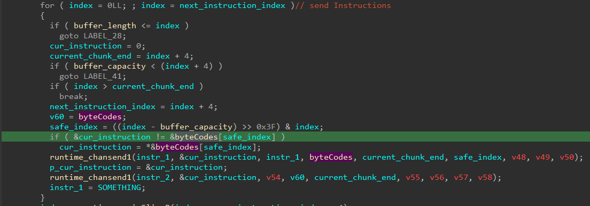

### Map1

> Each pair is set by:
> `runtime_mapassign(..., key_x[i], ...)` + `if(isGC)...` +  `*variable = &handler[j];`
> Extract the hash table

```c
// main.map.init.0
char *__golang main_map_init_0(
        __int64 a1,
        __int64 a2,
        __int64 a3,
        __int64 a4,
        __int64 a5,
        int a6,
        int a7,
        int a8,
        int a9)
{
  int v9; // r8d
  int v10; // r9d
  int v11; // r10d
  int v12; // r11d
  _QWORD *v13; // rax
  __int64 v14; // rcx
  __int64 v15; // r8
  __int64 v16; // r9
  __int64 v17; // r10
  _QWORD *v18; // r11
  __int64 v19; // rdx
  _QWORD *v20; // rax
  __int64 v21; // rcx
  __int64 v22; // r8
  __int64 v23; // r9
  __int64 v24; // r10
  _QWORD *v25; // r11
  __int64 v26; // rdx
  _QWORD *v27; // rax
  __int64 v28; // rcx
  __int64 v29; // r8
  __int64 v30; // r9
  __int64 v31; // r10
  _QWORD *v32; // r11
  __int64 v33; // rdx
  _QWORD *v34; // rax
  __int64 v35; // rcx
  __int64 v36; // r8
  __int64 v37; // r9
  __int64 v38; // r10
  _QWORD *v39; // r11
  __int64 v40; // rdx
  _QWORD *v41; // rax
  __int64 v42; // rcx
  __int64 v43; // r8
  __int64 v44; // r9
  __int64 v45; // r10
  _QWORD *v46; // r11
  __int64 v47; // rdx
  _QWORD *v48; // rax
  __int64 v49; // rcx
  __int64 v50; // r8
  __int64 v51; // r9
  __int64 v52; // r10
  _QWORD *v53; // r11
  __int64 v54; // rdx
  _QWORD *v55; // rax
  __int64 v56; // rcx
  __int64 v57; // r8
  __int64 v58; // r9
  __int64 v59; // r10
  _QWORD *v60; // r11
  __int64 v61; // rdx
  _QWORD *v62; // rax
  __int64 v63; // rcx
  __int64 v64; // r8
  __int64 v65; // r9
  __int64 v66; // r10
  _QWORD *v67; // r11
  __int64 v68; // rdx
  _QWORD *v69; // rax
  __int64 v70; // rcx
  __int64 v71; // r8
  __int64 v72; // r9
  __int64 v73; // r10
  _QWORD *v74; // r11
  __int64 v75; // rdx
  _QWORD *v76; // rax
  __int64 v77; // rcx
  __int64 v78; // r8
  __int64 v79; // r9
  __int64 v80; // r10
  _QWORD *v81; // r11
  __int64 v82; // rdx
  _QWORD *v83; // rax
  __int64 v84; // rcx
  __int64 v85; // r8
  __int64 v86; // r9
  __int64 v87; // r10
  _QWORD *v88; // r11
  __int64 v89; // rdx
  _QWORD *v90; // rax
  __int64 v91; // rcx
  __int64 v92; // r8
  __int64 v93; // r9
  __int64 v94; // r10
  _QWORD *v95; // r11
  __int64 v96; // rdx
  _QWORD *v97; // rax
  __int64 v98; // rcx
  __int64 v99; // r8
  __int64 v100; // r9
  __int64 v101; // r10
  _QWORD *v102; // r11
  __int64 v103; // rdx
  char *result; // rax
  __int64 v105; // rcx
  __int64 v106; // rcx
  _QWORD *v107; // r11
  __int64 v108; // [rsp+0h] [rbp-8h]

  v108 = runtime_makemap(&RTYPE_map_uint8_main_handler, 14LL, 0, a4, a5, a6, a7, a8, a9);
  v13 = runtime_mapassign(&RTYPE_map_uint8_main_handler, v108, key_1, a4, a5, v9, v10, v11, v12);
  if ( isGC )
  {
    v13 = runtime_gcWriteBarrier1(v13, v108, v14, a4, a5, v15, v16, v17);
    *v18 = v19;
  }
  *v13 = &handler[3];
  v20 = runtime_mapassign(&RTYPE_map_uint8_main_handler, v108, &key_1[1], a4, a5, v15, v16, v17, v18);
  if ( isGC )
  {
    v20 = runtime_gcWriteBarrier1(v20, v108, v21, a4, a5, v22, v23, v24);
    *v25 = v26;
  }
  *v20 = &handler[4];
  v27 = runtime_mapassign(&RTYPE_map_uint8_main_handler, v108, &key_1[2], a4, a5, v22, v23, v24, v25);
  if ( isGC )
  {
    v27 = runtime_gcWriteBarrier1(v27, v108, v28, a4, a5, v29, v30, v31);
    *v32 = v33;
  }
  *v27 = &handler[10];
  v34 = runtime_mapassign(&RTYPE_map_uint8_main_handler, v108, &key_1[3], a4, a5, v29, v30, v31, v32);
  if ( isGC )
  {
    v34 = runtime_gcWriteBarrier1(v34, v108, v35, a4, a5, v36, v37, v38);
    *v39 = v40;
  }
  *v34 = &handler[11];
  v41 = runtime_mapassign(&RTYPE_map_uint8_main_handler, v108, &key_1[4], a4, a5, v36, v37, v38, v39);
  if ( isGC )
  {
    v41 = runtime_gcWriteBarrier1(v41, v108, v42, a4, a5, v43, v44, v45);
    *v46 = v47;
  }
  *v41 = &handler[7];
  v48 = runtime_mapassign(&RTYPE_map_uint8_main_handler, v108, key_2, a4, a5, v43, v44, v45, v46);
  if ( isGC )
  {
    v48 = runtime_gcWriteBarrier1(v48, v108, v49, a4, a5, v50, v51, v52);
    *v53 = v54;
  }
  *v48 = handler;
  v55 = runtime_mapassign(&RTYPE_map_uint8_main_handler, v108, &key_1[5], a4, a5, v50, v51, v52, v53);
  if ( isGC )
  {
    v55 = runtime_gcWriteBarrier1(v55, v108, v56, a4, a5, v57, v58, v59);
    *v60 = v61;
  }
  *v55 = &handler[12];
  v62 = runtime_mapassign(&RTYPE_map_uint8_main_handler, v108, &key_2[1], a4, a5, v57, v58, v59, v60);
  if ( isGC )
  {
    v62 = runtime_gcWriteBarrier1(v62, v108, v63, a4, a5, v64, v65, v66);
    *v67 = v68;
  }
  *v62 = &handler[8];
  v69 = runtime_mapassign(&RTYPE_map_uint8_main_handler, v108, &key_2[2], a4, a5, v64, v65, v66, v67);
  if ( isGC )
  {
    v69 = runtime_gcWriteBarrier1(v69, v108, v70, a4, a5, v71, v72, v73);
    *v74 = v75;
  }
  *v69 = &handler[5];
  v76 = runtime_mapassign(&RTYPE_map_uint8_main_handler, v108, &key_2[3], a4, a5, v71, v72, v73, v74);
  if ( isGC )
  {
    v76 = runtime_gcWriteBarrier1(v76, v108, v77, a4, a5, v78, v79, v80);
    *v81 = v82;
  }
  *v76 = &handler[6];
  v83 = runtime_mapassign(&RTYPE_map_uint8_main_handler, v108, key_3, a4, a5, v78, v79, v80, v81);
  if ( isGC )
  {
    v83 = runtime_gcWriteBarrier1(v83, v108, v84, a4, a5, v85, v86, v87);
    *v88 = v89;
  }
  *v83 = &handler[13];
  v90 = runtime_mapassign(&RTYPE_map_uint8_main_handler, v108, &key_3[1], a4, a5, v85, v86, v87, v88);
  if ( isGC )
  {
    v90 = runtime_gcWriteBarrier1(v90, v108, v91, a4, a5, v92, v93, v94);
    *v95 = v96;
  }
  *v90 = &handler[1];
  v97 = runtime_mapassign(&RTYPE_map_uint8_main_handler, v108, &key_2[4], a4, a5, v92, v93, v94, v95);
  if ( isGC )
  {
    v97 = runtime_gcWriteBarrier1(v97, v108, v98, a4, a5, v99, v100, v101);
    *v102 = v103;
  }
  *v97 = &handler[9];
  result = runtime_mapassign(&RTYPE_map_uint8_main_handler, v108, &key_2[5], a4, a5, v99, v100, v101, v102);
  if ( isGC )
  {
    result = runtime_gcWriteBarrier3(result, v108, *result);
    *v107 = v106;
    v105 = v108;
    v107[1] = v108;
    v107[2] = qword_67FFC0;
  }
  else
  {
    v105 = v108;
  }
  *result = &handler[2];
  qword_67FFC0 = v105;
  return result;
}
```

```assembly
.rdata:0000000000E09F60 handler         dq offset main_ADD      ; DATA XREF: main_map_init_0:loc_DD7F5B↑o
.rdata:0000000000E09F60                                         ; main_map_init_1:loc_DD82FB↑o ...
.rdata:0000000000E09F68                 dq offset main_AND
.rdata:0000000000E09F70                 dq offset main_HLT
.rdata:0000000000E09F78                 dq offset main_LDR
.rdata:0000000000E09F80                 dq offset main_LDRI
.rdata:0000000000E09F88                 dq offset main_LSL
.rdata:0000000000E09F90                 dq offset main_LSR
.rdata:0000000000E09F98                 dq offset main_MOV
.rdata:0000000000E09FA0                 dq offset main_MUL
.rdata:0000000000E09FA8                 dq offset main_RET
.rdata:0000000000E09FB0                 dq offset main_STR
.rdata:0000000000E09FB8                 dq offset main_STRI
.rdata:0000000000E09FC0                 dq offset main_SUB
.rdata:0000000000E09FC8                 dq offset main_XOR
```

```assembly
.rdata:0000000000E28390 key_1           dq 11h                  ; DATA XREF: main_map_init_0+2D↑o
.rdata:0000000000E28390                                         ; .rdata:RTYPE_godebug_Setting↑o ...
.rdata:0000000000E28398                 dq 12h
.rdata:0000000000E283A0                 dq 15h
.rdata:0000000000E283A8                 dq 16h
.rdata:0000000000E283B0                 dq 2Ah
.rdata:0000000000E283B8                 dq 42h
.rdata:0000000000E283C0                 dq 14h
.rdata:0000000000E283C8                 dq 18h
.rdata:0000000000E283D0                 dq 6
.rdata:0000000000E283D8                 dq 1Ch
.rdata:0000000000E283E0                 dq 7FFFCh
.rdata:0000000000E283E8                 dq 0FFFFh
.rdata:0000000000E283F0                 dq 155555554h
.rdata:0000000000E283F8                 dq 0AAAAAAAAh
```

```assembly
.rdata:0000000000E2896D key_2           db 41h                  ; DATA XREF: main_map_init_0+156↑o
.rdata:0000000000E2896D                                         ; main_map_init_0+1C9↑o ...
.rdata:0000000000E2896E                 db 47h
.rdata:0000000000E2896F                 db 71h
.rdata:0000000000E28970                 db 73h
.rdata:0000000000E28971                 db 0FEh
.rdata:0000000000E28972                 db 0FFh
.rdata:0000000000E28973                 db 13h
.rdata:0000000000E28974                 db 17h
.rdata:0000000000E28975                 db 2Bh
.rdata:0000000000E28976                 db 91h
.rdata:0000000000E28977                 db 92h
.rdata:0000000000E28978                 db 97h
.rdata:0000000000E28979                 db 0C1h
.rdata:0000000000E2897A                 db 0C3h
.rdata:0000000000E2897B                 db 0CAh
.rdata:0000000000E2897C                 db 80h
.rdata:0000000000E2897D                 db 96h
.rdata:0000000000E2897E                 db 18h
.rdata:0000000000E2897F                 db 4Bh
```

```assembly
.rdata:0000000000E28988 key_3           dq 7Ah                  ; DATA XREF: main_map_init_0+276↑o
.rdata:0000000000E28988                                         ; runtime_printArgs+390↑o ...
.rdata:0000000000E28990                 dq 7Bh
.rdata:0000000000E28998                 dq 0CBh
```

### Map2

> Each pair is set by:
> `runtime_mapassign(..., key_x[i], ...)` + `if(isGC){...}` +   `*vxx = &handler[j];`
> Extract the hash table

```c
// main.map.init.1
char *__golang main_map_init_1(
        __int64 a1,
        __int64 a2,
        __int64 a3,
        __int64 a4,
        __int64 a5,
        int a6,
        int a7,
        int a8,
        int a9)
{
  int v9; // r8d
  int v10; // r9d
  int v11; // r10d
  int v12; // r11d
  _QWORD *v13; // rax
  __int64 v14; // rcx
  __int64 v15; // r8
  __int64 v16; // r9
  __int64 v17; // r10
  _QWORD *v18; // r11
  __int64 v19; // rdx
  _QWORD *v20; // rax
  __int64 v21; // rcx
  __int64 v22; // r8
  __int64 v23; // r9
  __int64 v24; // r10
  _QWORD *v25; // r11
  __int64 v26; // rdx
  _QWORD *v27; // rax
  __int64 v28; // rcx
  __int64 v29; // r8
  __int64 v30; // r9
  __int64 v31; // r10
  _QWORD *v32; // r11
  __int64 v33; // rdx
  _QWORD *v34; // rax
  __int64 v35; // rcx
  __int64 v36; // r8
  __int64 v37; // r9
  __int64 v38; // r10
  _QWORD *v39; // r11
  __int64 v40; // rdx
  _QWORD *v41; // rax
  __int64 v42; // rcx
  __int64 v43; // r8
  __int64 v44; // r9
  __int64 v45; // r10
  _QWORD *v46; // r11
  __int64 v47; // rdx
  _QWORD *v48; // rax
  __int64 v49; // rcx
  __int64 v50; // r8
  __int64 v51; // r9
  __int64 v52; // r10
  _QWORD *v53; // r11
  __int64 v54; // rdx
  _QWORD *v55; // rax
  __int64 v56; // rcx
  __int64 v57; // r8
  __int64 v58; // r9
  __int64 v59; // r10
  _QWORD *v60; // r11
  __int64 v61; // rdx
  _QWORD *v62; // rax
  __int64 v63; // rcx
  __int64 v64; // r8
  __int64 v65; // r9
  __int64 v66; // r10
  _QWORD *v67; // r11
  __int64 v68; // rdx
  _QWORD *v69; // rax
  __int64 v70; // rcx
  __int64 v71; // r8
  __int64 v72; // r9
  __int64 v73; // r10
  _QWORD *v74; // r11
  __int64 v75; // rdx
  _QWORD *v76; // rax
  __int64 v77; // rcx
  __int64 v78; // r8
  __int64 v79; // r9
  __int64 v80; // r10
  _QWORD *v81; // r11
  __int64 v82; // rdx
  _QWORD *v83; // rax
  __int64 v84; // rcx
  __int64 v85; // r8
  __int64 v86; // r9
  __int64 v87; // r10
  _QWORD *v88; // r11
  __int64 v89; // rdx
  _QWORD *v90; // rax
  __int64 v91; // rcx
  __int64 v92; // r8
  __int64 v93; // r9
  __int64 v94; // r10
  _QWORD *v95; // r11
  __int64 v96; // rdx
  _QWORD *v97; // rax
  __int64 v98; // rcx
  __int64 v99; // r8
  __int64 v100; // r9
  __int64 v101; // r10
  _QWORD *v102; // r11
  __int64 v103; // rdx
  char *result; // rax
  __int64 v105; // rcx
  __int64 v106; // rcx
  _QWORD *v107; // r11
  __int64 v108; // [rsp+0h] [rbp-8h]

  v108 = runtime_makemap((int)&RTYPE_map_uint8_main_handler, 14LL, 0, a4, a5, a6, a7, a8, a9);
  v13 = runtime_mapassign((__int64)&RTYPE_map_uint8_main_handler, v108, (__int64)&key_2[6], a4, a5, v9, v10, v11, v12);
  if ( isGC )
  {
    v13 = (_QWORD *)runtime_gcWriteBarrier1((__int64)v13, v108, v14, a4, a5, v15, v16, v17);
    *v18 = v19;
  }
  *v13 = &handler[3];
  v20 = runtime_mapassign(
          (__int64)&RTYPE_map_uint8_main_handler,
          v108,
          (__int64)&key_1[6],
          a4,
          a5,
          v15,
          v16,
          v17,
          (int)v18);
  if ( isGC )
  {
    v20 = (_QWORD *)runtime_gcWriteBarrier1((__int64)v20, v108, v21, a4, a5, v22, v23, v24);
    *v25 = v26;
  }
  *v20 = &handler[4];
  v27 = runtime_mapassign(
          (__int64)&RTYPE_map_uint8_main_handler,
          v108,
          (__int64)&key_2[7],
          a4,
          a5,
          v22,
          v23,
          v24,
          (int)v25);
  if ( isGC )
  {
    v27 = (_QWORD *)runtime_gcWriteBarrier1((__int64)v27, v108, v28, a4, a5, v29, v30, v31);
    *v32 = v33;
  }
  *v27 = &handler[10];
  v34 = runtime_mapassign(
          (__int64)&RTYPE_map_uint8_main_handler,
          v108,
          (__int64)&key_1[7],
          a4,
          a5,
          v29,
          v30,
          v31,
          (int)v32);
  if ( isGC )
  {
    v34 = (_QWORD *)runtime_gcWriteBarrier1((__int64)v34, v108, v35, a4, a5, v36, v37, v38);
    *v39 = v40;
  }
  *v34 = &handler[11];
  v41 = runtime_mapassign(
          (__int64)&RTYPE_map_uint8_main_handler,
          v108,
          (__int64)&key_2[8],
          a4,
          a5,
          v36,
          v37,
          v38,
          (int)v39);
  if ( isGC )
  {
    v41 = (_QWORD *)runtime_gcWriteBarrier1((__int64)v41, v108, v42, a4, a5, v43, v44, v45);
    *v46 = v47;
  }
  *v41 = &handler[7];
  v48 = runtime_mapassign(
          (__int64)&RTYPE_map_uint8_main_handler,
          v108,
          (__int64)&key_2[9],
          a4,
          a5,
          v43,
          v44,
          v45,
          (int)v46);
  if ( isGC )
  {
    v48 = (_QWORD *)runtime_gcWriteBarrier1((__int64)v48, v108, v49, a4, a5, v50, v51, v52);
    *v53 = v54;
  }
  *v48 = handler;
  v55 = runtime_mapassign(
          (__int64)&RTYPE_map_uint8_main_handler,
          v108,
          (__int64)&key_2[10],
          a4,
          a5,
          v50,
          v51,
          v52,
          (int)v53);
  if ( isGC )
  {
    v55 = (_QWORD *)runtime_gcWriteBarrier1((__int64)v55, v108, v56, a4, a5, v57, v58, v59);
    *v60 = v61;
  }
  *v55 = &handler[12];
  v62 = runtime_mapassign(
          (__int64)&RTYPE_map_uint8_main_handler,
          v108,
          (__int64)&key_2[11],
          a4,
          a5,
          v57,
          v58,
          v59,
          (int)v60);
  if ( isGC )
  {
    v62 = (_QWORD *)runtime_gcWriteBarrier1((__int64)v62, v108, v63, a4, a5, v64, v65, v66);
    *v67 = v68;
  }
  *v62 = &handler[8];
  v69 = runtime_mapassign(
          (__int64)&RTYPE_map_uint8_main_handler,
          v108,
          (__int64)&key_2[12],
          a4,
          a5,
          v64,
          v65,
          v66,
          (int)v67);
  if ( isGC )
  {
    v69 = (_QWORD *)runtime_gcWriteBarrier1((__int64)v69, v108, v70, a4, a5, v71, v72, v73);
    *v74 = v75;
  }
  *v69 = &handler[5];
  v76 = runtime_mapassign(
          (__int64)&RTYPE_map_uint8_main_handler,
          v108,
          (__int64)&key_2[13],
          a4,
          a5,
          v71,
          v72,
          v73,
          (int)v74);
  if ( isGC )
  {
    v76 = (_QWORD *)runtime_gcWriteBarrier1((__int64)v76, v108, v77, a4, a5, v78, v79, v80);
    *v81 = v82;
  }
  *v76 = &handler[6];
  v83 = runtime_mapassign(
          (__int64)&RTYPE_map_uint8_main_handler,
          v108,
          (__int64)&key_2[14],
          a4,
          a5,
          v78,
          v79,
          v80,
          (int)v81);
  if ( isGC )
  {
    v83 = (_QWORD *)runtime_gcWriteBarrier1((__int64)v83, v108, v84, a4, a5, v85, v86, v87);
    *v88 = v89;
  }
  *v83 = &handler[13];
  v90 = runtime_mapassign(
          (__int64)&RTYPE_map_uint8_main_handler,
          v108,
          (__int64)&key_3[2],
          a4,
          a5,
          v85,
          v86,
          v87,
          (int)v88);
  if ( isGC )
  {
    v90 = (_QWORD *)runtime_gcWriteBarrier1((__int64)v90, v108, v91, a4, a5, v92, v93, v94);
    *v95 = v96;
  }
  *v90 = &handler[1];
  v97 = runtime_mapassign(
          (__int64)&RTYPE_map_uint8_main_handler,
          v108,
          (__int64)&key_2[4],
          a4,
          a5,
          v92,
          v93,
          v94,
          (int)v95);
  if ( isGC )
  {
    v97 = (_QWORD *)runtime_gcWriteBarrier1((__int64)v97, v108, v98, a4, a5, v99, v100, v101);
    *v102 = v103;
  }
  *v97 = &handler[9];
  result = runtime_mapassign(
             (__int64)&RTYPE_map_uint8_main_handler,
             v108,
             (__int64)&key_2[5],
             a4,
             a5,
             v99,
             v100,
             v101,
             (int)v102);
  if ( isGC )
  {
    result = (char *)runtime_gcWriteBarrier3(result, v108, *(_QWORD *)result);
    *v107 = v106;
    v105 = v108;
    v107[1] = v108;
    v107[2] = qword_EBFFC8;
  }
  else
  {
    v105 = v108;
  }
  *(_QWORD *)result = &handler[2];
  qword_EBFFC8 = v105;
  return result;
```

```assembly
.rdata:0000000000E28988 key_3           dq 7Ah                  ; DATA XREF: main_map_init_0+276↑o
.rdata:0000000000E28988                                         ; runtime_printArgs+390↑o ...
.rdata:0000000000E28990                 dq 7Bh
.rdata:0000000000E28998                 dq 0CBh
```

```assembly
.rdata:0000000000E09F60 handler         dq offset main_ADD      ; DATA XREF: main_map_init_0:loc_DD7F5B↑o
.rdata:0000000000E09F60                                         ; main_map_init_1:loc_DD82FB↑o ...
.rdata:0000000000E09F68                 dq offset main_AND
.rdata:0000000000E09F70                 dq offset main_HLT
.rdata:0000000000E09F78                 dq offset main_LDR
.rdata:0000000000E09F80                 dq offset main_LDRI
.rdata:0000000000E09F88                 dq offset main_LSL
.rdata:0000000000E09F90                 dq offset main_LSR
.rdata:0000000000E09F98                 dq offset main_MOV
.rdata:0000000000E09FA0                 dq offset main_MUL
.rdata:0000000000E09FA8                 dq offset main_RET
.rdata:0000000000E09FB0                 dq offset main_STR
.rdata:0000000000E09FB8                 dq offset main_STRI
.rdata:0000000000E09FC0                 dq offset main_SUB
.rdata:0000000000E09FC8                 dq offset main_XOR
```

```assembly
.rdata:0000000000E28390 key_1           dq 11h                  ; DATA XREF: main_map_init_0+2D↑o
.rdata:0000000000E28390                                         ; .rdata:RTYPE_godebug_Setting↑o ...
.rdata:0000000000E28398                 dq 12h
.rdata:0000000000E283A0                 dq 15h
.rdata:0000000000E283A8                 dq 16h
.rdata:0000000000E283B0                 dq 2Ah
.rdata:0000000000E283B8                 dq 42h
.rdata:0000000000E283C0                 dq 14h
.rdata:0000000000E283C8                 dq 18h
.rdata:0000000000E283D0                 dq 6
.rdata:0000000000E283D8                 dq 1Ch
.rdata:0000000000E283E0                 dq 7FFFCh
.rdata:0000000000E283E8                 dq 0FFFFh
.rdata:0000000000E283F0                 dq 155555554h
.rdata:0000000000E283F8                 dq 0AAAAAAAAh
```

```assembly
.rdata:0000000000E2896D key_2           db 41h                  ; DATA XREF: main_map_init_0+156↑o
.rdata:0000000000E2896D                                         ; main_map_init_0+1C9↑o ...
.rdata:0000000000E2896E                 db 47h
.rdata:0000000000E2896F                 db 71h
.rdata:0000000000E28970                 db 73h
.rdata:0000000000E28971                 db 0FEh
.rdata:0000000000E28972                 db 0FFh
.rdata:0000000000E28973                 db 13h
.rdata:0000000000E28974                 db 17h
.rdata:0000000000E28975                 db 2Bh
.rdata:0000000000E28976                 db 91h
.rdata:0000000000E28977                 db 92h
.rdata:0000000000E28978                 db 97h
.rdata:0000000000E28979                 db 0C1h
.rdata:0000000000E2897A                 db 0C3h
.rdata:0000000000E2897B                 db 0CAh
.rdata:0000000000E2897C                 db 80h
.rdata:0000000000E2897D                 db 96h
.rdata:0000000000E2897E                 db 18h
.rdata:0000000000E2897F                 db 4Bh
```

### Disassembly

> Based on the handler function for each opcode, we know:
>
> - Both VM emulate ARM32 instruction set
> - Both use the same set of handler functions
> - The bytecodes of two VM are mixed together, only the opcodes that match the respective VM will be executed
> 
> Info on hand:
>
> 1. Hash tables for different VM
> 2. Instruction structure: `Opcode` + `Oprand * 3`, total `4Bytes`
> 3. Dumped bytecode (`DumpedByteCodes.bin`)

```yml
{
    0x11: "main_LDR",
    0x12: "main_LDRI",
    0x15: "main_STR",
    0x16: "main_STRI",
    0x2A: "main_MOV",
    0x41: "main_ADD",
    0x42: "main_SUB",
    0x47: "main_MUL",
    0x71: "main_LSL",
    0x73: "main_LSR",
    0x7A: "main_XOR",
    0x7B: "main_AND",
    0xFE: "main_RET",
    0xFF: "main_HLT"
}
```

```yml
{
    0x13: main_LDR,
    0x14: main_LDRI,
    0x17: main_STR,
    0x18: main_STRI,
    0x2B: main_MOV,
    0x91: main_ADD,
    0x92: main_SUB,
    0x97: main_MUL,
    0xC1: main_LSL,
    0xC3: main_LSR,
    0xCA: main_XOR,
    0xCB: main_AND,
    0xFE: main_RET,
    0xFF: main_HLT
}
```

Based on the hash table & instruction set, write a script to read file `DumpedByteCodes.bin` and disassemble bytecode for two VM respectively, outputting to two `.asm` files

> Note: `movzx   edx, [rsp+10h+oprand_3]` in STRI. Zero-extend this byte into the 32-bit `edx` register. The upper 24 bits of `edx` are set to 0. (Note: This implicitly zeros the upper 32 bits of `rdx` as well in x86-64). Let's call the byte value `val3`. `rdx` becomes `0x00000000000000XX` where `XX` is `val3`.

Disassembly script

```python
import struct
import os

# --- Configuration ---

# Define Opcode Mappings (Using simplified mnemonics for clarity)
VM1_OPS = {
    0x11: "LDR",   0x12: "LDRI",  0x15: "STR",   0x16: "STRI",
    0x2A: "MOV",   0x41: "ADD",   0x42: "SUB",   0x47: "MUL",
    0x71: "LSL",   0x73: "LSR",   0x7A: "XOR",   0x7B: "AND",
    0xFE: "RET",   0xFF: "HLT"
}

VM2_OPS = {
    0x13: "LDR",   0x14: "LDRI",  0x17: "STR",   0x18: "STRI",
    0x2B: "MOV",   0x91: "ADD",   0x92: "SUB",   0x97: "MUL",
    0xC1: "LSL",   0xC3: "LSR",   0xCA: "XOR",   0xCB: "AND",
    0xFE: "RET",   0xFF: "HLT"
}

INPUT_FILE = "DumpedByteCodes.bin"
OUTPUT_VM1_FILE = "vm1_disassembly.asm"
OUTPUT_VM2_FILE = "vm2_disassembly.asm"

INSTRUCTION_SIZE = 4 # bytes

# --- Operand Parsing Logic ---

def parse_operands(mnemonic, b1, b2, b3):
    """
    Parses operand bytes based on the instruction mnemonic.
    Returns a formatted string representation of the operands.
    """
    try:
        if mnemonic in ["ADD", "SUB", "MUL", "XOR", "AND", "LSL", "LSR"]:
            return f"R{b1}, R{b2}, R{b3}"
        elif mnemonic == "MOV":
            imm = (b3 << 8) | b2
            return f"R{b1}, #{imm:#06x}"
        elif mnemonic in ["LDRI", "STRI"]:
            if b2 != 0x00:
                print(f"Warning: Expected 0x00 for operand 2 in {mnemonic} (Opcode byte 2), got {b2:#04x}")
            return f"R{b1}, [#{b3:#04x}]"
        elif mnemonic in ["LDR", "STR"]:
            if b3 != 0x00:
                 print(f"Warning: Expected 0x00 for operand 3 in {mnemonic} (Opcode byte 3), got {b3:#04x}")
            return f"R{b1}, [R{b2}]"
        elif mnemonic in ["RET", "HLT"]:
            return ""
        else:
            print(f"Warning: Unknown mnemonic '{mnemonic}' during operand parsing.")
            return f"?? DB 0x{b1:02X}, 0x{b2:02X}, 0x{b3:02X}"
    except Exception as e:
        print(f"Error parsing operands for {mnemonic} with bytes {b1}, {b2}, {b3}: {e}")
        return f"!! PARSE ERROR !!"

# --- Main Disassembly Function ---

def disassemble():
    """
    Reads the bytecode file and performs disassembly for both VMs,
    including the raw bytes in the output.
    """
    if not os.path.exists(INPUT_FILE):
        print(f"Error: Input file '{INPUT_FILE}' not found.")
        return

    processed_instructions = 0
    unknown_opcodes = 0

    try:
        with open(INPUT_FILE, 'rb') as f_in, \
             open(OUTPUT_VM1_FILE, 'w') as f_out1, \
             open(OUTPUT_VM2_FILE, 'w') as f_out2:

            print(f"Starting disassembly of '{INPUT_FILE}'...")
            # Add header explaining the format
            header_format = "; Format: Offset   Bytes        Instruction\n"
            f_out1.write(f"; --- VM1 Disassembly from {INPUT_FILE} ---\n")
            f_out1.write(header_format)
            f_out2.write(f"; --- VM2 Disassembly from {INPUT_FILE} ---\n")
            f_out2.write(header_format)

            offset = 0
            while True:
                chunk = f_in.read(INSTRUCTION_SIZE)
                if not chunk:
                    break

                if len(chunk) < INSTRUCTION_SIZE:
                    print(f"Warning: Trailing {len(chunk)} byte(s) at offset 0x{offset:08X}, ignored.")
                    break

                try:
                    b0, b1, b2, b3 = struct.unpack('<BBBB', chunk)
                except struct.error:
                     print(f"Error: Could not unpack 4 bytes at offset 0x{offset:08X}.")
                     break

                offset_str = f"0x{offset:08X}:"
                # Format the raw bytes as hex strings, separated by spaces
                byte_str = ' '.join(f"{byte:02X}" for byte in chunk)
                # Pad the byte string for alignment (4 bytes * 2 hex chars + 3 spaces = 11 chars)
                # Use padding of 12 for a bit extra space.
                padded_byte_str = f"{byte_str:<12}"

                vm1_mnemonic = VM1_OPS.get(b0)
                vm2_mnemonic = VM2_OPS.get(b0)

                instruction_part = "" # The mnemonic and operands part
                target_files = []

                if vm1_mnemonic and vm2_mnemonic: # Shared opcode
                    mnemonic = vm1_mnemonic
                    operands_str = parse_operands(mnemonic, b1, b2, b3)
                    instruction_part = f"{mnemonic:<5} {operands_str}".strip()
                    target_files.extend([f_out1, f_out2])
                elif vm1_mnemonic: # VM1 specific
                    mnemonic = vm1_mnemonic
                    operands_str = parse_operands(mnemonic, b1, b2, b3)
                    instruction_part = f"{mnemonic:<5} {operands_str}".strip()
                    target_files.append(f_out1)
                elif vm2_mnemonic: # VM2 specific
                    mnemonic = vm2_mnemonic
                    operands_str = parse_operands(mnemonic, b1, b2, b3)
                    instruction_part = f"{mnemonic:<5} {operands_str}".strip()
                    target_files.append(f_out2)
                else: # Opcode not found in either map
                    print(f"Warning: Unknown opcode 0x{b0:02X} at offset {offset_str}")
                    unknown_opcodes += 1
                    # Represent unknown opcodes clearly in the output
                    instruction_part = f"; --- UNKNOWN OPCODE {b0:#04x} ---"
                    # Write unknown lines to both files for completeness
                    target_files.extend([f_out1, f_out2])

                # Construct the final disassembled line including bytes
                disassembled_line = f"{offset_str}  {padded_byte_str} {instruction_part}"

                # Write the line to the determined target file(s)
                for f_out in target_files:
                    f_out.write(disassembled_line + "\n")

                processed_instructions += 1
                offset += INSTRUCTION_SIZE

        print("-" * 30)
        print(f"Disassembly complete.")
        print(f"Processed {processed_instructions} instructions ({processed_instructions * INSTRUCTION_SIZE} bytes).")
        if unknown_opcodes > 0:
            print(f"Encountered {unknown_opcodes} unknown opcodes.")
        print(f"VM1 output saved to '{OUTPUT_VM1_FILE}'")
        print(f"VM2 output saved to '{OUTPUT_VM2_FILE}'")

    except IOError as e:
        print(f"Error handling files: {e}")
    except Exception as e:
        print(f"An unexpected error occurred: {e}")

# --- Run the Disassembler ---
if __name__ == "__main__":
    # Run the main function
    disassemble()
```

```assembly
; --- VM1 Disassembly from DumpedByteCodes.bin ---
; Offset           Bytes        Instruction
0x00000000:  2A 00 37 9E  MOV   R0, #0x9e37
0x00000004:  2A 01 B9 79  MOV   R1, #0x79b9
0x0000000C:  2A 02 10 00  MOV   R2, #0x0010
0x00000010:  71 03 00 02  LSL   R3, R0, R2
0x0000001C:  41 01 01 03  ADD   R1, R1, R3
0x00000020:  16 01 00 1C  STRI  R1, [#0x1c] ; 0x9e3779b9
0x00000024:  2A 00 00 00  MOV   R0, #0x0000
0x00000034:  16 00 00 18  STRI  R0, [#0x18]
0x00000040:  2A 0E 00 00  MOV   R14, #0x0000
0x00000044:  12 02 00 04  LDRI  R2, [#0x04] ; y
0x0000004C:  12 03 00 10  LDRI  R3, [#0x10] ; z
0x00000050:  2A 00 02 00  MOV   R0, #0x0002
0x00000060:  2A 0F 05 00  MOV   R15, #0x0005
0x00000064:  71 04 02 00  LSL   R4, R2, R0  ; y << 2
0x0000006C:  73 05 03 0F  LSR   R5, R3, R15 ; z >> 5
0x00000070:  7A 06 04 05  XOR   R6, R4, R5  ; (z >> 5) ^ (y << 2)
0x00000080:  2A 00 03 00  MOV   R0, #0x0003
0x00000084:  2A 0F 04 00  MOV   R15, #0x0004
0x00000088:  73 04 02 00  LSR   R4, R2, R0  ; y >> 3
0x00000098:  71 05 03 0F  LSL   R5, R3, R15 ; z << 4
0x0000009C:  7A 07 04 05  XOR   R7, R4, R5  ; (y >> 3) ^ (z << 4)
0x000000A0:  41 08 06 07  ADD   R8, R6, R7  ; ((z >> 5) ^ (y << 2)) + ((y >> 3) ^ (z << 4))
0x000000A8:  2A 04 8C A7  MOV   R4, #0xa78c
0x000000AC:  2A 05 4F 0B  MOV   R5, #0x0b4f
0x000000BC:  2A 0F 10 00  MOV   R15, #0x0010
0x000000C4:  71 06 04 0F  LSL   R6, R4, R15
0x000000C8:  41 05 05 06  ADD   R5, R5, R6
0x000000CC:  16 05 00 28  STRI  R5, [#0x28] ; 0xa78c0b4f
0x000000D8:  2A 0F 02 00  MOV   R15, #0x0002
0x000000DC:  73 09 01 0F  LSR   R9, R1, R15 ; sum >> 2
0x000000E8:  7B 0D 09 00  AND   R13, R9, R0 ; (sum >> 2) & 3
0x000000EC:  7A 04 0D 0E  XOR   R4, R13, R14; p ^ ( (sum >> 2) & 3 )
0x000000F4:  7B 04 04 00  AND   R4, R4, R0  ; p ^ ( (sum >> 2) & 3 ) & 3
0x00000100:  2A 0C 04 00  MOV   R12, #0x0004
0x00000104:  47 04 04 0C  MUL   R4, R4, R12 ; idx * 4
0x00000108:  2A 0F 20 00  MOV   R15, #0x0020
0x00000110:  41 0A 04 0F  ADD   R10, R4, R15; (idx * 4) + 0x20
0x0000011C:  11 04 0A 00  LDR   R4, [R10]   ; key[p ^ ( (sum >> 2) & 3 ) & 3]
0x00000120:  7A 06 01 02  XOR   R6, R1, R2  ; sum ^ y
0x00000128:  7A 07 03 04  XOR   R7, R3, R4  ; z ^ key[p]
0x0000012C:  41 09 06 07  ADD   R9, R6, R7  ; (sum ^ y) + (z ^ key[p ^ e & 3])
0x0000013C:  7A 0A 08 09  XOR   R10, R8, R9 ; ((z >> 5) ^ (y << 2)) + ((y >> 3) ^ (z << 4)) ^ ((sum ^ y) + (key[(p & 3) ^ e] ^ z))
0x00000144:  2A 04 63 6E  MOV   R4, #0x6e63
0x00000148:  2A 05 66 74  MOV   R5, #0x7466
0x0000014C:  2A 0F 10 00  MOV   R15, #0x0010
0x0000015C:  71 06 04 0F  LSL   R6, R4, R15
0x00000164:  41 05 05 06  ADD   R5, R5, R6
0x00000168:  16 05 00 20  STRI  R5, [#0x20] ; 0x6e637466
0x00000170:  12 0B 00 00  LDRI  R11, [#0x00]
0x00000180:  41 0C 0A 0B  ADD   R12, R10, R11
0x00000188:  16 0C 00 00  STRI  R12, [#0x00]
0x00000198:  2A 00 01 00  MOV   R0, #0x0001
0x0000019C:  41 0E 0E 00  ADD   R14, R14, R0
0x000001AC:  2A 04 2E 06  MOV   R4, #0x062e
0x000001B0:  2A 05 ED F0  MOV   R5, #0xf0ed
0x000001B8:  2A 0F 10 00  MOV   R15, #0x0010
0x000001C4:  71 06 04 0F  LSL   R6, R4, R15
0x000001C8:  41 05 05 06  ADD   R5, R5, R6
0x000001D8:  16 05 00 24  STRI  R5, [#0x24] ; 0x062ef0ed
0x000001DC:  12 02 00 08  LDRI  R2, [#0x08] ; y
0x000001E0:  12 03 00 00  LDRI  R3, [#0x00] ; z
0x000001F0:  2A 00 02 00  MOV   R0, #0x0002 ;
0x000001F4:  2A 0F 05 00  MOV   R15, #0x0005;
0x000001F8:  71 04 02 00  LSL   R4, R2, R0  ; << 2
0x00000208:  73 05 03 0F  LSR   R5, R3, R15 ; >> 5
0x00000218:  7A 06 04 05  XOR   R6, R4, R5
0x0000021C:  2A 00 03 00  MOV   R0, #0x0003 ;
0x00000220:  2A 0F 04 00  MOV   R15, #0x0004;
0x0000022C:  73 04 02 00  LSR   R4, R2, R0
0x00000230:  71 05 03 0F  LSL   R5, R3, R15
0x00000234:  7A 07 04 05  XOR   R7, R4, R5
0x00000244:  41 08 06 07  ADD   R8, R6, R7
0x00000248:  2A 04 30 32  MOV   R4, #0x3230
0x00000250:  2A 05 34 32  MOV   R5, #0x3234
0x00000254:  2A 0F 10 00  MOV   R15, #0x0010
0x00000258:  71 06 04 0F  LSL   R6, R4, R15
0x00000264:  41 05 05 06  ADD   R5, R5, R6
0x00000268:  16 05 00 2C  STRI  R5, [#0x2c] ; 0x32303234
```

```assembly
; --- VM2 Disassembly from DumpedByteCodes.bin ---
; Offset           Bytes        Instruction
0x00000008:  2B 00 37 9E  MOV   R0, #0x9e37
0x00000014:  2B 01 B9 79  MOV   R1, #0x79b9
0x00000018:  2B 02 10 00  MOV   R2, #0x0010
0x00000028:  C1 03 00 02  LSL   R3, R0, R2
0x0000002C:  91 01 01 03  ADD   R1, R1, R3  ;0x9e3779b9
0x00000030:  18 01 00 1C  STRI  R1, [#0x1c]
0x00000038:  2B 00 01 00  MOV   R0, #0x0001
0x0000003C:  18 00 00 18  STRI  R0, [#0x18]
0x00000048:  2B 0E 00 00  MOV   R14, #0x0000; p = 0
0x00000054:  14 02 00 04  LDRI  R2, [#0x04] ; y
0x00000058:  14 03 00 10  LDRI  R3, [#0x10] ; z
0x0000005C:  2B 00 02 00  MOV   R0, #0x0002 ;
0x00000068:  2B 0F 05 00  MOV   R15, #0x0005
0x00000074:  C3 04 02 00  LSR   R4, R2, R0  ; y >> 2
0x00000078:  C1 05 03 0F  LSL   R5, R3, R15 ; z << 5
0x0000007C:  CA 06 04 05  XOR   R6, R4, R5  ; (z << 5) ^ (y >> 2)
0x0000008C:  2B 00 03 00  MOV   R0, #0x0003 ;
0x00000090:  2B 0F 04 00  MOV   R15, #0x0004
0x00000094:  C1 04 02 00  LSL   R4, R2, R0  ; y << 3
0x000000A4:  C3 05 03 0F  LSR   R5, R3, R15 ; z >> 4
0x000000B0:  CA 07 04 05  XOR   R7, R4, R5  ; (y << 3)(z >> 4)
0x000000B4:  91 08 06 07  ADD   R8, R6, R7  ; (z << 5) ^ (y >> 2) + (y << 3) ^ (z >> 4)
0x000000B8:  2B 04 1C 9F  MOV   R4, #0x9f1c
0x000000C0:  2B 05 2E F7  MOV   R5, #0xf72e
0x000000D0:  2B 0F 10 00  MOV   R15, #0x0010
0x000000D4:  C1 06 04 0F  LSL   R6, R4, R15
0x000000E0:  91 05 05 06  ADD   R5, R5, R6
0x000000E4:  18 05 00 28  STRI  R5, [#0x28] ; 0x9f1cf72e
0x000000F0:  2B 0F 02 00  MOV   R15, #0x0002
0x000000F8:  C3 09 01 0F  LSR   R9, R1, R15 ; sum >> 2
0x000000FC:  CB 0D 09 00  AND   R13, R9, R0 ; (sum >> 2) & 3
0x0000010C:  CA 04 0D 0E  XOR   R4, R13, R14; (sum >> 2) & 3 ^ p
0x00000114:  CB 04 04 00  AND   R4, R4, R0  ; idx = (p & 3) ^ ( (sum >> 2) & 3 )
0x00000118:  2B 0C 04 00  MOV   R12, #0x0004; 
0x00000124:  97 04 04 0C  MUL   R4, R4, R12 ; idx * 4
0x00000130:  2B 0F 20 00  MOV   R15, #0x0020
0x00000134:  91 0A 04 0F  ADD   R10, R4, R15; 0x20 + idx * 4
0x00000138:  13 04 0A 00  LDR   R4, [R10]   ; mem[0x20 + idx * 4]
0x00000140:  CA 06 01 02  XOR   R6, R1, R2  ; sum ^ y
0x00000150:  CA 07 03 04  XOR   R7, R3, R4  ; mem[0x20 + idx * 4] ^ z
0x00000154:  91 09 06 07  ADD   R9, R6, R7  ; (sum ^ y) + (mem[0x20 + idx * 4] ^ z)
0x00000158:  CA 0A 08 09  XOR   R10, R8, R9 ; (z << 5) ^ (y >> 2) + (y << 3) ^ (z >> 4) + (sum ^ y) + (mem[0x20 + idx * 4] ^ z)
0x00000160:  2B 04 30 32  MOV   R4, #0x3230
0x0000016C:  2B 05 34 32  MOV   R5, #0x3234
0x00000174:  2B 0F 10 00  MOV   R15, #0x0010
0x00000178:  C1 06 04 0F  LSL   R6, R4, R15
0x0000017C:  91 05 05 06  ADD   R5, R5, R6
0x00000184:  18 05 00 20  STRI  R5, [#0x20] ; 0x32303234
0x0000018C:  14 0B 00 00  LDRI  R11, [#0x00]
0x00000190:  91 0C 0A 0B  ADD   R12, R10, R11
0x00000194:  18 0C 00 00  STRI  R12, [#0x00]
0x000001A0:  2B 00 01 00  MOV   R0, #0x0001
0x000001A4:  91 0E 0E 00  ADD   R14, R14, R0
0x000001A8:  2B 04 EB D6  MOV   R4, #0xd6eb
0x000001B4:  2B 05 C3 12  MOV   R5, #0x12c3
0x000001BC:  2B 0F 10 00  MOV   R15, #0x0010
0x000001C0:  C1 06 04 0F  LSL   R6, R4, R15
0x000001CC:  91 05 05 06  ADD   R5, R5, R6
0x000001D0:  18 05 00 24  STRI  R5, [#0x24] ; 0xd6eb12c3
0x000001D4:  14 02 00 08  LDRI  R2, [#0x08]
0x000001E4:  14 03 00 00  LDRI  R3, [#0x00]
0x000001E8:  2B 00 02 00  MOV   R0, #0x0002
0x000001EC:  2B 0F 05 00  MOV   R15, #0x0005
0x000001FC:  C3 04 02 00  LSR   R4, R2, R0
0x00000200:  C1 05 03 0F  LSL   R5, R3, R15
0x00000204:  CA 06 04 05  XOR   R6, R4, R5
0x0000020C:  2B 00 03 00  MOV   R0, #0x0003
0x00000210:  2B 0F 04 00  MOV   R15, #0x0004
0x00000214:  C1 04 02 00  LSL   R4, R2, R0
0x00000224:  C3 05 03 0F  LSR   R5, R3, R15
0x00000228:  CA 07 04 05  XOR   R7, R4, R5
0x00000238:  91 08 06 07  ADD   R8, R6, R7
0x0000023C:  2B 04 43 4E  MOV   R4, #0x4e43
0x00000240:  2B 05 46 54  MOV   R5, #0x5446
0x0000024C:  2B 0F 10 00  MOV   R15, #0x0010
0x0000025C:  C1 06 04 0F  LSL   R6, R4, R15
0x00000260:  91 05 05 06  ADD   R5, R5, R6
0x00000270:  18 05 00 2C  STRI  R5, [#0x2c] ; 0x4e435446
```

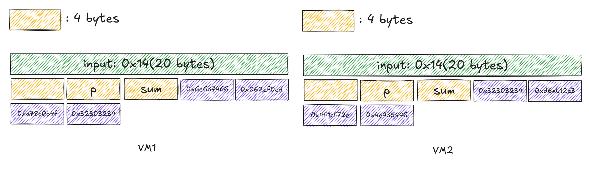

---

Decrypt script:

```c
#include <stdint.h>
#include <stdlib.h>
#include <stdio.h>

#define DELTA 0x9e3779b9

void XXTEA_decrypt1(uint32_t *v, int n, const uint32_t key[4]) {
    if (n < 2) return;
    uint32_t y, z, sum, e;
    int p, q = 6 + 52 / n;
    sum = q * DELTA;
    y = v[0];
    do {
        e = (sum >> 2) & 3;
        for (p = n - 1; p > 0; p--) {
            z = v[p - 1];
            v[p] -= ((z >> 5) ^ (y << 2)) + ((y >> 3) ^ (z << 4)) ^ ((sum ^ y) + (key[(p & 3) ^ e] ^ z));
            y = v[p];
        }
        z = v[n - 1];
        v[0] -= ((z >> 5) ^ (y << 2)) + ((y >> 3) ^ (z << 4)) ^ ((sum ^ y) + (key[(p & 3) ^ e] ^ z));
        y = v[0];
        sum -= DELTA;
    } while (--q > 0);
}

void XXTEA_decrypt2(uint32_t *v, int n, const uint32_t key[4]) {
    if (n < 2) return;
    uint32_t y, z, sum, e;
    int p, q = 6 + 52 / n; 
    sum = q * DELTA;
    y = v[0];
    do {
        e = (sum >> 2) & 3;
        for (p = n - 1; p > 0; p--) {
            z = v[p - 1];
            v[p] -= ((z << 5) ^ (y >> 2)) + ((y << 3) ^ (z >> 4)) ^ ((sum ^ y) + (key[(p & 3) ^ e] ^ z));
            y = v[p];
        }
        z = v[n - 1];
        v[0] -= ((z << 5) ^ (y >> 2)) + ((y << 3) ^ (z >> 4)) ^ ((sum ^ y) + (key[(p & 3) ^ e] ^ z));
        y = v[0];
        sum -= DELTA;
    } while (--q > 0);
}

int main()
{
    uint32_t key1[] = {0x6e637466, 0x062ef0ed, 0xa78c0b4f, 0x32303234};
    unsigned char cipher1[] =
    {
      0x5D, 0x45, 0xD5, 0xB9, 0x8C, 0x95, 0x9C, 0x38, 0x3B, 0xB1, 
      0x3E, 0x1E, 0x5F, 0xC8, 0xE8, 0xBB, 0x64, 0x38, 0x48, 0x69
    };

    size_t cipher_len_bytes = sizeof(cipher1);
    int n = cipher_len_bytes / sizeof(uint32_t);

    XXTEA_decrypt1((uint32_t *)cipher1, n, (const uint32_t *)key1);

    // output
    printf("\nDecrypted data (as chars, %zu bytes):\n", cipher_len_bytes);
    for (size_t i = 0; i < cipher_len_bytes; i++)
    {
        if (cipher1[i] >= 32 && cipher1[i] <= 126) {
             printf("%c", cipher1[i]);
        } else {
             printf("."); 
        }
    }

    uint32_t key2[] = {0x32303234, 0xd6eb12c3, 0x9f1cf72e, 0x4e435446};
    unsigned char cipher2[] =
    {
      0xDE, 0x81, 0xD8, 0xAD, 0xC2, 0xC4, 0xA6, 0x32, 0x1C, 0xAB, 
      0x61, 0x3E, 0xCB, 0xFF, 0xEF, 0xF1, 0x27, 0x30, 0x7A, 0x16
    };

    XXTEA_decrypt2((uint32_t *)cipher2, n, (const uint32_t *)key2);

    // output
    printf("\nDecrypted data (as chars, %zu bytes):\n", cipher_len_bytes);
    for (size_t i = 0; i < cipher_len_bytes; i++)
    {
        if (cipher2[i] >= 32 && cipher2[i] <= 126) {
             printf("%c", cipher2[i]);
        } else {
             printf("."); 
        }
    }

    return 0;
}

/*
std TEA
void XXTEA_encrypt(uint32_t *v, int n, const uint32_t key[4]) {
    if (n < 2) return;  // At least two elements
    uint32_t y, z, sum = 0, e;
    int p, q = 6 + 52 / n;  // Rounds
    z = v[n - 1];   // |  z(>>5  <<4)  |  v[p]  |  y(>>3  <<2) |
    do {
        sum += DELTA;
        e = (sum >> 2) & 3;
        for (p = 0; p < n - 1; p++) {
            y = v[p + 1];
            v[p] += ((z >> 5) ^ (y << 2)) + ((y >> 3) ^ (z << 4)) ^ ((sum ^ y) + (key[(p & 3) ^ e] ^ z));
            z = v[p];
        }
        y = v[0];
        v[n - 1] += ((z >> 5) ^ (y << 2)) + ((y >> 3) ^ (z << 4)) ^ ((sum ^ y) + (key[(p & 3) ^ e] ^ z));
        z = v[n - 1];
    } while (--q > 0);
}
*/
```

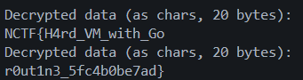

`NCTF{H4rd_VM_with_Gor0ut1n3_5fc4b0be7ad}`

## Method 2 - IDAPython

Instruction set:


Each handler function's oprands are stack passing:

<table>
<tr>
<td>Oprand 1<br/></td><td>`^0.1`<br/></td></tr>
<tr>
<td>Oprand 2<br/></td><td>`^1.1`<br/></td></tr>
<tr>
<td>Oprand 3<br/></td><td>`^2.1`<br/></td></tr>
</table>

Write IDA python script to set "Trace" breakpoint and hook registers:

```python
import idaapi
import idc

def set_python_bpt(ea, cond):
    ''' 设置跟踪断点：触发时执行 Python 代码并继续执行 '''
    # 检查地址是否有效
    if not idaapi.is_mapped(ea):
        print(f"[错误] 地址 {ea:x} 不在当前加载的模块中")
        return

    # 添加断点（类型：软件断点，默认行为）
    if not idaapi.add_bpt(ea, 0, idaapi.BPT_SOFT):
        print(f"[错误] 无法在地址 {ea:x} 添加断点")
        return

    # 配置断点属性
    bpt = idaapi.bpt_t()
    if not idaapi.get_bpt(ea, bpt):
        print(f"[错误] 无法获取地址 {ea:x} 的断点信息")
        return

    bpt.elang = 'Python'  # 使用 Python 条件
    bpt.condition = cond  # 条件表达式
    bpt.flags |= idaapi.BPT_ENABLED  # 启用断点
    bpt.flags &= ~idaapi.BPT_BRK  # 触发后不暂停程序（关键修改）
    
    if not idaapi.update_bpt(bpt):
        print(f"[错误] 无法更新地址 {ea:x} 的断点")
        return
    print(f"[成功] 在地址 {ea:x} 设置跟踪断点")

# ------------------------- 钩子函数定义 -------------------------
def hook_shr():
    rbx = idc.get_reg_value("rbx")
    cl = idc.get_reg_value("cl")
    val1 = rbx
    val2 = cl
    print(f"{val1:x} >> {val2:x} = {(val1 >> val2) & 0xFFFFFFFFFFFFFFFF:x}")

def hook_shl():
    rbx = idc.get_reg_value("rbx")
    cl = idc.get_reg_value("cl")
    val1 = rbx
    val2 = cl
    print(f"{val1:x} << {val2:x} = {(val1 << val2) & 0xFFFFFFFFFFFFFFFF:x}")

def hook_add():
    rdx = idc.get_reg_value("rdx")
    rax = idc.get_reg_value("rax")
    rbx = idc.get_reg_value("rbx")
    val1 = rdx
    val2 = idc.get_qword(rax + rbx*4)
    print(f"{val1:x} + {val2:x} = {(val1 + val2) & 0xFFFFFFFFFFFFFFFF:x}")

def hook_xor():
    rdx = idc.get_reg_value("rdx")
    rax = idc.get_reg_value("rax")
    rbx = idc.get_reg_value("rbx")
    val1 = rdx
    val2 = idc.get_qword(rax + rbx*4)
    print(f"{val1:x} ^ {val2:x} = {(val1 ^ val2) & 0xFFFFFFFFFFFFFFFF:x}")

def hook_sub():
    rdx = idc.get_reg_value("rdx")
    rax = idc.get_reg_value("rax")
    rbx = idc.get_reg_value("rbx")
    val1 = rdx
    val2 = idc.get_qword(rax + rbx*4)
    print(f"{val1:x} - {val2:x} = {(val1 - val2) & 0xFFFFFFFFFFFFFFFF:x}")

def hook_mul():
    rdx = idc.get_reg_value("rdx")
    rbx = idc.get_reg_value("rbx")
    val1 = rdx
    val2 = rbx
    print(f"{val1:x} * {val2:x} = {(val1 * val2) & 0xFFFFFFFFFFFFFFFF:x}")

def hook_and():
    rdx = idc.get_reg_value("rdx")
    rax = idc.get_reg_value("rax")
    rbx = idc.get_reg_value("rbx")
    val1 = rdx
    val2 = idc.get_qword(rax + rbx*4)
    print(f"{val1:x} & {val2:x} = {(val1 & val2) & 0xFFFFFFFFFFFFFFFF:x}")

# ------------------------- 设置断点 -------------------------
# 设置跟踪断点列表（地址需根据实际情况调整）
trace_bpts = [
    (0x0000000000848860, 'hook_shr()'),
    (0x0000000000848820, 'hook_shl()'),
    (0x000000000084871D, 'hook_add()'),
    (0x00000000008487DD, 'hook_xor()'),
    (0x000000000084875D, 'hook_sub()'),
    (0x00000000008487A0, 'hook_mul()'),
    (0x000000000084889D, 'hook_and()')
]

for ea, cond in trace_bpts:
    set_python_bpt(ea, cond)
```

### Result

---

# ezDOS

> MS-DOS on Intel 8086
> old but classic architecture

---

> Directly examine the assembly code, a heavily modified RC4 and junk code are inspected. Don't care about its internal implementation, the final XOR step remains unmodified. Hence extract the XOR Key in the proccess

Junk code:

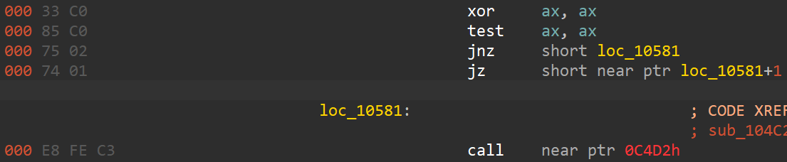

Debug:

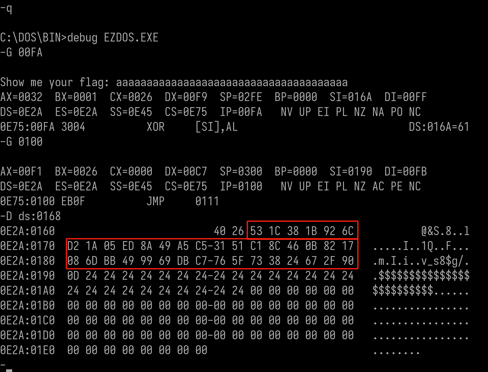

> [Note](https://drive.google.com/file/d/16wIDvVap2-amHaF9QUD4nHRnE8mbGytl/view): [Input](https://courses.cs.umbc.edu/undergraduate/CMSC211/fall02/burt/tech_help/int21.html) [buffer](https://www.uobabylon.edu.iq/eprints/publication_1_26684_35.pdf) [structure](https://www.philadelphia.edu.jo/academics/qhamarsheh/uploads/Lecture%2021%20MS-DOS%20Function%20Calls%20_INT%2021h_.pdf): `0x40(maxLength)` + `actualLength`+ `data`

- XOR step：starts at `0x169 + 1 = 0x170`
- CMP step: also starts at `0x170`

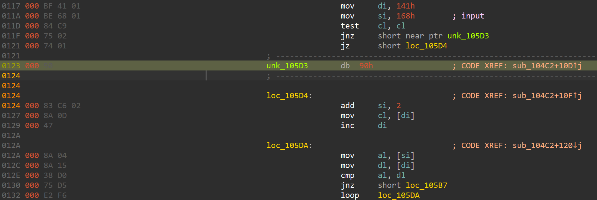
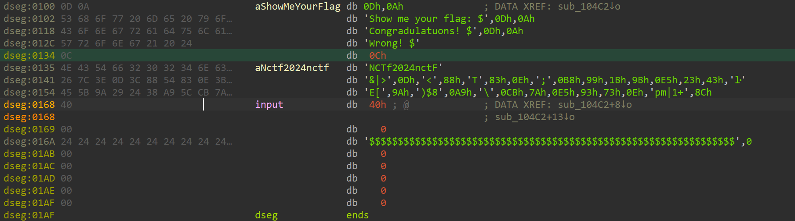
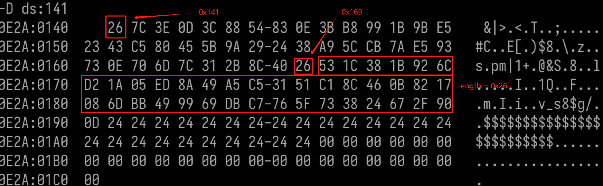

```plain
# 0x26 'a' chars: aaaaaaaaaaaaaaaaaaaaaaaaaaaaaaaaaaaaaa，XORed
53 1C 38 1B 92 6C D2 1A 05 ED 8A 49 A5 C5 31 51 C1 8C 46 0B 82 17 08 6D BB 49 99 69 DB C7 76 5F 73 38 24 67 2F 90
```

```plain
# Key
32 7d 59 7a f3 0d b3 7b 64 8c eb 28 c4 a4 50 30 a0 ed 27 6a e3 76 69 0c da 28 f8 08 ba a6 17 3e 12 59 45 06 4e f1
```

```plain
# Cipher
7C 3E 0D 3C 88 54 83 0E 3B B8 99 1B 9B E5 23 43 C5 80 45 5B 9A 29 24 38 A9 5C CB 7A E5 93 73 0E 70 6D 7C 31 2B 8C
```
[Cyberchef](https://gchq.github.io/CyberChef/#recipe=From_Hex('Auto')XOR(%7B'option':'Hex','string':'32%207d%2059%207a%20f3%200d%20b3%207b%2064%208c%20eb%2028%20c4%20a4%2050%2030%20a0%20ed%2027%206a%20e3%2076%2069%200c%20da%2028%20f8%2008%20ba%20a6%2017%203e%2012%2059%2045%2006%204e%20f1'%7D,'Standard',false)&input=N0MgM0UgMEQgM0MgODggNTQgODMgMEUgM0IgQjggOTkgMUIgOUIgRTUgMjMgNDMgQzUgODAgNDUgNUIgOUEgMjkgMjQgMzggQTkgNUMgQ0IgN0EgRTUgOTMgNzMgMEUgNzAgNkQgN0MgMzEgMkIgOEM&oeol=NEL)

`NCTF{Y0u_4r3_Assemb1y_M4st3r_5d0b497e}`

---

# SafeProgram

> The program monitors everything you do.
> So it reminds you: "DONOT DEBUG ME!".
> But really?

---

> The main function implements [SM4](https://datatracker.ietf.org/doc/html/draft-ribose-cfrg-sm4-10#section-3) encryption ~~without modifying SBox~~. Note that one dummy thread is continuously spawned / terminated, which triggers TLS each time.
> [TLS Anti-debugging](https://www.anquanke.com/post/id/208404): TLS then triggers CRC self-validation upon every thread creation, unable to set software breakpoint(INT 3 == 0xCC). Hence, use hardware breakpoint to bypass CRC self-check, obtaining hacked SBox.

Set software breakpoint, `0xE0000001` exception occurred:

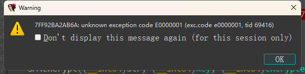

`No(discard)`, F8 step over:

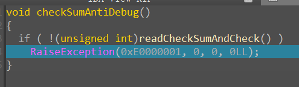

[Callback functions](https://pcnc027ut287.feishu.cn/wiki/Sslpw98OziXPWmk5CfXcgUGVnhh#share-RDwTdsfZEoBJ17x0Rj0cNL0nngg) were found:

> - `DLL_PROCESS_ATTACH` (1): Process initialization
> - `DLL_THREAD_ATTACH` (2): Thread creation
> - `DLL_THREAD_DETACH` (3): Thread exit
> - `DLL_PROCESS_DETACH` (0): Process termination

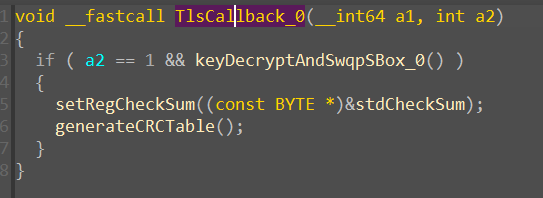
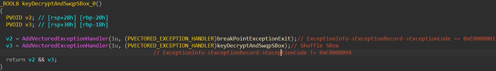
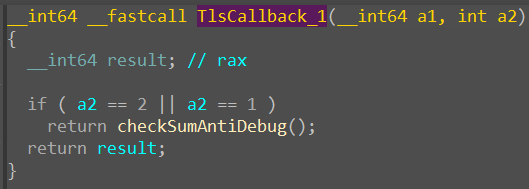
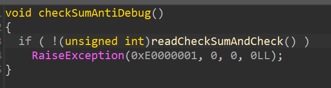

Divide by 0 exception:

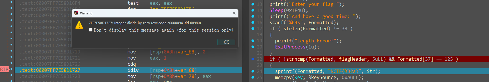
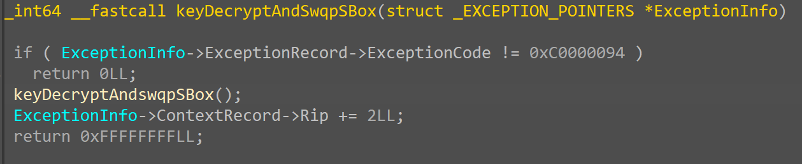

The decrypted keySource array orchestrates a sequential substitution on SBos

Extract necessary data:

```c
// NCTF24nctfNCTF24
unsigned char Key[] =
{
  0x4E, 0x43, 0x54, 0x46, 0x32, 0x34, 0x6E, 0x63, 0x74, 0x66, 
  0x4E, 0x43, 0x54, 0x46, 0x32, 0x34
};
```

```c
unsigned char Cipher[] =
{
  0xFB, 0x97, 0x3C, 0x3B, 0xF1, 0x99, 0x12, 0xDF, 0x13, 0x30, 
  0xF7, 0xD8, 0x7F, 0xEB, 0xA0, 0x6C, 0x14, 0x5B, 0xA6, 0x2A, 
  0xA8, 0x05, 0xA5, 0xF3, 0x76, 0xBE, 0xC9, 0x01, 0xF9, 0x36, 
  0x7B, 0x46
};
```

```c
// hacked SBox
unsigned char SBox[] =
{
  0xD1, 0x90, 0xE9, 0xFE, 0xCC, 0xE1, 0x3D, 0xB7, 0x16, 0xB6, 
  0x14, 0xC2, 0x28, 0xFB, 0x2C, 0x05, 0x2B, 0x67, 0x9A, 0x76, 
  0x2A, 0xBE, 0x04, 0xC3, 0xAA, 0x44, 0x13, 0x26, 0x49, 0x86, 
  0x06, 0x99, 0x9C, 0x42, 0x50, 0xF4, 0x91, 0xEF, 0x98, 0x7A, 
  0x33, 0x54, 0x0B, 0x43, 0xED, 0xCF, 0xAC, 0x62, 0xE4, 0xB3, 
  0x17, 0xA9, 0x1C, 0x08, 0xE8, 0x95, 0x80, 0xDF, 0x94, 0xFA, 
  0x75, 0x8F, 0x3F, 0xA6, 0x47, 0x07, 0xA7, 0x4F, 0xF3, 0x73, 
  0x71, 0xBA, 0x83, 0x59, 0x3C, 0x19, 0xE6, 0x85, 0xD6, 0xA8, 
  0x68, 0x6B, 0x81, 0xB2, 0xFC, 0x64, 0xDA, 0x8B, 0xF8, 0xEB, 
  0x0F, 0x4B, 0x70, 0x56, 0x9D, 0x35, 0x1E, 0x24, 0x0E, 0x78, 
  0x63, 0x58, 0x9F, 0xA2, 0x25, 0x22, 0x7C, 0x3B, 0x01, 0x21, 
  0xC9, 0x87, 0xD4, 0x00, 0x46, 0x57, 0x5E, 0xD3, 0x27, 0x52, 
  0x4C, 0x36, 0x02, 0xE7, 0xA0, 0xC4, 0xC8, 0x9E, 0xEA, 0xBF, 
  0x8A, 0xD2, 0x40, 0xC7, 0x38, 0xB5, 0xA3, 0xF7, 0xF2, 0xCE, 
  0xF9, 0x61, 0x15, 0xA1, 0xE0, 0xAE, 0x5D, 0xA4, 0x9B, 0x34, 
  0x1A, 0x55, 0xAD, 0x93, 0x32, 0x30, 0xF5, 0x8C, 0xB1, 0xE3, 
  0x1D, 0xF6, 0xE2, 0x2E, 0x82, 0x66, 0xCA, 0x60, 0xC0, 0x29, 
  0x23, 0xAB, 0x0D, 0x53, 0x4E, 0x6F, 0xD5, 0xDB, 0x37, 0x45, 
  0xDE, 0xFD, 0x8E, 0x2F, 0x03, 0xFF, 0x6A, 0x72, 0x6D, 0x6C, 
  0x5B, 0x51, 0x8D, 0x1B, 0xAF, 0x92, 0xBB, 0xDD, 0xBC, 0x7F, 
  0x11, 0xD9, 0x5C, 0x41, 0x1F, 0x10, 0x5A, 0xD8, 0x0A, 0xC1, 
  0x31, 0x88, 0xA5, 0xCD, 0x7B, 0xBD, 0x2D, 0x74, 0xD0, 0x12, 
  0xB8, 0xE5, 0xB4, 0xB0, 0x89, 0x69, 0x97, 0x4A, 0x0C, 0x96, 
  0x77, 0x7E, 0x65, 0xB9, 0xF1, 0x09, 0xC5, 0x6E, 0xC6, 0x84, 
  0x18, 0xF0, 0x7D, 0xEC, 0x3A, 0xDC, 0x4D, 0x20, 0x79, 0xEE, 
  0x5F, 0x3E, 0xD7, 0xCB, 0x39, 0x48
};
```

```c
// Standard constant
FK_0 = 0xA3B1BAC6  
FK_1 = 0x56AA3350  
FK_2 = 0x677D9197  
FK_3 = 0xB27022DC
---
CK0 = 0x00070e15
CK1 = 0x1c232a31
CK2 = 0x383f464d
CK3 = 0x545b6269
CK4 = 0x70777e85
CK5 = 0x8c939aa1
CK6 = 0xa8afb6bd
CK7 = 0xc4cbd2d9
CK8 = 0xe0e7eef5
CK9 = 0xfc030a11
CK10 = 0x181f262d
CK11 = 0x343b4249
CK12 = 0x50575e65
CK13 = 0x6c737a81
CK14 = 0x888f969d
CK15 = 0xa4abb2b9
CK16 = 0xc0c7ced5
CK17 = 0xdce3eaf1
CK18 = 0xf8ff060d
CK19 = 0x141b2229
CK20 = 0x30373e45
CK21 = 0x4c535a61
CK22 = 0x686f767d
CK23 = 0x848b9299
CK24 = 0xa0a7aeb5
CK25 = 0xbcc3cad1
CK26 = 0xd8dfe6ed
CK27 = 0xf4fb0209
CK28 = 0x10171e25
CK29 = 0x2c333a41
CK30 = 0x484f565d
CK31 = 0x646b7279
```

Exp:

```python
import struct

# 系统参数
FK = [0xA3B1BAC6, 0x56AA3350, 0x677D9197, 0xB27022DC]

# 固定参数CK
CK = [
    0x00070e15, 0x1c232a31, 0x383f464d, 0x545b6269,
    0x70777e85, 0x8c939aa1, 0xa8afb6bd, 0xc4cbd2d9,
    0xe0e7eef5, 0xfc030a11, 0x181f262d, 0x343b4249,
    0x50575e65, 0x6c737a81, 0x888f969d, 0xa4abb2b9,
    0xc0c7ced5, 0xdce3eaf1, 0xf8ff060d, 0x141b2229,
    0x30373e45, 0x4c535a61, 0x686f767d, 0x848b9299,
    0xa0a7aeb5, 0xbcc3cad1, 0xd8dfe6ed, 0xf4fb0209,
    0x10171e25, 0x2c333a41, 0x484f565d, 0x646b7279
]

# 自定义S盒
SBox = [
    0xD1, 0x90, 0xE9, 0xFE, 0xCC, 0xE1, 0x3D, 0xB7, 0x16, 0xB6, 
    0x14, 0xC2, 0x28, 0xFB, 0x2C, 0x05, 0x2B, 0x67, 0x9A, 0x76, 
    0x2A, 0xBE, 0x04, 0xC3, 0xAA, 0x44, 0x13, 0x26, 0x49, 0x86, 
    0x06, 0x99, 0x9C, 0x42, 0x50, 0xF4, 0x91, 0xEF, 0x98, 0x7A, 
    0x33, 0x54, 0x0B, 0x43, 0xED, 0xCF, 0xAC, 0x62, 0xE4, 0xB3, 
    0x17, 0xA9, 0x1C, 0x08, 0xE8, 0x95, 0x80, 0xDF, 0x94, 0xFA, 
    0x75, 0x8F, 0x3F, 0xA6, 0x47, 0x07, 0xA7, 0x4F, 0xF3, 0x73, 
    0x71, 0xBA, 0x83, 0x59, 0x3C, 0x19, 0xE6, 0x85, 0xD6, 0xA8, 
    0x68, 0x6B, 0x81, 0xB2, 0xFC, 0x64, 0xDA, 0x8B, 0xF8, 0xEB, 
    0x0F, 0x4B, 0x70, 0x56, 0x9D, 0x35, 0x1E, 0x24, 0x0E, 0x78, 
    0x63, 0x58, 0x9F, 0xA2, 0x25, 0x22, 0x7C, 0x3B, 0x01, 0x21, 
    0xC9, 0x87, 0xD4, 0x00, 0x46, 0x57, 0x5E, 0xD3, 0x27, 0x52, 
    0x4C, 0x36, 0x02, 0xE7, 0xA0, 0xC4, 0xC8, 0x9E, 0xEA, 0xBF, 
    0x8A, 0xD2, 0x40, 0xC7, 0x38, 0xB5, 0xA3, 0xF7, 0xF2, 0xCE, 
    0xF9, 0x61, 0x15, 0xA1, 0xE0, 0xAE, 0x5D, 0xA4, 0x9B, 0x34, 
    0x1A, 0x55, 0xAD, 0x93, 0x32, 0x30, 0xF5, 0x8C, 0xB1, 0xE3, 
    0x1D, 0xF6, 0xE2, 0x2E, 0x82, 0x66, 0xCA, 0x60, 0xC0, 0x29, 
    0x23, 0xAB, 0x0D, 0x53, 0x4E, 0x6F, 0xD5, 0xDB, 0x37, 0x45, 
    0xDE, 0xFD, 0x8E, 0x2F, 0x03, 0xFF, 0x6A, 0x72, 0x6D, 0x6C, 
    0x5B, 0x51, 0x8D, 0x1B, 0xAF, 0x92, 0xBB, 0xDD, 0xBC, 0x7F, 
    0x11, 0xD9, 0x5C, 0x41, 0x1F, 0x10, 0x5A, 0xD8, 0x0A, 0xC1, 
    0x31, 0x88, 0xA5, 0xCD, 0x7B, 0xBD, 0x2D, 0x74, 0xD0, 0x12, 
    0xB8, 0xE5, 0xB4, 0xB0, 0x89, 0x69, 0x97, 0x4A, 0x0C, 0x96, 
    0x77, 0x7E, 0x65, 0xB9, 0xF1, 0x09, 0xC5, 0x6E, 0xC6, 0x84, 
    0x18, 0xF0, 0x7D, 0xEC, 0x3A, 0xDC, 0x4D, 0x20, 0x79, 0xEE, 
    0x5F, 0x3E, 0xD7, 0xCB, 0x39, 0x48
]

def left_rotate(n, b):
    return ((n << b) | (n >> (32 - b))) & 0xFFFFFFFF

def tau(b):
    a = b.to_bytes(4, 'big')
    a = [SBox[x] for x in a]
    return int.from_bytes(bytes(a), 'big')

def L(b):
    return b ^ left_rotate(b, 2) ^ left_rotate(b, 10) ^ left_rotate(b, 18) ^ left_rotate(b, 24)

def T(b):
    return L(tau(b))

def L_prime(b):
    return b ^ left_rotate(b, 13) ^ left_rotate(b, 23)

def T_prime(b):
    return L_prime(tau(b))

def sm4_key_expansion(key):
    MK = struct.unpack('>4I', key)
    K = [0] * 36
    K[0] = MK[0] ^ FK[0]
    K[1] = MK[1] ^ FK[1]
    K[2] = MK[2] ^ FK[2]
    K[3] = MK[3] ^ FK[3]
    rk = [0] * 32
    for i in range(32):
        tmp = K[i+1] ^ K[i+2] ^ K[i+3] ^ CK[i]
        tmp = T_prime(tmp)
        K[i+4] = K[i] ^ tmp
        rk[i] = K[i+4]
    return rk

def sm4_decrypt(ciphertext, rk):
    x = list(struct.unpack('>4I', ciphertext))
    for i in range(32):
        rk_i = rk[i]
        tmp = x[i+1] ^ x[i+2] ^ x[i+3] ^ rk_i
        tmp = T(tmp)
        x.append(x[i] ^ tmp)
    return struct.pack('>4I', x[35], x[34], x[33], x[32])

# 输入数据
key = bytes([0x4E, 0x43, 0x54, 0x46, 0x32, 0x34, 0x6E, 0x63, 0x74, 0x66, 
  0x4E, 0x43, 0x54, 0x46, 0x32, 0x34])
cipher = bytes([0xFB, 0x97, 0x3C, 0x3B, 0xF1, 0x99, 0x12, 0xDF, 0x13, 0x30, 
  0xF7, 0xD8, 0x7F, 0xEB, 0xA0, 0x6C, 0x14, 0x5B, 0xA6, 0x2A, 
  0xA8, 0x05, 0xA5, 0xF3, 0x76, 0xBE, 0xC9, 0x01, 0xF9, 0x36, 
  0x7B, 0x46])

# 生成轮密钥并反转
rk = sm4_key_expansion(key)
dec_rk = rk[::-1]

# 分块解密
block1 = cipher[:16]
block2 = cipher[16:]
plain1 = sm4_decrypt(block1, dec_rk)
plain2 = sm4_decrypt(block2, dec_rk)
plain = plain1 + plain2

print("Decrypted:", plain)
# NCTF{58cb925e0cd823c0d0b54fd06b820b7e}
```


---

## Appendix

```c
// 替换前
unsigned char SBox[] =
{
  0xD6, 0x90, 0xE9, 0xFE, 0xCC, 0xE1, 0x3D, 0xB7, 0x16, 0xB6, 
  0x14, 0xC2, 0x28, 0xFB, 0x2C, 0x05, 0x2B, 0x67, 0x9A, 0x76, 
  0x2A, 0xBE, 0x04, 0xC3, 0xAA, 0x44, 0x13, 0x26, 0x49, 0x86, 
  0x06, 0x99, 0x9C, 0x42, 0x50, 0xF4, 0x91, 0xEF, 0x98, 0x7A, 
  0x33, 0x54, 0x0B, 0x43, 0xED, 0xCF, 0xAC, 0x62, 0xE4, 0xB3, 
  0x1C, 0xA9, 0xC9, 0x08, 0xE8, 0x95, 0x80, 0xDF, 0x94, 0xFA, 
  0x75, 0x8F, 0x3F, 0xA6, 0x47, 0x07, 0xA7, 0xFC, 0xF3, 0x73, 
  0x17, 0xBA, 0x83, 0x59, 0x3C, 0x19, 0xE6, 0x85, 0x4F, 0xA8, 
  0x68, 0x6B, 0x81, 0xB2, 0x71, 0x64, 0xDA, 0x8B, 0xF8, 0xEB, 
  0x0F, 0x4B, 0x70, 0x56, 0x9D, 0x35, 0x1E, 0x24, 0x0E, 0x5E, 
  0x63, 0x58, 0xD1, 0xA2, 0x25, 0x22, 0x7C, 0x3B, 0x01, 0x21, 
  0x78, 0x87, 0xD4, 0x00, 0x46, 0x57, 0x9F, 0xD3, 0x27, 0x52, 
  0x4C, 0x36, 0x02, 0xE7, 0xA0, 0xC4, 0xC8, 0x9E, 0xEA, 0xBF, 
  0x8A, 0xD2, 0x40, 0xC7, 0x38, 0xB5, 0xA3, 0xF7, 0xF2, 0xCE, 
  0xF9, 0x61, 0x15, 0xA1, 0xE0, 0xAE, 0x5D, 0xA4, 0x9B, 0x34, 
  0x1A, 0x55, 0xAD, 0x93, 0x32, 0x30, 0xF5, 0x8C, 0xB1, 0xE3, 
  0x1D, 0xF6, 0xE2, 0x2E, 0x82, 0x66, 0xCA, 0x60, 0xC0, 0x29, 
  0x23, 0xAB, 0x0D, 0x53, 0x4E, 0x6F, 0xD5, 0xDB, 0x37, 0x45, 
  0xDE, 0xFD, 0x8E, 0x2F, 0x03, 0xFF, 0x6A, 0x72, 0x6D, 0x6C, 
  0x5B, 0x51, 0x8D, 0x1B, 0xAF, 0x92, 0xBB, 0xDD, 0xBC, 0x7F, 
  0x11, 0xD9, 0x5C, 0x41, 0x1F, 0x10, 0x5A, 0xD8, 0x0A, 0xC1, 
  0x31, 0x88, 0xA5, 0xCD, 0x7B, 0xBD, 0x2D, 0x74, 0xD0, 0x12, 
  0xB8, 0xE5, 0xB4, 0xB0, 0x89, 0x69, 0x97, 0x4A, 0x0C, 0x96, 
  0x77, 0x7E, 0x65, 0xB9, 0xF1, 0x09, 0xC5, 0x6E, 0xC6, 0x84, 
  0x18, 0xF0, 0x7D, 0xEC, 0x3A, 0xDC, 0x4D, 0x20, 0x79, 0xEE, 
  0x5F, 0x3E, 0xD7, 0xCB, 0x39, 0x48
};

unsigned char keySource[] =
{
  0xDF, 0xD2, 0xC5, 0xD7, 0xA3, 0xA5, 0xFF, 0xF2, 0xE5, 0xF7, 
  0x00, 0x00, 0x00, 0x00, 0x00, 0x00
};
```

```c
// 替换后
unsigned char SBox[] =
{
  0xD1, 0x90, 0xE9, 0xFE, 0xCC, 0xE1, 0x3D, 0xB7, 0x16, 0xB6, 
  0x14, 0xC2, 0x28, 0xFB, 0x2C, 0x05, 0x2B, 0x67, 0x9A, 0x76, 
  0x2A, 0xBE, 0x04, 0xC3, 0xAA, 0x44, 0x13, 0x26, 0x49, 0x86, 
  0x06, 0x99, 0x9C, 0x42, 0x50, 0xF4, 0x91, 0xEF, 0x98, 0x7A, 
  0x33, 0x54, 0x0B, 0x43, 0xED, 0xCF, 0xAC, 0x62, 0xE4, 0xB3, 
  0x17, 0xA9, 0x1C, 0x08, 0xE8, 0x95, 0x80, 0xDF, 0x94, 0xFA, 
  0x75, 0x8F, 0x3F, 0xA6, 0x47, 0x07, 0xA7, 0x4F, 0xF3, 0x73, 
  0x71, 0xBA, 0x83, 0x59, 0x3C, 0x19, 0xE6, 0x85, 0xD6, 0xA8, 
  0x68, 0x6B, 0x81, 0xB2, 0xFC, 0x64, 0xDA, 0x8B, 0xF8, 0xEB, 
  0x0F, 0x4B, 0x70, 0x56, 0x9D, 0x35, 0x1E, 0x24, 0x0E, 0x78, 
  0x63, 0x58, 0x9F, 0xA2, 0x25, 0x22, 0x7C, 0x3B, 0x01, 0x21, 
  0xC9, 0x87, 0xD4, 0x00, 0x46, 0x57, 0x5E, 0xD3, 0x27, 0x52, 
  0x4C, 0x36, 0x02, 0xE7, 0xA0, 0xC4, 0xC8, 0x9E, 0xEA, 0xBF, 
  0x8A, 0xD2, 0x40, 0xC7, 0x38, 0xB5, 0xA3, 0xF7, 0xF2, 0xCE, 
  0xF9, 0x61, 0x15, 0xA1, 0xE0, 0xAE, 0x5D, 0xA4, 0x9B, 0x34, 
  0x1A, 0x55, 0xAD, 0x93, 0x32, 0x30, 0xF5, 0x8C, 0xB1, 0xE3, 
  0x1D, 0xF6, 0xE2, 0x2E, 0x82, 0x66, 0xCA, 0x60, 0xC0, 0x29, 
  0x23, 0xAB, 0x0D, 0x53, 0x4E, 0x6F, 0xD5, 0xDB, 0x37, 0x45, 
  0xDE, 0xFD, 0x8E, 0x2F, 0x03, 0xFF, 0x6A, 0x72, 0x6D, 0x6C, 
  0x5B, 0x51, 0x8D, 0x1B, 0xAF, 0x92, 0xBB, 0xDD, 0xBC, 0x7F, 
  0x11, 0xD9, 0x5C, 0x41, 0x1F, 0x10, 0x5A, 0xD8, 0x0A, 0xC1, 
  0x31, 0x88, 0xA5, 0xCD, 0x7B, 0xBD, 0x2D, 0x74, 0xD0, 0x12, 
  0xB8, 0xE5, 0xB4, 0xB0, 0x89, 0x69, 0x97, 0x4A, 0x0C, 0x96, 
  0x77, 0x7E, 0x65, 0xB9, 0xF1, 0x09, 0xC5, 0x6E, 0xC6, 0x84, 
  0x18, 0xF0, 0x7D, 0xEC, 0x3A, 0xDC, 0x4D, 0x20, 0x79, 0xEE, 
  0x5F, 0x3E, 0xD7, 0xCB, 0x39, 0x48
};

unsigned char keySource[] =
{
  0x4E, 0x43, 0x54, 0x46, 0x32, 0x34, 0x6E, 0x63, 0x74, 0x66, 
  0x00, 0x00, 0x00, 0x00, 0x00, 0x00
};
```

Standard SBox for SM4：

```bash
0   1   2   3   4   5   6   7   8   9   A   B   C   D   E   F
00 | D6 90 E9 FE CC E1 3D B7 16 B6 14 C2 28 FB 2C 05
10 | 2B 67 9A 76 2A BE 04 C3 AA 44 13 26 49 86 06 99
20 | 9C 42 50 F4 91 EF 98 7A 33 54 0B 43 ED CF AC 62
30 | E4 B3 1C A9 C9 08 E8 95 80 DF 94 FA 75 8F 3F A6
40 | 47 07 A7 FC F3 73 17 BA 83 59 3C 19 E6 85 4F A8
50 | 68 6B 81 B2 71 64 DA 8B F8 EB 0F 4B 70 56 9D 35
60 | 1E 24 0E 5E 63 58 D1 A2 25 22 7C 3B 01 21 78 87
70 | D4 00 46 57 9F D3 27 52 4C 36 02 E7 A0 C4 C8 9E
80 | EA BF 8A D2 40 C7 38 B5 A3 F7 F2 CE F9 61 15 A1
90 | E0 AE 5D A4 9B 34 1A 55 AD 93 32 30 F5 8C B1 E3
A0 | 1D F6 E2 2E 82 66 CA 60 C0 29 23 AB 0D 53 4E 6F
B0 | D5 DB 37 45 DE FD 8E 2F 03 FF 6A 72 6D 6C 5B 51
C0 | 8D 1B AF 92 BB DD BC 7F 11 D9 5C 41 1F 10 5A D8
D0 | 0A C1 31 88 A5 CD 7B BD 2D 74 D0 12 B8 E5 B4 B0
E0 | 89 69 97 4A 0C 96 77 7E 65 B9 F1 09 C5 6E C6 84
F0 | 18 F0 7D EC 3A DC 4D 20 79 EE 5F 3E D7 CB 39 48
```

### TLS callback function structure

```c
void NTAPI TlsCallback(
    PVOID DllHandle,
    DWORD Reason,
    PVOID Reserved
);
```

### Structure

```assembly
typedef struct _EXCEPTION_POINTERS {
  PEXCEPTION_RECORD ExceptionRecord;
  PCONTEXT ContextRecord;
} EXCEPTION_POINTERS, *PEXCEPTION_POINTERS;
```

### Exception Code

1. Windows 结构化异常处理 (SEH - Structured Exception Handling) 代码:

这些是操作系统层面或硬件层面产生的异常，通常以 0x 开头的十六进制表示。

- `0xC0000005`: **Access Violation (访问冲突)** - 这是最常见的异常代码之一。表示程序试图读取或写入它没有权限访问的内存地址（例如，访问已释放的内存、空指针解引用、写入只读内存段等）。
- `0xC00000FD`: **Stack Overflow (栈溢出)** - 表示程序的调用栈超出了其预留的大小，通常由无限递归或在栈上分配过大的局部变量引起。
- `0xC0000006`: **In Page Error (页错误)** - 通常与 I/O 错误相关，表示系统在尝试从页面文件读取或写入数据到内存时遇到问题。
- `0xC000001D`: **Illegal Instruction (非法指令)** - CPU 尝试执行一个无法识别或无效的指令。可能是代码损坏、跳转到非代码区域或使用了特定 CPU 不支持的指令集。
- `0xC0000094`: **Integer Divide by Zero (整数除零)** - 程序尝试执行一个整数除法，且除数为零。
- `0xE06D7363`: **Microsoft C++ Exception** - 当 C++ 代码 `throw` 一个异常时，Windows SEH 机制会捕获它并使用这个特定的代码来标识这是一个 C++ 异常。附加信息会包含关于实际 C++ 异常类型的细节。

2. POSIX 错误号 (errno):

在 Linux、macOS 等类 UNIX 系统中，系统调用失败时通常会设置一个全局或线程局部的 errno 变量。虽然不是严格意义上的“异常代码”（因为它们通常通过返回值和检查 errno 来处理，而不是像 SEH 或 C++ 异常那样中断控制流），但它们在功能上类似，表示错误条件。它们通常用宏定义表示。

- `EACCES` (13): **Permission denied (权限被拒绝)** - 试图以不允许的方式访问文件或资源。
- `ENOENT` (2): **No such file or directory (无此文件或目录)** - 访问的文件或路径不存在。
- `EINVAL` (22): **Invalid argument (无效参数)** - 提供给系统调用的参数无效。
- `ENOMEM` (12): **Out of memory (内存不足)** - 系统无法分配所需的内存。
- `EBUSY` (16): **Device or resource busy (设备或资源忙)** - 尝试访问一个正在被其他进程使用的资源。
